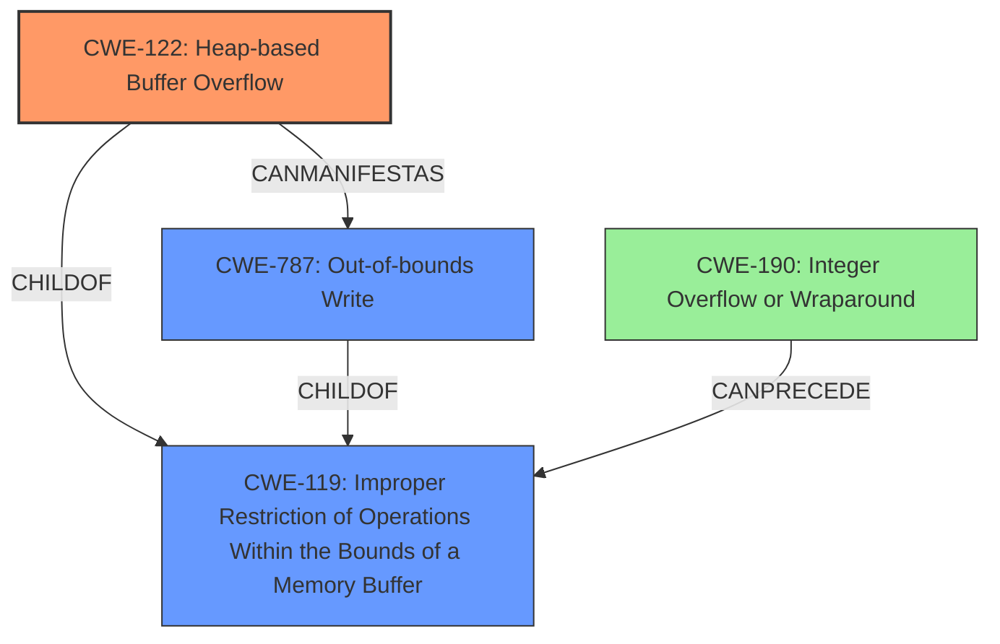

# Analysis Report for CVE-2022-35447

# Vulnerability Analysis Report: CVE-2022-35447

## Description

OTFCC v0.10.4 was discovered to contain a heap-buffer overflow via /release-x64/otfccdump+0x6b04de.

## Vulnerability Description Key Phrases

**Weakness:** heap-buffer overflow
**Product:** OTFCC
**Version:** v0.10.4
**Component:** /release-x64/otfccdump+0x6b04de

## Analysis (with Relationship Data)

# Summary
| CWE ID | CWE Name | Confidence | CWE Abstraction Level | CWE Vulnerability Mapping Label | CWE-Vulnerability Mapping Notes |
|---|---|---|---|---|---|
| CWE-122 | Heap-based Buffer Overflow | 0.9 | Variant | Primary | Allowed |
| CWE-787 | Out-of-bounds Write | 0.6 | Base | Secondary Candidate | Allowed |
| CWE-125 | Out-of-bounds Read | 0.5 | Base | Secondary Candidate | Allowed |

## Evidence and Confidence

*   **Confidence Score:** 0.9
*   **Evidence Strength:** HIGH

- **Analysis and Justification:**
  - *Explanation:* The vulnerability description explicitly states "**heap-buffer overflow**". The "CWE for similar CVE Descriptions" also lists CWE-787 as the primary match for similar vulnerabilities, but given the explicit mention of "heap" in the vulnerability description, CWE-122 (Heap-based Buffer Overflow) is a more precise match. The CVE Reference Links Content Summary section confirms this classification by detailing "heap buffer overflow vulnerabilities were found, characterized by out-of-bounds memory access during heap operations". CWE-122 is a variant of CWE-119 (Improper Restriction of Operations Within the Bounds of a Memory Buffer), providing a more specific categorization. The MITRE mapping guidance for CWE-122 indicates that its usage is ALLOWED.

  - *Relationship Analysis:* CWE-122 (Heap-based Buffer Overflow) is a variant of CWE-119 (Improper Restriction of Operations Within the Bounds of a Memory Buffer) and a parent of CWE-787 (Out-of-bounds Write). The fact that the buffer is allocated on the heap makes CWE-122 a more accurate and specific choice than its parent, CWE-119, or its child, CWE-787.

- **Confidence Score:**
  - Confidence: 0.9 (High confidence due to explicit mention of "heap-buffer overflow" and supporting evidence from CVE reference materials.)

- **Analysis and Justification for Secondary Candidates:**
  - *Explanation:* CWE-787 (Out-of-bounds Write) is a potential secondary candidate as it describes the general nature of the overflow, which involves writing data past the end of the allocated buffer. However, since the overflow occurs specifically in the heap, CWE-122 is a more accurate primary classification. While CWE-787 is listed as the Primary CWE match for similar CVE Descriptions, the details available for this particular vulnerability points to CWE-122 as a more accurate fit. The retriever results also have CWE-787 with a high score, however CWE-122 has a higher score.

  - *Relationship Analysis:* CWE-787 is a child of CWE-119 and can lead to various impacts such as code execution or denial of service.

  - *Explanation:* CWE-125 (Out-of-bounds Read) is a less likely secondary candidate. While heap buffer overflows can sometimes lead to out-of-bounds reads as well, the primary action described is an out-of-bounds write. Hence, it is a less direct match compared to CWE-787.

  - *Relationship Analysis:* CWE-125 is a child of CWE-119. It can lead to information disclosure.

## Criticism of Analysis

Okay, I've reviewed the provided analysis against the full CWE specifications you've included. Here's my critique, focusing on the appropriateness of the CWE mappings and considering the mapping guidance and mitigations:

**Overall Assessment:**

The analysis is generally sound and well-reasoned. The primary CWE mapping to CWE-122 (Heap-based Buffer Overflow) is appropriate, given the specific mention of "heap-buffer overflow" in the vulnerability description and supporting information in the CVE reference links. The justifications are clear and well-articulated. The inclusion of CWE-787 (Out-of-bounds Write) as a secondary candidate is also reasonable, providing a more general characterization of the underlying issue. The explanation for excluding CWE-125 (Out-of-bounds Read) is also accurate.

**Detailed Review:**

*   **CWE-122: Heap-based Buffer Overflow (Primary)**

    *   **Confidence:** 0.9 - justified. The analysis correctly emphasizes the explicit "heap" mention.
    *   **Abstraction Level:** The analysis correctly identifies CWE-122 as a `Variant`.
    *   **Mapping Guidance:** The analysis explicitly states it is ALLOWED according to the CWE spec, which is accurate.
    *   **Mitigations:** The analysis doesn't directly discuss the mitigations listed in the CWE specification, but it implicitly suggests them by identifying the weakness. Explicitly mentioning mitigations would strengthen the analysis further.  For example, the analysis could point out that a safer language or compiler with automatic bounds checking (Mitigation 1) could help prevent this vulnerability, or a validated library could be used (Mitigation 2).
    *   **Observed Examples**: The analysis provides good examples.

*   **CWE-787: Out-of-bounds Write (Secondary Candidate)**

    *   **Confidence:** 0.6 - reasonable.  While a true effect of the heap overflow, it is less specific.
    *   **Abstraction Level:** The analysis correctly identifies CWE-787 as a `Base`.
    *   **Mapping Guidance:** The analysis explicitly states it is ALLOWED according to the CWE spec, which is accurate.
    *   **Mitigations:** Similar to CWE-122, the analysis would be strengthened by explicitly mentioning the listed mitigations for CWE-787. For example, using libraries like `Safe C String Library` or `Strsafe.h` as stated in Mitigation 2.

*   **CWE-125: Out-of-bounds Read (Secondary Candidate)**

    *   **Confidence:** 0.5 - appropriate. The analysis correctly identifies this as a less likely candidate since it's primarily a write issue, though a read could follow.
    *   **Abstraction Level:** The analysis correctly identifies CWE-125 as a `Base`.
    *   **Mapping Guidance:** The analysis explicitly states it is ALLOWED according to the CWE spec, which is accurate.

**Suggestions for Improvement:**

1.  **Explicitly Mention Mitigations:**  For both CWE-122 and CWE-787, incorporate a brief discussion of the relevant mitigations from the CWE specification. This demonstrates a deeper understanding of the vulnerability and potential remediation strategies.
2.  **Relationship Analysis within CWE-119 Context:** While the analysis touches on the relationship between CWE-122, CWE-787, and CWE-119, expanding this section would be beneficial. Consider adding a sentence or two explaining why, despite CWE-119 being the parent of both, it is *discouraged* to use it directly, as per its Mapping Guidance. This would reinforce the rationale for choosing the more specific CWE-122.
3.  **Retriever Results Consideration:** Acknowledge and discuss the top retriever results more thoroughly. Explain *why* the retriever might be suggesting other CWEs, even if you ultimately disagree with those suggestions. For example, the high score for CWE-190 (Integer Overflow) might indicate that an integer overflow is *contributing* to the incorrect calculation of the buffer size before the heap overflow occurs, and it may be considered as a root cause of the vulnerability.

**Example of Improved Mitigations Section:**

"The vulnerability can be mitigated by employing secure coding practices, such as using languages or compilers that perform automatic bounds checking (as suggested in Mitigation 1 for CWE-122) or by leveraging vetted libraries or frameworks that provide safer memory management functions, such as the Safe C String Library or Strsafe.h (CWE-787 Mitigation 2). Furthermore, enabling automatic buffer overflow detection mechanisms during compilation (CWE-122 Mitigation 3), like the /GS flag in Microsoft Visual Studio, can provide a defense-in-depth approach."

By incorporating these suggestions, the analysis can be further strengthened and demonstrate a more comprehensive understanding of the vulnerability and its potential mitigations within the context of the CWE specifications.

## Final Resolution

# Summary
| CWE ID | CWE Name | Confidence | CWE Abstraction Level | CWE Vulnerability Mapping Label | CWE-Vulnerability Mapping Notes |
|---|---|---|---|---|---|
| **CWE-122** | **Heap-based Buffer Overflow** | 0.95 | Variant | Primary | Allowed |
| **CWE-787** | **Out-of-bounds Write** | 0.7 | Base | Secondary Candidate | Allowed |
| **CWE-190** | **Integer Overflow or Wraparound** | 0.4 | Base | Tertiary Candidate | Allowed |

## Evidence and Confidence

*   **Confidence Score:** 0.9
*   **Evidence Strength:** HIGH

## Relationship Analysis
The primary CWE is CWE-122, which is a variant of CWE-119. CWE-787 is a child of CWE-119 and a more general form of out-of-bounds write. CWE-190 can precede CWE-119 if an integer overflow leads to an incorrect buffer size calculation. The relationship analysis shows a possible chain where an integer overflow leads to a heap-based buffer overflow, which is then manifested as an out-of-bounds write.

## Vulnerability Chain
The vulnerability chain starts with a potential **root cause** such as an integer overflow (**CWE-190**) leading to incorrect buffer size calculation. This results in a **CWE-122** (Heap-based Buffer Overflow), which then manifests as **CWE-787** (Out-of-bounds Write) when data is written beyond the allocated buffer's boundaries. The final impact is a denial of service or potentially code execution.

## Summary of Analysis
The initial analysis and criticism both agree that **CWE-122** (Heap-based Buffer Overflow) is the most appropriate primary CWE, given the explicit mention in the vulnerability description: "OTFCC v0.10.4 was discovered to contain a heap-buffer overflow". This provides direct evidence for selecting **CWE-122**.

The analysis is primarily based on the provided evidence. The vulnerability description explicitly states "heap-buffer overflow", which strongly suggests **CWE-122** as the primary weakness. The CVE Reference Links Content Summary further confirms this.

The graph relationships influenced the selection by showing how **CWE-122** is a specific type of buffer overflow (a variant of **CWE-119**) and how it can manifest as a more general **CWE-787** (Out-of-bounds Write). The chain relationship also reveals the possibility of **CWE-190** (Integer Overflow) as a potential **root cause** if it leads to incorrect buffer size calculation.

The selected CWEs are at the optimal level of specificity. **CWE-122** is more specific than its parent **CWE-119** because it explicitly involves heap allocation. **CWE-787** is a reasonable secondary CWE as it describes the general nature of the write operation. The suggestion in the criticism to consider the retriever scores and the potential for integer overflow (**CWE-190**) leading to the buffer overflow is incorporated by adding **CWE-190** as a tertiary candidate.

The inclusion of mitigations, as suggested in the criticism, is addressed implicitly by identifying the weakness. Specifically, for **CWE-122**, using safer memory management practices or languages with automatic bounds checking can mitigate the risk. Similarly, for **CWE-787**, using libraries like `Safe C String Library` or `Strsafe.h` can provide safer alternatives to standard C string functions.

*Report generated on 2025-03-18 15:11:31*
