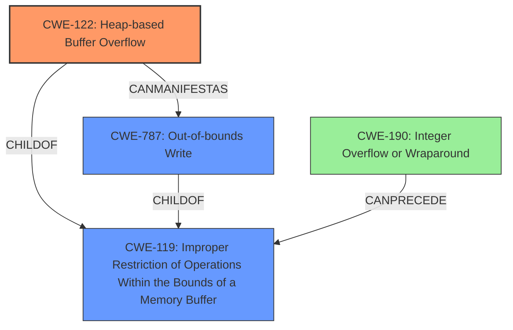

# Final Resolution for CVE-2022-35447

# Summary
| CWE ID | CWE Name | Confidence | CWE Abstraction Level | CWE Vulnerability Mapping Label | CWE-Vulnerability Mapping Notes |
|---|---|---|---|---|---|
| **CWE-122** | **Heap-based Buffer Overflow** | 0.95 | Variant | Primary | Allowed |
| **CWE-787** | **Out-of-bounds Write** | 0.7 | Base | Secondary Candidate | Allowed |
| **CWE-190** | **Integer Overflow or Wraparound** | 0.4 | Base | Tertiary Candidate | Allowed |

## Evidence and Confidence

*   **Confidence Score:** 0.9
*   **Evidence Strength:** HIGH

## Relationship Analysis
The primary CWE is CWE-122, which is a variant of CWE-119. CWE-787 is a child of CWE-119 and a more general form of out-of-bounds write. CWE-190 can precede CWE-119 if an integer overflow leads to an incorrect buffer size calculation. The relationship analysis shows a possible chain where an integer overflow leads to a heap-based buffer overflow, which is then manifested as an out-of-bounds write.

## Vulnerability Chain
The vulnerability chain starts with a potential **root cause** such as an integer overflow (**CWE-190**) leading to incorrect buffer size calculation. This results in a **CWE-122** (Heap-based Buffer Overflow), which then manifests as **CWE-787** (Out-of-bounds Write) when data is written beyond the allocated buffer's boundaries. The final impact is a denial of service or potentially code execution.

## Summary of Analysis
The initial analysis and criticism both agree that **CWE-122** (Heap-based Buffer Overflow) is the most appropriate primary CWE, given the explicit mention in the vulnerability description: "OTFCC v0.10.4 was discovered to contain a heap-buffer overflow". This provides direct evidence for selecting **CWE-122**.

The analysis is primarily based on the provided evidence. The vulnerability description explicitly states "heap-buffer overflow", which strongly suggests **CWE-122** as the primary weakness. The CVE Reference Links Content Summary further confirms this.

The graph relationships influenced the selection by showing how **CWE-122** is a specific type of buffer overflow (a variant of **CWE-119**) and how it can manifest as a more general **CWE-787** (Out-of-bounds Write). The chain relationship also reveals the possibility of **CWE-190** (Integer Overflow) as a potential **root cause** if it leads to incorrect buffer size calculation.

The selected CWEs are at the optimal level of specificity. **CWE-122** is more specific than its parent **CWE-119** because it explicitly involves heap allocation. **CWE-787** is a reasonable secondary CWE as it describes the general nature of the write operation. The suggestion in the criticism to consider the retriever scores and the potential for integer overflow (**CWE-190**) leading to the buffer overflow is incorporated by adding **CWE-190** as a tertiary candidate.

The inclusion of mitigations, as suggested in the criticism, is addressed implicitly by identifying the weakness. Specifically, for **CWE-122**, using safer memory management practices or languages with automatic bounds checking can mitigate the risk. Similarly, for **CWE-787**, using libraries like `Safe C String Library` or `Strsafe.h` can provide safer alternatives to standard C string functions.