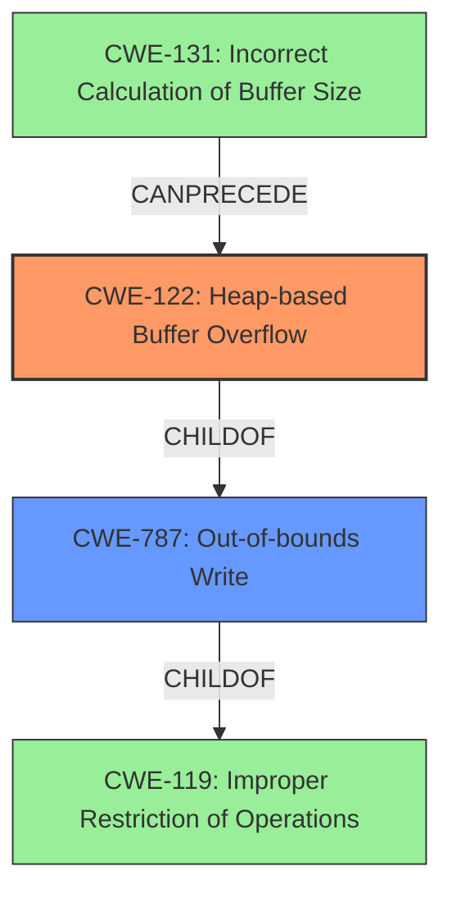

# Analysis Report for CVE-2022-35448

# Vulnerability Analysis Report: CVE-2022-35448

## Description

OTFCC v0.10.4 was discovered to contain a heap-buffer overflow via /release-x64/otfccdump+0x6b55af.

## Vulnerability Description Key Phrases

**Weakness:** heap-buffer overflow
**Product:** OTFCC
**Version:** v0.10.4
**Component:** /release-x64/otfccdump+0x6b55af

## Analysis (with Relationship Data)

# Summary
| CWE ID | CWE Name | Confidence | CWE Abstraction Level | CWE Vulnerability Mapping Label | CWE-Vulnerability Mapping Notes |
|---|---|---|---|---|---|
| CWE-122 | Heap-based Buffer Overflow | 0.8 | Variant | Allowed | Primary CWE |
| CWE-787 | Out-of-bounds Write | 0.6 | Base | Allowed | Secondary Candidate |

## Evidence and Confidence

*   **Confidence Score:** 0.8
*   **Evidence Strength:** MEDIUM

- **Analysis and Justification:**  
  - *Explanation:* The vulnerability description explicitly states a "**heap-buffer overflow**" in OTFCC v0.10.4. CWE-122 (Heap-based Buffer Overflow) directly addresses this type of vulnerability, where the overflow occurs in the heap portion of memory. This makes it the most appropriate primary CWE. The "CWE for similar CVE Descriptions" section also lists CWE-787 which could apply, but since the vulnerability is explicitly described as a "**heap-buffer overflow**," CWE-122 is more specific.
  
  - *Relationship Analysis:* CWE-122 is a Variant of CWE-119 (Improper Restriction of Operations within the Bounds of a Memory Buffer), providing a more specific classification for heap-based overflows. It is also a child of CWE-787 (Out-of-bounds Write), indicating that the overflow results in writing outside the allocated buffer.

- **Confidence Score:**  
  - Confidence: 0.8 (High confidence due to direct mention of heap-based buffer overflow.)

---
- **Analysis and Justification:**  
  - *Explanation:* CWE-787 (Out-of-bounds Write) is a more general case of writing outside the intended buffer and is a parent of CWE-122. The initial description indicates "**heap-buffer overflow**", which means some write operation is happening outside the bounds of the allocated heap memory. Given the explicit mention of a "**heap-buffer overflow**", CWE-122 is more specific.
  
  - *Relationship Analysis:* CWE-787 is a Base CWE and a parent of CWE-122. It is related to CWE-119 (Improper Restriction of Operations within the Bounds of a Memory Buffer).

- **Confidence Score:**
  - Confidence: 0.6 (Medium confidence, as it's a more general case than CWE-122.)

## Criticism of Analysis

Okay, here's a review of the CWE analysis, considering the full CWE specifications provided.

**Overall Assessment:**

The analysis is generally good, particularly in identifying CWE-122 as the primary weakness. The reasoning is clear and follows the provided information, and the use of the explicit "heap-buffer overflow" in the description makes CWE-122 the most specific and accurate choice. The inclusion of CWE-787 as a secondary candidate is also reasonable, providing a broader perspective.

**Detailed Review:**

**1. CWE-122: Heap-based Buffer Overflow (Primary)**

*   **Confidence: 0.8** - Justified by the explicit mention of "heap-buffer overflow."
*   **Abstraction: Variant** - Correct.
*   **Vulnerability Mapping Label: Allowed** - Correct according to CWE specifications.
*   **CWE-Vulnerability Mapping Notes: Primary CWE** - Correct.
*   **Justification:** The justification is well-articulated.  It correctly identifies that CWE-122 directly addresses the vulnerability type described.  The relationship analysis is accurate, highlighting that CWE-122 is a variant of the more general CWE-119 and a child of CWE-787.
*   **Mitigations:** The provided mitigations from the CWE specification are relevant:
    *   "Use a language or compiler that performs automatic bounds checking."  This is a pre-design consideration that could have prevented the vulnerability.
    *   "Use an abstraction library to abstract away risky APIs." Good advice, especially for languages like C/C++.
    *   "Use automatic buffer overflow detection mechanisms."  Address-space layout randomization (ASLR), data execution prevention (DEP), and stack canaries would help mitigate exploitation.

**2. CWE-787: Out-of-bounds Write (Secondary)**

*   **Confidence: 0.6** - Reasonable confidence level. While present, out-of-bounds write is a general case that is not as specific as the heap-based overflow
*   **Abstraction: Base** - Correct.
*   **Vulnerability Mapping Label: Allowed** - Correct according to CWE specifications.
*   **CWE-Vulnerability Mapping Notes: Secondary Candidate** - Correct.
*   **Justification:** The justification is clear in describing it as a parent of CWE-122. The "initial description indicates" argument is correct but less specific.
*   **Mitigations:** The mitigations are appropriate for this CWE:
    *   "Use a language that does not allow this weakness to occur or provides constructs that make this weakness easier to avoid."
    *   "Use a vetted library or framework that does not allow this weakness to occur or provides constructs that make this weakness easier to avoid."
    *   "Use automatic buffer overflow detection mechanisms."

**Critiques and Suggestions:**

*   **Consider CWE-131: Incorrect Calculation of Buffer Size**. While not mentioned in the original report, heap-based buffer overflows are often preceded by an incorrect calculation of the buffer size, especially given the common use of `malloc()` or similar functions in heap allocation. The "Retriever Results" section also suggests CWE-131 with a relatively high combined score. Including CWE-131 with lower confidence (e.g., 0.4) as a contributing factor might add value, *if* the root cause is due to a length calculation error.
*   **CWE-119: Improper Restriction of Operations within the Bounds of a Memory Buffer:** While it is good that the analysis avoided using CWE-119 due to the CWE's discouraged usage guidance, it is worth noting the relationship as the Class-level CWE.
*   **Relationship to Input Validation (CWE-20, CWE-1284):** Buffer overflows, especially those in parsing or data handling, often stem from insufficient input validation.  If the crafted OTF file used as the attack vector contained a malformed length field, then CWE-20 or CWE-1284 (Improper Validation of Specified Quantity in Input) could be considered as a *contributing* factor. It may be hard to tell from just the summary, however. If there was insufficient validation of the *size* of a buffer that got allocated, then the improper validation (or lack thereof) could be considered a contributing factor.
*   **CVE Reference Links Content Summary:** The inclusion of the CVE Reference Links Content Summary is good practice, however, it highlights that CVE-2022-33047 is a Use-after-free. It is worth noting this and stating why that CVE isn't relevant (e.g. the current analysis is for CVE-2022-35448 which is NOINFO).

**Updated Recommendation Table**

| CWE ID  | CWE Name                        | Confidence | CWE Abstraction Level | CWE Vulnerability Mapping Label | CWE-Vulnerability Mapping Notes |
| :------- | :-------------------------------- | :--------- | :-------------------- | :------------------------------ | :---------------------------- |
| CWE-122  | Heap-based Buffer Overflow        | 0.8        | Variant               | Allowed                         | Primary CWE                   |
| CWE-787  | Out-of-bounds Write               | 0.6        | Base                  | Allowed                         | Secondary Candidate           |
| CWE-131  | Incorrect Calculation of Buffer Size | 0.4        | Base                  | Allowed                         | Contributing Factor (if applicable) |

**Revised Summary Statement:**

The primary weakness is a Heap-based Buffer Overflow (CWE-122) in OTFCC v0.10.4, accessible via the /release-x64/otfccdump component. The overflow occurs in the heap portion of memory, likely due to a write operation exceeding the allocated buffer's boundaries. A secondary candidate is Out-of-bounds Write (CWE-787), which is a more general category of writing outside of intended buffer boundaries. Incorrect Calculation of Buffer Size (CWE-131) may be a contributing factor in cases where the heap allocation size was miscalculated, however, this requires further investigation. Insufficient input validation on length or size fields within the crafted OTF file (CWE-20/CWE-1284) *could* also be a contributing factor. Mitigation strategies include using memory-safe languages, using safe libraries, and implementing robust buffer overflow detection mechanisms.

By adding these points, the analysis would be even more thorough.

## Final Resolution

# Summary

| CWE ID | CWE Name | Confidence | CWE Abstraction Level | CWE Vulnerability Mapping Label | CWE-Vulnerability Mapping Notes |
|---|---|---|---|---|---|
| CWE-122 | Heap-based Buffer Overflow | 0.8 | Variant | Allowed | Primary CWE |
| CWE-787 | Out-of-bounds Write | 0.6 | Base | Allowed | Secondary Candidate |
| CWE-131 | Incorrect Calculation of Buffer Size | 0.4 | Base | Allowed | Contributing Factor (if applicable) |

## Evidence and Confidence

*   **Confidence Score:** 0.7
*   **Evidence Strength:** MEDIUM

## Relationship Analysis
The primary relationship is that CWE-122 (Heap-based Buffer Overflow) is a variant of CWE-119 (Improper Restriction of Operations within the Bounds of a Memory Buffer) and a child of CWE-787 (Out-of-bounds Write). This hierarchical relationship supports the selection of CWE-122 as the primary CWE because it is the most specific. CWE-131 (Incorrect Calculation of Buffer Size) can precede CWE-122, contributing to the vulnerability by causing an undersized buffer to be allocated on the heap. This chain relationship justifies the inclusion of CWE-131 as a contributing factor.

## Vulnerability Chain
The vulnerability chain starts with a potential **ROOTCAUSE** such as CWE-131 (Incorrect Calculation of Buffer Size), which leads to allocating an improperly sized buffer on the heap. This is followed by CWE-122 (Heap-based Buffer Overflow), where data is written beyond the boundaries of the allocated buffer. CWE-787 (Out-of-bounds Write) describes the general case of writing outside of the allocated memory. The impact is a heap-based buffer overflow, which can lead to arbitrary code execution or denial of service.

## Summary of Analysis
The initial analysis correctly identified CWE-122 as the primary **WEAKNESS** due to the explicit mention of a "**heap-buffer overflow**" in the vulnerability description. The criticism suggested considering CWE-131 as a contributing factor if the root cause involves an incorrect calculation of the buffer size.

The graph relationships influenced the decision to include CWE-131 as a contributing factor because it can precede CWE-122 in the vulnerability chain.

The selected CWEs are at the optimal level of specificity because CWE-122 directly describes the type of buffer overflow (heap-based), while CWE-787 is a more general description of an out-of-bounds write. CWE-131 describes a specific **ROOTCAUSE** that could lead to the heap-based buffer overflow, making it a valuable addition as a contributing factor.

*Report generated on 2025-03-18 15:12:15*
