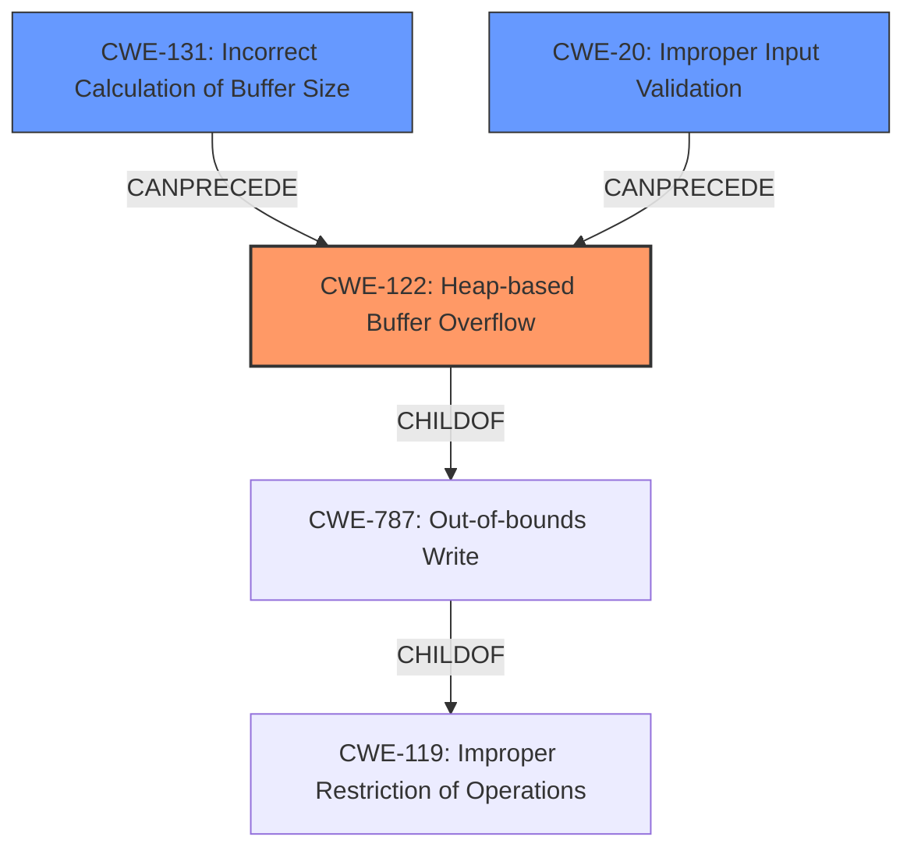

# Final Resolution for CVE-2022-35454

# Summary
| CWE ID | CWE Name | Confidence | CWE Abstraction Level | CWE Vulnerability Mapping Label | CWE-Vulnerability Mapping Notes |
|---|---|---|---|---|---|
| CWE-122 | Heap-based Buffer Overflow | 0.9 | Variant | Allowed | Primary CWE |
| CWE-131 | Incorrect Calculation of Buffer Size | 0.6 | Base | Allowed | Secondary Candidate |
| CWE-20 | Improper Input Validation | 0.5 | Class | Allowed-with-Review | Secondary Candidate |

## Evidence and Confidence

*   **Confidence Score:** 0.8
*   **Evidence Strength:** MEDIUM

## Relationship Analysis
The primary relationship influencing the decision is the parent-child relationship between CWE-787 (**Out-of-bounds Write**) and CWE-122 (**Heap-based Buffer Overflow**). CWE-122 is a variant of CWE-119 (**Improper Restriction of Operations within the Bounds of a Memory Buffer**). While CWE-787 is a valid parent, CWE-122 is more specific given the "heap" context. The relationship between CWE-131 (**Incorrect Calculation of Buffer Size**) and CWE-122 is that a flawed size calculation can precede a heap overflow. CWE-20 (**Improper Input Validation**) is considered because the size of the heap allocation could be derived from untrusted input.

## Vulnerability Chain
The vulnerability chain starts with a potential **ROOTCAUSE** such as **CWE-131** (**Incorrect Calculation of Buffer Size**) or **CWE-20** (**Improper Input Validation**). This leads to an undersized heap allocation, which is then exploited via a heap-based buffer overflow (**CWE-122**). The impact is memory corruption, potentially leading to code execution.

## Summary of Analysis
The initial analysis correctly identified **CWE-122** (**Heap-based Buffer Overflow**) as the primary **weakness**, which is directly supported by the vulnerability description: "OTFCC v0.10.4 was discovered to contain a heap-buffer overflow". However, it is important to consider the potential root causes. The criticism suggested investigating **CWE-131** (**Incorrect Calculation of Buffer Size**) and **CWE-20** (**Improper Input Validation**), which could lead to the buffer overflow.

I agree with the criticism that exploring potential root causes would strengthen the analysis. I am adding **CWE-131** and **CWE-20** as secondary CWEs. Although there's no explicit evidence in the description, these are common causes for buffer overflows and their inclusion enhances the analysis.

The final classification reflects the optimal level of specificity. **CWE-122** accurately describes the direct cause (heap-based overflow), while **CWE-131** and **CWE-20** capture potential root causes.