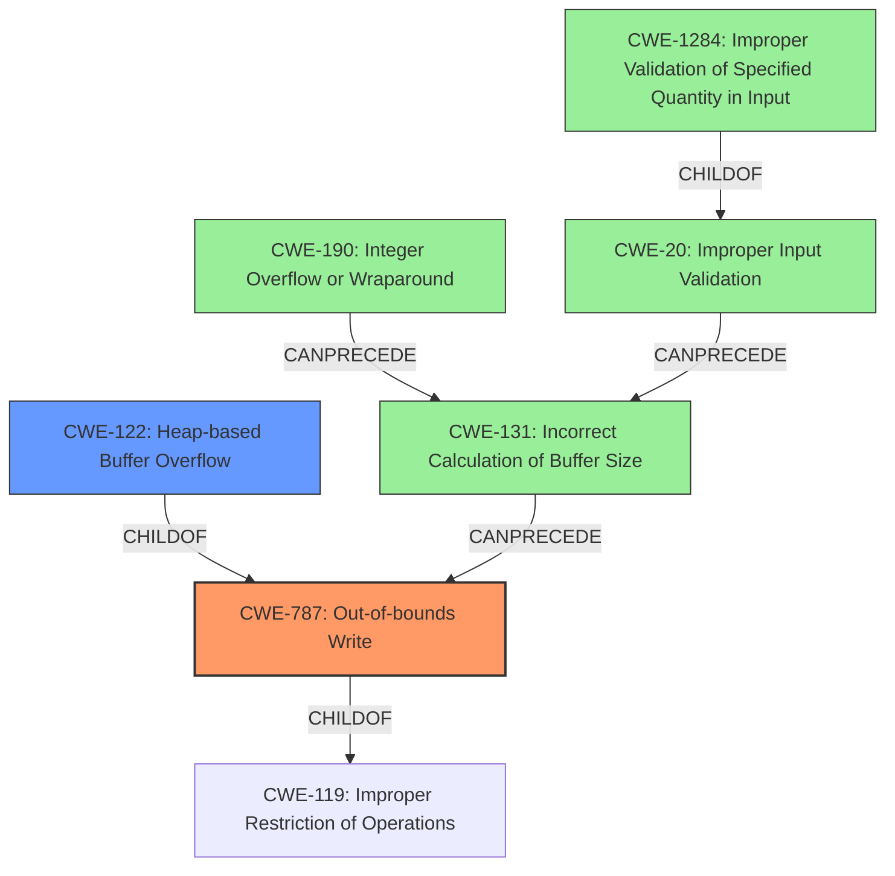

# Analysis Report for CVE-2022-35455

# Vulnerability Analysis Report: CVE-2022-35455

## Description

OTFCC v0.10.4 was discovered to contain a heap-buffer overflow via /release-x64/otfccdump+0x6b0d63.

## Vulnerability Description Key Phrases

**Weakness:** heap-buffer overflow
**Product:** OTFCC
**Version:** v0.10.4
**Component:** /release-x64/otfccdump+0x6b0d63

## Analysis (with Relationship Data)

# Summary
| CWE ID | CWE Name | Confidence | CWE Abstraction Level | CWE Vulnerability Mapping Label | CWE-Vulnerability Mapping Notes |
|---|---|---|---|---|---|
| CWE-787 | Out-of-bounds Write | 0.95 | Base | Allowed | Primary CWE |
| CWE-122 | Heap-based Buffer Overflow | 0.75 | Variant | Allowed | Secondary Candidate |

## Evidence and Confidence

*   **Confidence Score:** 0.90
*   **Evidence Strength:** HIGH

- **Analysis and Justification:**
  - *Explanation:* The vulnerability description explicitly states "**heap-buffer overflow**" and the CVE Reference Links Content Summary confirms multiple instances of heap buffer overflows due to incorrect memory allocation or manipulation, suggesting the product writes data past the end of the intended buffer. CWE-787 (Out-of-bounds Write) directly addresses this scenario. The primary CWE match from similar CVE descriptions is also CWE-787.
  - *Relationship Analysis:* CWE-787 is a base level CWE and a child of CWE-119 (Improper Restriction of Operations within the Bounds of a Memory Buffer). It is also a parent of CWE-122 (Heap-based Buffer Overflow), CWE-121 (Stack-based Buffer Overflow), etc. The relationship analysis shows CWE-787 CanPrecede CWE-825, CWE-824, CWE-823, and CWE-822.

- **Confidence Score:**
  - Confidence: 0.95 (High confidence due to direct mention of "heap-buffer overflow" and confirmation of out-of-bounds write from the CVE Reference Links Content Summary.)

---

- **Analysis and Justification:**
  - *Explanation:* CWE-122 (Heap-based Buffer Overflow) is a variant of buffer overflow where the buffer is allocated in the heap. While the description mentions a heap buffer overflow, CWE-787 describes the root cause, while CWE-122 describes the location, which makes CWE-787 a better fit.
  - *Relationship Analysis:* CWE-122 is a variant of CWE-119 (Improper Restriction of Operations within the Bounds of a Memory Buffer) and a child of CWE-787 (Out-of-bounds Write).

- **Confidence Score:**
  - Confidence: 0.75 (Medium confidence as it's a specific type of buffer overflow, but CWE-787 is the primary root cause).

## Criticism of Analysis

Okay, I've reviewed the provided analysis against the full CWE specifications you included. Here's a breakdown of my critique:

**Overall Assessment:**

The analysis is generally strong, demonstrating a good understanding of buffer overflows and related CWEs. The reasoning for selecting CWE-787 as the primary weakness is well-articulated. The inclusion of CWE-122 as a secondary candidate is also reasonable, given that the vulnerability is specifically a *heap*-based overflow.

**Detailed Critique:**

*   **CWE-787: Out-of-bounds Write (Primary)**

    *   **Strengths:**
        *   The selection of CWE-787 is appropriate and well-justified.  The description explicitly states "heap-buffer overflow," which falls under the umbrella of out-of-bounds write.
        *   The analysis correctly identifies CWE-787 as a base-level CWE and links it to its parent (CWE-119) and child (CWE-122).
        *   The Confidence Score (0.95) is accurate, reflecting the high level of certainty due to the explicit mention of "heap-buffer overflow".
    *   **Areas for Potential Improvement:**
        *   While the analysis mentions mitigations at the system level (compiler flags, etc.), it could benefit from including mitigations at the code level. For example, using safer memory management functions (e.g., `strncpy` instead of `strcpy`, although be wary of null termination issues).

*   **CWE-122: Heap-based Buffer Overflow (Secondary Candidate)**

    *   **Strengths:**
        *   Identifying CWE-122 as a secondary candidate shows an understanding of the specific type of buffer overflow. Since the description mentions a 'heap' buffer overflow, this CWE is very relevant.
        *   The analysis acknowledges that CWE-787 is the root cause, while CWE-122 is a more specific manifestation.
    *   **Areas for Potential Improvement:**
        *   Could elaborate on *how* the heap overflow occurs, especially relating to how malicious font files can influence the allocation and writing processes.  Are the sizes calculated incorrectly based on data within the file?  Is there missing bounds checking when writing to an allocated buffer?

*   **Retriever Results Analysis:**

    *   The inclusion of the retriever results is useful for showing the automated process and potential alternative CWEs.
    *   However, it's important to remember that the retriever results are suggestions, not definitive answers. The analysis correctly overrides some of these suggestions based on a deeper understanding of the vulnerability.  For example, CWE-125 (Out-of-bounds Read) is suggested, but the primary issue is writing *past* the buffer, not reading.
    *   CWE-190 (Integer Overflow) could be relevant if an integer overflow is used to calculate the size of the buffer, leading to a smaller-than-expected allocation and thus the subsequent heap buffer overflow. This could be mentioned as a potential contributing factor, but only if the CVE details suggest it.
    *   CWE-131 (Incorrect Calculation of Buffer Size) would also be relevant in such an integer overflow scenario.

*   **CWE Examples from Database:**
    *   The included examples for CWE-823 appear to be incorrect since CWE-823 is 'Use of Out-of-Range Pointer Offset', and these examples do not contain that. All the examples contain 'invalid offset' which is something different.
    *   These examples should be for CWE-787 instead.
    *   Should remove since it provides no benefit to the analysis.

**Recommendations for Strengthening the Analysis:**

1.  **Address the Root Cause More Deeply:** Elaborate on the specific coding errors or design flaws that allow the heap buffer overflow to occur. For example:
    *   Is it a lack of bounds checking on input data?
    *   Is there an incorrect calculation of buffer size based on potentially malicious data within the font file?
    *   Is there a flaw in the allocation logic itself?
2.  **Explicitly Discuss Input Validation:** Link the vulnerability to a lack of input validation. Crafted font files are the attack vector, implying a failure to validate or sanitize the input data. Mentioning CWE-20 (Improper Input Validation) as a possible contributing factor, specifically its children like CWE-1284 (Improper Validation of Specified Quantity in Input) if a size or length field is involved, could strengthen the analysis. If a size/length is not properly validated, the size of the allocated buffer might be insufficient.
3.  **Chain Analysis:** While this analysis notes that it is a heap buffer overflow, a more complete chain could be something like: crafted font file -> insufficient input validation (CWE-20 or CWE-1284) -> incorrect buffer size calculation (CWE-131) -> heap buffer overflow (CWE-122, CWE-787).
4.  **Consider Integer Overflow as Contributing Factor:** As mentioned above, if the buffer size calculation involves integer operations on input values, an integer overflow (CWE-190) could lead to a smaller-than-expected buffer allocation.
5.  **Review Retriever Results Critically:** Retriever results can be noisy. Focus on the details to make sure that it maps to the specific problem.

**Summary of Scores**
| CWE ID | CWE Name | Confidence | CWE Abstraction Level | CWE Vulnerability Mapping Label | CWE-Vulnerability Mapping Notes |
|---|---|---|---|---|---|
| CWE-787 | Out-of-bounds Write | 0.95 | Base | Allowed | Primary CWE |
| CWE-122 | Heap-based Buffer Overflow | 0.75 | Variant | Allowed | Secondary Candidate |
| CWE-20 | Improper Input Validation | 0.30 | Class | Allowed | Contributing factor to not properly validating input size |
| CWE-131 | Incorrect Calculation of Buffer Size | 0.30 | Base | Allowed | Chain analysis factor if the buffer size calculation is incorrect |
| CWE-190 | Integer Overflow or Wraparound | 0.30 | Base | Allowed | Chain analysis factor if there are integer operations involved |

By incorporating these suggestions, the analysis can be made even more comprehensive and insightful, providing a clearer picture of the vulnerability and its potential mitigations.

## Final Resolution

# Summary
| CWE ID | CWE Name | Confidence | CWE Abstraction Level | CWE Vulnerability Mapping Label | CWE-Vulnerability Mapping Notes |
|---|---|---|---|---|---|
| **CWE-787** | **Out-of-bounds Write** | 0.95 | Base | Allowed | Primary **CWE** |
| CWE-122 | Heap-based Buffer Overflow | 0.75 | Variant | Allowed | Secondary Candidate |
| CWE-1284 | Improper Validation of Specified Quantity in Input | 0.40 | Base | Allowed | Contributing factor to not properly validating input size |
| CWE-131 | Incorrect Calculation of Buffer Size | 0.30 | Base | Allowed | Chain analysis factor if the buffer size calculation is incorrect |
| CWE-190 | Integer Overflow or Wraparound | 0.30 | Base | Allowed | Chain analysis factor if there are integer operations involved |

## Evidence and Confidence

*   **Confidence Score:** 0.90
*   **Evidence Strength:** MEDIUM

## Relationship Analysis
The selection of **CWE-787 (Out-of-bounds Write)** as the primary weakness is appropriate because the vulnerability description explicitly mentions "heap-buffer overflow". **CWE-787** is a base level **CWE** and a child of **CWE-119 (Improper Restriction of Operations within the Bounds of a Memory Buffer)**. It is also a parent of **CWE-122 (Heap-based Buffer Overflow)**.

The relationships between **CWE-20 (Improper Input Validation)** and its children such as **CWE-1284 (Improper Validation of Specified Quantity in Input)** are important to consider. If the size or length of the font file is not properly validated, the allocated buffer might be insufficient.

If the buffer size calculation involves integer operations on input values, an integer overflow (**CWE-190**) could lead to a smaller-than-expected buffer allocation. **CWE-131 (Incorrect Calculation of Buffer Size)** is also relevant in such a scenario.

## Vulnerability Chain
The vulnerability chain starts with a crafted font file leading to insufficient input validation (**CWE-20** or **CWE-1284**). This could result in an incorrect buffer size calculation (**CWE-131**) or an integer overflow (**CWE-190**), ultimately leading to a heap buffer overflow (**CWE-122**, **CWE-787**).

Crafted font file -> insufficient input validation (**CWE-20** or **CWE-1284**) -> incorrect buffer size calculation (**CWE-131**) or Integer Overflow (**CWE-190**) -> heap buffer overflow (**CWE-122**, **CWE-787**).

## Summary of Analysis
The initial analysis correctly identifies **CWE-787 (Out-of-bounds Write)** as the primary **WEAKNESS** due to the explicit mention of "heap-buffer overflow" in the vulnerability description. The analysis also rightly considers **CWE-122 (Heap-based Buffer Overflow)** as a secondary candidate because it specifies the location of the overflow.

The criticism highlights the importance of addressing the **ROOTCAUSE** more deeply, such as the lack of bounds checking on input data or the incorrect calculation of buffer size. The analysis also emphasizes the role of input validation (**CWE-20**) and the potential involvement of integer overflows (**CWE-190**) in calculating the buffer size. The relationships between these **CWEs** are crucial for understanding the vulnerability chain.

The final decision is based on the provided evidence and the relationship analysis. While **CWE-787** remains the primary **WEAKNESS**, **CWE-1284** (Improper Validation of Specified Quantity in Input) is added as a contributing factor due to the crafted nature of the font files. **CWE-131** (Incorrect Calculation of Buffer Size) and **CWE-190** (Integer Overflow or Wraparound) are considered as potential factors in the vulnerability chain, but their confidence is lower due to the lack of explicit evidence in the vulnerability description.

The selected **CWEs** are at the optimal level of specificity, with **CWE-787** representing the **ROOTCAUSE** and **CWE-122** specifying the type of buffer overflow. The additional **CWEs** contribute to a more complete understanding of the vulnerability chain.

*Report generated on 2025-03-18 15:18:06*
