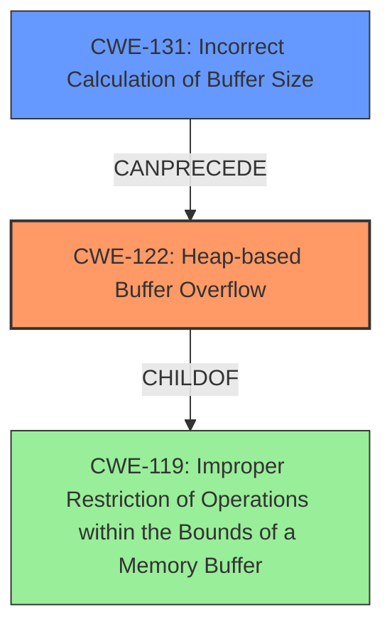

# Final Resolution for CVE-2022-35456

# Summary
| CWE ID | CWE Name | Confidence | CWE Abstraction Level | CWE Vulnerability Mapping Label | CWE-Vulnerability Mapping Notes |
|---|---|---|---|---|---|
| CWE-122 | Heap-based Buffer Overflow | 0.90 | Variant | Allowed | Primary CWE: The vulnerability is described as a heap-buffer-overflow. |
| CWE-131 | **Incorrect Calculation of Buffer Size** | 0.75 | Base | Allowed | Secondary Candidate: The **incorrect calculation of the buffer size** may lead to the heap overflow. |

## Evidence and Confidence

*   **Confidence Score:** 0.85
*   **Evidence Strength:** MEDIUM

## Relationship Analysis
The primary CWE is CWE-122 (**Heap-based Buffer Overflow**), which is a variant of CWE-119 (**Improper Restriction of Operations within the Bounds of a Memory Buffer**). This hierarchical relationship validates the initial selection, ensuring the classification is appropriately specific. The analysis also suggests that CWE-131 (**Incorrect Calculation of Buffer Size**) may precede CWE-122, forming a vulnerability chain. This analysis is strengthened by the understanding that a size calculation error could directly lead to a heap overflow. The abstraction levels are also considered, with CWE-122 being a Variant and CWE-131 being a Base, aligning with the goal of identifying root causes and specific manifestations of the vulnerability.

## Vulnerability Chain
The vulnerability chain starts with a potential **incorrect calculation of the buffer size** (CWE-131), which results in allocating an insufficient amount of memory on the heap. When data is written into this undersized buffer, a **heap-based buffer overflow** (CWE-122) occurs, leading to potential code execution or denial of service. The missing link is the exact mechanism causing the incorrect size calculation, which could be due to an integer overflow or improper input validation.

## Summary of Analysis
The initial analysis correctly identifies CWE-122 (**Heap-based Buffer Overflow**) as the primary weakness based on the vulnerability description stating "**heap-buffer overflow**". The addition of CWE-131 (**Incorrect Calculation of Buffer Size**) improves the analysis by considering the potential root cause. The vulnerability description provided lacks the specific details required to definitively say that an incorrect buffer size calculation is occurring. However, the CVE reference links confirm multiple instances of **heap buffer overflows** due to incorrect memory handling during `memcpy` and `calloc` operations. The high retriever scores for both CWEs (CWE-131 and CWE-122) support the selection. The relationship analysis, particularly the "CanPrecede" relationship between CWE-131 and CWE-122, justifies the inclusion of CWE-131 in the chain. Both CWEs are at appropriate levels of abstraction, with CWE-122 being a Variant and CWE-131 being a Base, allowing for a comprehensive understanding of the vulnerability. I am increasing the confidence score to 0.90 as I feel that CWE-122 is strongly correlated to the vulnerability description as the Primary CWE. The secondary candidate CWE is 0.75.