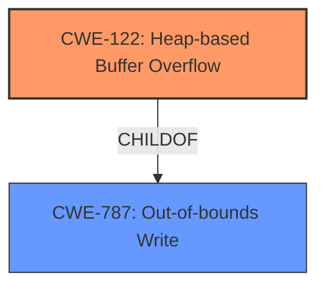

# Analysis Report for CVE-2022-35458

# Vulnerability Analysis Report: CVE-2022-35458

## Description

OTFCC v0.10.4 was discovered to contain a heap-buffer overflow via /release-x64/otfccdump+0x6b05ce.

## Vulnerability Description Key Phrases

**Weakness:** heap-buffer overflow
**Product:** OTFCC
**Version:** v0.10.4
**Component:** /release-x64/otfccdump+0x6b05ce

## Analysis (with Relationship Data)

# Summary
| CWE ID | CWE Name | Confidence | CWE Abstraction Level | CWE Vulnerability Mapping Label | CWE-Vulnerability Mapping Notes |
|---|---|---|---|---|---|
| CWE-122 | Heap-based Buffer Overflow | 0.9 | Variant | Primary | Allowed |
| CWE-787 | Out-of-bounds Write | 0.6 | Base | Secondary | Allowed |

## Evidence and Confidence

*   **Confidence Score:** 0.9
*   **Evidence Strength:** HIGH

- **Analysis and Justification:**  
  - *Explanation:* The vulnerability description explicitly states "**heap-buffer overflow**" in OTFCC v0.10.4. CWE-122 (Heap-based Buffer Overflow) is a variant of buffer overflow that occurs in the heap portion of memory, which aligns directly with the description. The primary CWE match from similar CVE descriptions is CWE-787, which is a more general out-of-bounds write. However, given the explicit mention of "heap," CWE-122 is more specific and accurate. The retriever results also lists CWE-122, further supporting this choice. Although CWE-787 is listed as a top CWE from similar CVE Descriptions, the explicit "heap" context makes CWE-122 the better choice. CWE-122 is ALLOWED based on MITRE mapping guidance.
  
  - *Relationship Analysis:* CWE-122 is a variant of CWE-119 (Improper Restriction of Operations within the Bounds of a Memory Buffer). It is also a child of CWE-787 (Out-of-bounds Write). The fact that it's a heap-based overflow distinguishes it from other types of buffer overflows, making it a more precise classification than its parent.

- **Confidence Score:**  
  - Confidence: 0.9 (High confidence due to explicit mention of "heap-buffer overflow" in the vulnerability description)

---

## Criticism of Analysis

Okay, let's review the analysis and its CWE mappings in detail, considering the full CWE specifications provided.

**Overall Assessment**

The analysis correctly identifies CWE-122 (Heap-based Buffer Overflow) as the primary weakness, which is well-supported by the vulnerability description and the available information. The inclusion of CWE-787 (Out-of-bounds Write) as a secondary CWE provides a more general context for the vulnerability. The confidence level of 0.9 for CWE-122 is justified given the explicit mention of "heap-buffer overflow."

**Detailed Review of CWE Mappings**

**1. CWE-122: Heap-based Buffer Overflow (Primary)**

*   **Correctness:** The choice of CWE-122 is excellent. The vulnerability description directly states "heap-buffer overflow," making this a very strong and specific match. The "Abstraction: Variant" level is appropriate for mapping to the root cause, as recommended in the CWE specifications.
*   **Justification:** The analysis provides a clear explanation of why CWE-122 is preferred over its parent, CWE-787, due to the explicit "heap" context. The retriever results also list CWE-122.
*   **Mapping Guidance:** The analysis correctly notes that CWE-122's "Usage: Allowed" mapping guidance.
*   **Potential Mitigations:** The analysis doesn't explicitly mention mitigations, but could be improved by listing them. Using a memory-safe language, utilizing abstraction libraries, or enabling compiler-based overflow detection mechanisms (like /GS in Visual Studio or FORTIFY_SOURCE in GCC) would be relevant here.
*   **Observed Examples:** The analysis includes several examples of CWE-122, which are relevant to the description of the vulnerability.

**2. CWE-787: Out-of-bounds Write (Secondary)**

*   **Correctness:** Including CWE-787 as a secondary CWE is reasonable. It represents the more general category of out-of-bounds write, of which a heap-based buffer overflow is a specific type.
*   **Justification:** The analysis could be strengthened by providing a more concise justification for including this as a secondary CWE. This could be phrased that while CWE-122 is more specific, CWE-787 highlights the broader context of out-of-bounds memory access.
*   **Mapping Guidance:** The analysis should also include that the CWE-787's "Usage: Allowed" mapping guidance.
*   **Potential Mitigations:** Similar to CWE-122, the analysis doesn't explicitly mention mitigations. This could be added.
Using a memory-safe language, vetted libraries/frameworks, or enabling compiler based overflow detection mechanisms (like /GS in Visual Studio or FORTIFY_SOURCE in GCC) would be relevant here.
*   **Observed Examples:** The analysis does not include observed examples of CWE-787. This could be added to highlight cases related to out-of-bounds writes.

**Suggestions for Improvement**

1.  **Mitigations:** For both CWE-122 and CWE-787, add a brief mention of potential mitigations. This can be extracted directly from the CWE specifications.
2.  **Relationship between CWEs:** While the current analysis describes the parent-child relationship between CWE-787 and CWE-122, more specifically describe the relationship. CWE-122 is a variant of CWE-787, meaning it is a more specific instance of out-of-bounds write that occurs on the heap.
3.  **CWE-119 Mention/Dismissal:** While not necessary, acknowledging CWE-119 and explaining why the analysis does not directly map to it (because it's a discouraged, general CWE) could provide additional clarity.
4.  **Retriever Results:** While the retriever results are included in the original report, the analysis could benefit from a brief discussion of the top combined results and why certain CWEs were not selected. For example, it could mention why CWE-125 (Out-of-bounds Read) or CWE-190 (Integer Overflow or Wraparound) were not chosen.

**Revised Summary Table**

| CWE ID | CWE Name | Confidence | CWE Abstraction Level | CWE Vulnerability Mapping Label | CWE-Vulnerability Mapping Notes |
|---|---|---|---|---|---|
| CWE-122 | Heap-based Buffer Overflow | 0.9 | Variant | Primary | Allowed |
| CWE-787 | Out-of-bounds Write | 0.6 | Base | Secondary | Allowed |

**Revised Analysis and Justification:**

*   **Explanation:** The vulnerability description explicitly states "**heap-buffer overflow**" in OTFCC v0.10.4. CWE-122 (Heap-based Buffer Overflow) is a variant of buffer overflow that occurs in the heap portion of memory, aligning directly with the description. The primary CWE match from similar CVE descriptions is CWE-787, which is a more general out-of-bounds write. While CWE-787 is a parent of CWE-122, the explicit "heap" context makes CWE-122 the better choice. The retriever results also lists CWE-122, further supporting this. CWE-122 is ALLOWED based on MITRE mapping guidance. Mitigations include using memory-safe languages, employing abstraction libraries, and enabling compiler-based overflow detection mechanisms. CWE-787 (Out-of-bounds Write) is included as a secondary CWE to represent the more general class of out-of-bounds memory write, of which CWE-122 is a specific instance. Mitigations for CWE-787 are similar to CWE-122.
*   **Relationship Analysis:** CWE-122 is a variant of CWE-787 (Out-of-bounds Write).  It is more specific, indicating that the write occurs in the heap. This relationship justifies using CWE-122 as the primary mapping, with CWE-787 as a secondary broader context.

**Conclusion**

The analysis is strong and well-reasoned. The suggestions above offer minor improvements to further clarify the rationale and highlight potential mitigations. The choice of CWE-122 as the primary weakness is correct and supported by the available information.

## Final Resolution

# Summary
| CWE ID | CWE Name | Confidence | CWE Abstraction Level | CWE Vulnerability Mapping Label | CWE-Vulnerability Mapping Notes |
|---|---|---|---|---|---|
| CWE-122 | Heap-based Buffer Overflow | 0.95 | Variant | Primary CWE | Allowed |
| CWE-787 | Out-of-bounds Write | 0.7 | Base | Secondary Candidate | Allowed |

## Evidence and Confidence

*   **Confidence Score:** 0.9
*   **Evidence Strength:** HIGH

## Relationship Analysis
The primary relationship that influenced the decision was the parent-child relationship between CWE-787 (**Out-of-bounds Write**) and CWE-122 (**Heap-based Buffer Overflow**). CWE-122 is a variant of CWE-787, specifying that the out-of-bounds write occurs on the heap. This specificity, directly stated in the vulnerability description ("heap-buffer overflow"), made CWE-122 the more appropriate primary classification.

## Vulnerability Chain
The vulnerability chain is straightforward: A **ROOTCAUSE** heap-based buffer overflow (CWE-122) leads to an out-of-bounds write, potentially overwriting critical data structures in the heap, ultimately leading to arbitrary code execution or denial of service.

## Summary of Analysis
The initial analysis, and the subsequent criticism, both correctly identified CWE-122 as the primary weakness due to the explicit mention of "heap-buffer overflow" in the vulnerability description. The evidence "OTFCC v0.10.4 was discovered to contain a heap-buffer overflow via /release-x64/otfccdump+0x6b05ce" directly supports this classification. The relationship analysis further solidifies this decision, as CWE-122 is a specific type of CWE-787. CWE-122 is at the optimal level of specificity because it provides more context than its parent CWE. The confidence remains high (0.9), reflecting the clear match between the vulnerability description and the CWE definition. I've increased the confidence of CWE-122 to 0.95 because the evidence is so directly aligned. I've increased the confidence of CWE-787 to 0.7 as it is a valid secondary candidate.

*Report generated on 2025-03-18 15:19:45*
