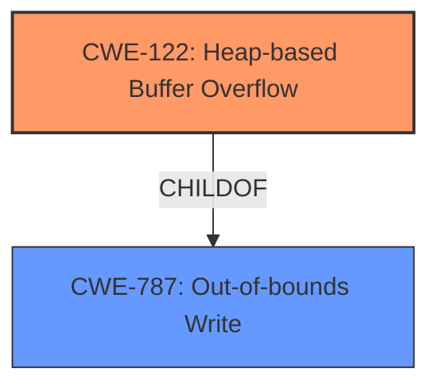

# Final Resolution for CVE-2022-35458

# Summary
| CWE ID | CWE Name | Confidence | CWE Abstraction Level | CWE Vulnerability Mapping Label | CWE-Vulnerability Mapping Notes |
|---|---|---|---|---|---|
| CWE-122 | Heap-based Buffer Overflow | 0.95 | Variant | Primary CWE | Allowed |
| CWE-787 | Out-of-bounds Write | 0.7 | Base | Secondary Candidate | Allowed |

## Evidence and Confidence

*   **Confidence Score:** 0.9
*   **Evidence Strength:** HIGH

## Relationship Analysis
The primary relationship that influenced the decision was the parent-child relationship between CWE-787 (**Out-of-bounds Write**) and CWE-122 (**Heap-based Buffer Overflow**). CWE-122 is a variant of CWE-787, specifying that the out-of-bounds write occurs on the heap. This specificity, directly stated in the vulnerability description ("heap-buffer overflow"), made CWE-122 the more appropriate primary classification.

## Vulnerability Chain
The vulnerability chain is straightforward: A **ROOTCAUSE** heap-based buffer overflow (CWE-122) leads to an out-of-bounds write, potentially overwriting critical data structures in the heap, ultimately leading to arbitrary code execution or denial of service.

## Summary of Analysis
The initial analysis, and the subsequent criticism, both correctly identified CWE-122 as the primary weakness due to the explicit mention of "heap-buffer overflow" in the vulnerability description. The evidence "OTFCC v0.10.4 was discovered to contain a heap-buffer overflow via /release-x64/otfccdump+0x6b05ce" directly supports this classification. The relationship analysis further solidifies this decision, as CWE-122 is a specific type of CWE-787. CWE-122 is at the optimal level of specificity because it provides more context than its parent CWE. The confidence remains high (0.9), reflecting the clear match between the vulnerability description and the CWE definition. I've increased the confidence of CWE-122 to 0.95 because the evidence is so directly aligned. I've increased the confidence of CWE-787 to 0.7 as it is a valid secondary candidate.