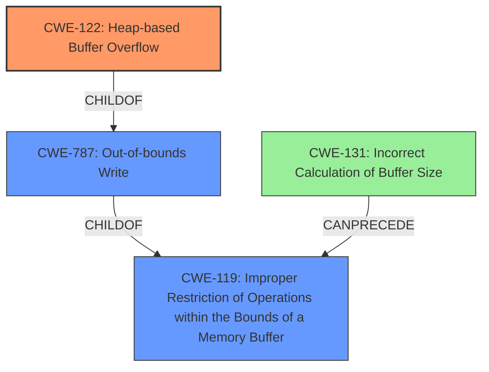

# Final Resolution for CVE-2022-35459

# Summary
| CWE ID | CWE Name | Confidence | CWE Abstraction Level | CWE Vulnerability Mapping Label | CWE-Vulnerability Mapping Notes |
|---|---|---|---|---|---|
| CWE-122 | Heap-based Buffer Overflow | 0.85 | Variant | Primary | Allowed |
| CWE-787 | Out-of-bounds Write | 0.6 | Secondary | Allowed |
| CWE-119 | Improper Restriction of Operations within the Bounds of a Memory Buffer | 0.5 | Secondary | Allowed |
| CWE-131 | Incorrect Calculation of Buffer Size | 0.3 | Informational | Contributing Factor |

## Evidence and Confidence

*   **Confidence Score:** 0.85
*   **Evidence Strength:** HIGH

## Relationship Analysis
The primary relationship is a parent-child hierarchy: CWE-119 is the parent of CWE-787, and CWE-787 is the parent of CWE-122. This indicates that CWE-119 is the most general, while CWE-122 is the most specific. CWE-131 can precede CWE-119, suggesting it can be a root cause. The selection of CWE-122 is based on the direct mention of "heap-buffer overflow" in the vulnerability description, making it the most specific and appropriate choice.

## Vulnerability Chain
The vulnerability chain starts with a potential **ROOTCAUSE** in **CWE-131 (Incorrect Calculation of Buffer Size)**, which leads to **CWE-119 (Improper Restriction of Operations within the Bounds of a Memory Buffer)**. This improper restriction results in **CWE-787 (Out-of-bounds Write)**, specifically a **CWE-122 (Heap-based Buffer Overflow)**. The final impact is a heap-based buffer overflow.

## Summary of Analysis
The initial analysis and criticism are well-aligned. The vulnerability description explicitly mentions "heap-buffer overflow," which strongly suggests **CWE-122 (Heap-based Buffer Overflow)** as the primary weakness. The relationship analysis confirms that CWE-122 is the most specific variant of the more general **CWE-787 (Out-of-bounds Write)** and **CWE-119 (Improper Restriction of Operations within the Bounds of a Memory Buffer)**.

The decision to include **CWE-131 (Incorrect Calculation of Buffer Size)** as a contributing factor is based on the understanding that incorrect buffer size calculation is a common cause of buffer overflows. While not explicitly mentioned in the vulnerability description, it is a reasonable potential root cause that should be investigated.

The graph relationships influenced the final selection by providing a clear hierarchy of weaknesses. The parent-child relationships helped to identify the most specific CWE, while the CanPrecede relationship suggested a potential vulnerability chain.

The selected CWEs are at the optimal level of specificity because they accurately reflect the vulnerability description and the underlying causes. **CWE-122 (Heap-based Buffer Overflow)** is the most specific CWE that directly corresponds to the vulnerability description. **CWE-787 (Out-of-bounds Write)** and **CWE-119 (Improper Restriction of Operations within the Bounds of a Memory Buffer)** are included as secondary CWEs to provide context and represent the broader class of buffer-related errors. **CWE-131 (Incorrect Calculation of Buffer Size)** is added as a potential contributing factor.