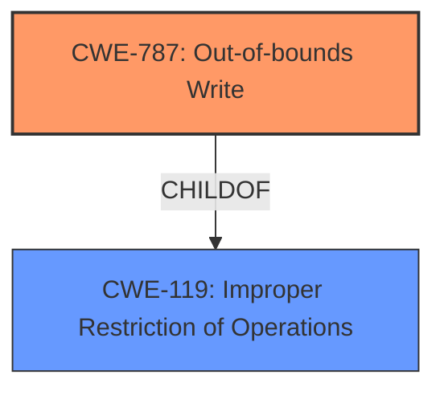

# Final Resolution for CVE-2022-35461

# Summary
| CWE ID  | CWE Name             | Confidence | CWE Abstraction Level | CWE Vulnerability Mapping Label | CWE-Vulnerability Mapping Notes                                                                      |
| :------ | :------------------- | :--------- | :---------------------- | :------------------------------ | :--------------------------------------------------------------------------------------------------- |
| CWE-787 | Out-of-bounds Write | 1.0        | Base                    | Allowed                         | Primary CWE.                                                                                           |

## Evidence and Confidence

*   **Confidence Score:** 1.0
*   **Evidence Strength:** HIGH

## Relationship Analysis
The primary relationship influencing the decision is the parent-child relationship between CWE-119 [CWE-119: Improper Restriction of Operations within the Bounds of a Memory Buffer] and CWE-787 [CWE-787: Out-of-bounds Write]. CWE-787 [CWE-787: Out-of-bounds Write] is a more specific instance of CWE-119 [CWE-119: Improper Restriction of Operations within the Bounds of a Memory Buffer], detailing the specific act of writing outside the intended buffer.

## Vulnerability Chain
The vulnerability chain consists of a heap-buffer overflow due to insufficient bounds checking during a data copy operation.
  - The **ROOTCAUSE** is the lack of proper bounds checking which allows writing beyond the allocated buffer.
  - This leads to the **WEAKNESS** of an out-of-bounds write (CWE-787 [CWE-787: Out-of-bounds Write]).
  - The final impact is a potential crash or arbitrary code execution.

## Summary of Analysis
The initial analysis correctly identified CWE-787 [CWE-787: Out-of-bounds Write] as the primary CWE for this vulnerability. The vulnerability description explicitly states a "heap-buffer overflow", which aligns directly with CWE-787 [CWE-787: Out-of-bounds Write]'s definition of writing data past the end of the intended buffer. The evidence strength is high due to this direct match and the explicit mention of "heap buffer overflows" in the CVE reference links content summary.

The criticism's suggestion of considering CWE-131 [CWE-131: Incorrect Calculation of Buffer Size] as a potential contributing factor is valid, as an incorrect size calculation could lead to the buffer overflow. However, without explicit evidence of this calculation error, it's speculative and should not be included as a primary or secondary CWE. The same logic applies to CWE-125 [CWE-125: Out-of-bounds Read]; there is no explicit evidence of this.

The selection of CWE-787 [CWE-787: Out-of-bounds Write] is at the optimal level of specificity because it directly describes the observed vulnerability (out-of-bounds write). While CWE-119 [CWE-119: Improper Restriction of Operations within the Bounds of a Memory Buffer] is a parent CWE, it is too general. The decision is based on the direct evidence of a heap-buffer overflow and the definitions of the relevant CWEs.