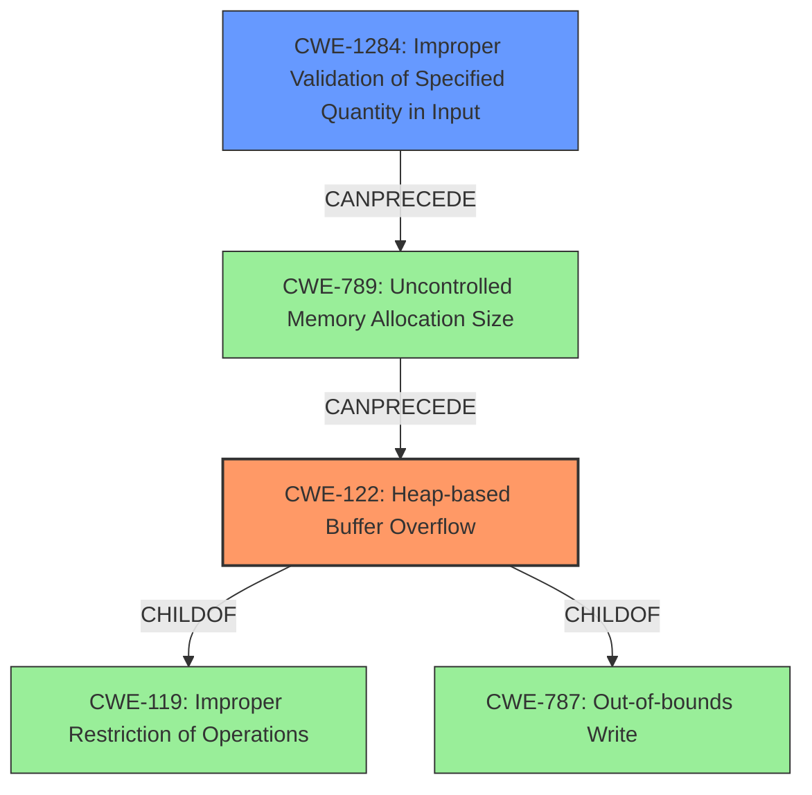

# Final Resolution for CVE-2022-35464

# Summary
| CWE ID | CWE Name | Confidence | CWE Abstraction Level | CWE Vulnerability Mapping Label | CWE-Vulnerability Mapping Notes |
|---|---|---|---|---|---|
| CWE-122 | Heap-based Buffer Overflow | 0.95 | Variant | Allowed | Primary CWE. The vulnerability is explicitly identified as a heap-buffer overflow. |
| CWE-1284 | Improper Validation of Specified Quantity in Input | 0.6 | Base | Allowed | Secondary CWE. Potentially a contributing factor if a specified size is not validated, leading to incorrect buffer allocation. |

## Evidence and Confidence

*   **Confidence Score:** 0.9
*   **Evidence Strength:** HIGH

## Relationship Analysis
The primary relationship influencing the decision is the hierarchical relationship where CWE-122 (Heap-based Buffer Overflow) is a child of CWE-119 (Improper Restriction of Operations within the Bounds of a Memory Buffer) and CWE-787 (Out-of-bounds Write). Selecting CWE-122 provides specificity fitting the vulnerability description, which explicitly mentions a "heap-buffer overflow." While CWE-787 is a parent, it is less specific. CWE-1284 can precede CWE-789 (Memory Allocation with Uncontrolled Size), indicating a potential chain where improper input validation leads to uncontrolled memory allocation, which might result in a heap overflow.

## Vulnerability Chain
The vulnerability chain starts potentially with **CWE-1284 (Improper Validation of Specified Quantity in Input)**, where the size of the buffer is not properly validated. This can lead to an incorrect buffer size calculation, resulting in **CWE-122 (Heap-based Buffer Overflow)** when data is written past the allocated buffer on the heap. The final impact is a crash due to the heap overflow, as evidenced by the CVE description.

## Summary of Analysis
The analysis strongly supports classifying this vulnerability as **CWE-122 (Heap-based Buffer Overflow)**. The vulnerability description explicitly states "**heap-buffer overflow**", and the CVE reference links content summary confirms this by mentioning "**Heap buffer overflow**". This direct evidence makes **CWE-122** the most appropriate primary classification. The inclusion of **CWE-787 (Out-of-bounds Write)** is somewhat redundant, as **CWE-122** inherently includes an out-of-bounds write, and **CWE-122** is more specific.

The graph relationships confirm that **CWE-122** is a child of **CWE-787** and **CWE-119**, indicating that it is a specialized form of a general out-of-bounds write.

The selection of **CWE-122** is at the optimal level of specificity because it accurately describes the vulnerability as a heap-based buffer overflow, as indicated in the vulnerability description and supporting evidence. The addition of **CWE-1284 (Improper Validation of Specified Quantity in Input)** as a secondary weakness suggests a potential root cause leading to the overflow, providing a more comprehensive picture of the vulnerability.