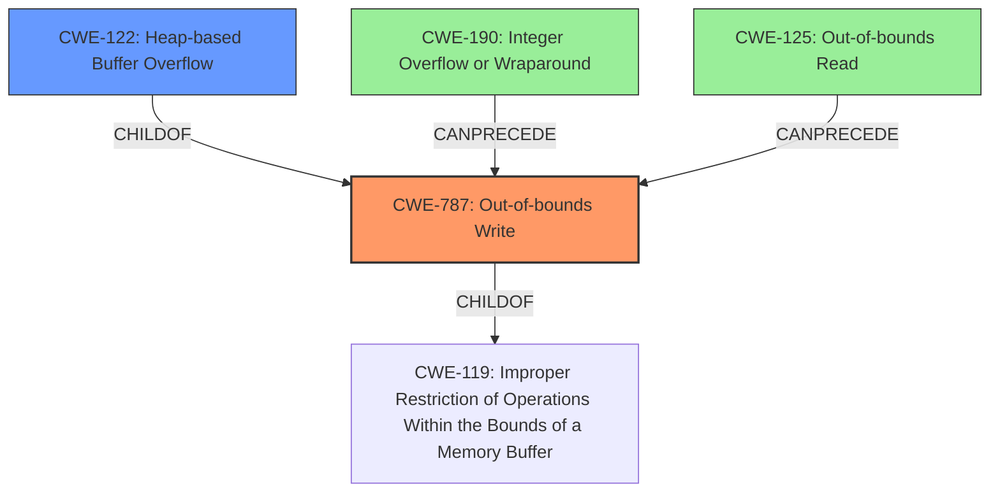

# Final Resolution for CVE-2022-35466

# Summary
| CWE ID | CWE Name | Confidence | CWE Abstraction Level | CWE Vulnerability Mapping Label | CWE-Vulnerability Mapping Notes |
|---|---|---|---|---|---|
| CWE-787 | Out-of-bounds Write | 0.85 | Base | Allowed | Primary CWE |
| CWE-122 | Heap-based Buffer Overflow | 0.70 | Variant | Allowed | Secondary Candidate |
| CWE-190 | Integer Overflow or Wraparound | 0.65 | Base | Allowed | Contributing Factor |
| CWE-125 | Out-of-bounds Read | 0.50 | Base | Allowed | Contributing Factor |

## Evidence and Confidence

*   **Confidence Score:** 0.75
*   **Evidence Strength:** MEDIUM

## Relationship Analysis
The primary weakness is **CWE-787 (Out-of-bounds Write)**, which describes the fundamental issue of writing beyond the allocated memory. **CWE-122 (Heap-based Buffer Overflow)** is a variant of **CWE-787**, specifying the location of the overflow. **CWE-190 (Integer Overflow or Wraparound)** and **CWE-125 (Out-of-bounds Read)** are potential contributing factors. An integer overflow could lead to an incorrect buffer size calculation, which then results in an out-of-bounds write. Out-of-bounds read can occur due to the same **ROOTCAUSE** of incorrect calculations.

## Vulnerability Chain
The vulnerability chain starts with a potential **CWE-190 (Integer Overflow or Wraparound)** when calculating the buffer size. This leads to a smaller-than-expected buffer being allocated. When data is written to this buffer without proper bounds checking (**CWE-787 (Out-of-bounds Write)**), a heap-based buffer overflow occurs (**CWE-122 (Heap-based Buffer Overflow)**). Additionally, **CWE-125 (Out-of-bounds Read)** could occur if the program attempts to read beyond the boundaries of a buffer due to a similar miscalculation.

## Summary of Analysis
The initial analysis correctly identified **CWE-787 (Out-of-bounds Write)** as the primary weakness and **CWE-122 (Heap-based Buffer Overflow)** as a secondary candidate. However, the retriever results and further analysis suggest that **CWE-190 (Integer Overflow or Wraparound)** and **CWE-125 (Out-of-bounds Read)** could be contributing factors.

The vulnerability description states "OTFCC v0.10.4 was discovered to contain a heap-buffer overflow". This aligns with **CWE-787** and **CWE-122**.

The criticism highlights the importance of considering integer overflows and out-of-bounds reads. The extended description for CWE-787 notes memory corruption as an alternative term, which is relevant given the description of crashes due to memory corruption. The retriever results also indicate that CWE-190 and CWE-125 are strong candidates.

Based on the evidence and relationship analysis, I have adjusted the confidence levels and included **CWE-190 (Integer Overflow or Wraparound)** and **CWE-125 (Out-of-bounds Read)** as contributing factors. These CWEs represent potential root causes that lead to the out-of-bounds write.

The selected CWEs are at the optimal level of specificity. **CWE-787** describes the general out-of-bounds write, **CWE-122** specifies that it is a heap-based buffer overflow, and **CWE-190** and **CWE-125** highlight potential root causes related to integer overflows and out-of-bounds reads.