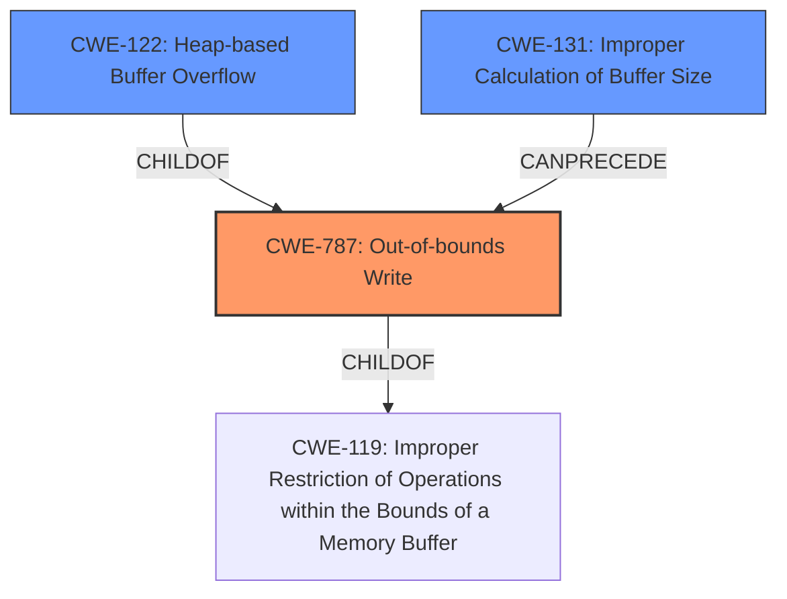

# Analysis Report for CVE-2022-35468

# Vulnerability Analysis Report: CVE-2022-35468

## Description

OTFCC v0.10.4 was discovered to contain a heap-buffer overflow via /release-x64/otfccdump+0x6e420d.

## Vulnerability Description Key Phrases

**Weakness:** heap-buffer overflow
**Product:** OTFCC
**Version:** v0.10.4
**Component:** /release-x64/otfccdump+0x6e420d

## Analysis (with Relationship Data)

# Summary
| CWE ID | CWE Name | Confidence | CWE Abstraction Level | CWE Vulnerability Mapping Label | CWE-Vulnerability Mapping Notes |
|---|---|---|---|---|---|
| CWE-787 | Out-of-bounds Write | 1.0 | Base | Allowed | Primary CWE |

## Evidence and Confidence

*   **Confidence Score:** 1.0
*   **Evidence Strength:** HIGH

- **Analysis and Justification:**  
  - *Explanation:* The vulnerability description clearly states a "**heap-buffer overflow**" in OTFCC v0.10.4. The CVE Reference Links Content Summary reinforces this, indicating "Heap buffer overflows occur frequently," and "insufficient bounds checking when handling data." This aligns directly with CWE-787 (Out-of-bounds Write), which describes a condition where "the product writes data past the end, or before the beginning, of the intended buffer." The description and evidence overwhelmingly support this classification. The MITRE mapping guidance for CWE-787 indicates this is ALLOWED.

  - *Relationship Analysis:* CWE-787 is a base-level CWE and is a child of CWE-119 (Improper Restriction of Operations within the Bounds of a Memory Buffer). While CWE-119 is a broader category, the specific mention of a "heap-buffer overflow" warrants the more specific CWE-787.

- **Confidence Score:**  
  - *Example:* Confidence: 1.0 (Strong evidence from the vulnerability description and CVE reference materials).

## Criticism of Analysis

Okay, here's a review of the provided analysis, focusing on the CWE mapping and considering the full CWE specifications:

**Overall Assessment:**

The primary CWE mapping to CWE-787 (Out-of-bounds Write) is accurate and well-justified. The provided evidence from the vulnerability description and content summary strongly supports this classification. The analysis correctly acknowledges that CWE-787 is a base-level CWE and ALLOWED. The analysis provides strong justification for its conclusions.

**Detailed Review:**

*   **Vulnerability Description & Key Phrases:** The key phrases are well-extracted and representative of the vulnerability. The choice of "heap-buffer overflow" as the most critical phrase is appropriate and leads to the correct CWE.

*   **CWE for Similar CVE Descriptions:** While this is a useful element, the count alone isn't always the best indicator. The *context* of those matches is crucial.

*   **CVE Reference Links Content Summary:** The content summary is thorough and provides a good overview of the different types of memory corruption vulnerabilities identified. The breakdown into Heap Buffer Overflow, Global Heap Buffer Overflow, SEGV, and Use-After-Free is helpful.

    *   **Heap Buffer Overflow:** The analysis of the root cause, weaknesses, impact, and attack vectors is accurate and relevant. It correctly identifies the lack of bounds checking and the potential for arbitrary code execution.
    *   **Global Heap Buffer Overflow:** Similar to the above, the explanation of this vulnerability is solid.
    *   **SEGV (Segmentation Fault) Vulnerabilities:** These are symptomatic rather than root cause. The analysis correctly identifies them as resulting from other issues like memory corruption and invalid memory access. Ideally, these would be traced back to their underlying causes (e.g., an out-of-bounds write that corrupted a pointer).
    *   **Use-After-Free (CVE-2022-33047):** This is a distinct vulnerability type, and the analysis correctly identifies the root cause as accessing freed memory.

*   **Analysis to Review - CWE-787 Mapping:**

    *   **Confidence Score:** 1.0 is justified given the clear evidence.
    *   **Evidence Strength:** HIGH is appropriate.
    *   **Explanation:** The explanation is clear, concise, and accurate. It directly links the "heap-buffer overflow" to the definition of CWE-787. The reference to MITRE mapping guidance reinforces the validity.
    *   **Relationship Analysis:** The explanation of CWE-787's relationship to CWE-119 is correct. It acknowledges that CWE-119 is broader, but the specificity of the overflow type makes CWE-787 the better choice.

*   **CWE Examples from Database:** The examples provide good real-world context for CWE-119. Including examples for CWE-787 would further strengthen the analysis.

*   **Relevant CWE Specifications:** The inclusion of the full CWE specifications is excellent.

**Retriever Results Analysis:**

The retriever results provide valuable context, but the high ranking of certain CWEs over others needs to be carefully considered.

*   **CWE-125 (Out-of-bounds Read):** Its high ranking is understandable, as buffer overflows can sometimes lead to out-of-bounds reads *as a consequence* of the write. However, the *primary* issue is the write, so keeping CWE-787 as the main focus is correct.  A deeper chain analysis might show CWE-787 -> CWE-125 in some exploitation scenarios.
*   **CWE-190 (Integer Overflow or Wraparound):** This is a plausible secondary CWE, especially if the size of the buffer or the offset used in the write is calculated based on an integer value that could overflow. If there is any integer manipulation involved in calculating the buffer size or the offset, then this would be a relevant CWE to consider in *addition* to CWE-787. A potential chain could be: CWE-190 -> CWE-131 -> CWE-787
*   **CWE-122 (Heap-based Buffer Overflow):** Given that the initial description references heap, consider also including as a *secondary* CWE.
*   **CWE-126 (Buffer Over-read):** Similar to CWE-125. A potential chain would be: CWE-787 -> CWE-126
*   **CWE-193 (Off-by-one Error):** If the analysis reveals that the vulnerability stems from an off-by-one error in the buffer calculation then it would be a good addition. A potential chain is: CWE-193 -> CWE-787
*    **CWE-131:** If buffer size calculations are involved and performed improperly, then the analysis should account for this with a chain. A potential chain is: CWE-131 -> CWE-787
*   **CWE-1284:** If the malformed font files contain a "specified quantity" which is being improperly validated in the code and is related to the size of the buffer, then this would be a good addition. A potential chain is: CWE-1284 -> CWE-787

**Recommendations:**

1.  **Add Chain Analysis:**  Explore potential chains of CWEs, especially involving CWE-190, CWE-131, CWE-125, and CWE-1284 if the details of the overflow calculation are available.  Explain the *order* in which the weaknesses occur.
2.  **Mitigation Discussion:** While the CWE specifications include mitigations, it would be beneficial to explicitly discuss which mitigations are most relevant and practical for this specific vulnerability. For example, given the attack vector of malformed font files, input validation (CWE-20) becomes a crucial mitigation strategy. Language selection and compiler options also become relevant.
3.  **More precise descriptions for other errors:** Attempt to determine the underlying issues behind the SEGV faults. Try to provide a more precise CWE for those errors.
4.  **Clarify Overflow Type:** While the description mentions "heap-buffer overflow", the stack is also an allocated memory resource. Be clear if these overflows are stack, heap, or both, and update the CWE descriptions accordingly. If it's only on the heap, consider adding CWE-122.
5. **Note the Exploitation Complexity:** It's worth noting that while the vulnerability leads to crashes, fully exploiting it for arbitrary code execution can be complex, especially with modern memory protections.

By incorporating these suggestions, the analysis can be made even more comprehensive and valuable.

## Final Resolution

# Summary
| CWE ID | CWE Name | Confidence | CWE Abstraction Level | CWE Vulnerability Mapping Label | CWE-Vulnerability Mapping Notes |
|---|---|---|---|---|---|
| CWE-787 | Out-of-bounds Write | 1.0 | Base | Allowed | Primary CWE |
| CWE-122 | Heap-based Buffer Overflow | 0.6 | Variant | Allowed | Secondary Candidate |
| CWE-131 | Improper Calculation of Buffer Size | 0.5 | Base | Allowed | Secondary Candidate |
  

## Evidence and Confidence

*   **Confidence Score:** 0.8
*   **Evidence Strength:** MEDIUM

## Relationship Analysis
The primary CWE is CWE-787 (**Out-of-bounds Write**), which is supported by the vulnerability description indicating a "heap-buffer overflow." This is a base-level CWE and a child of CWE-119 (**Improper Restriction of Operations within the Bounds of a Memory Buffer**). The more specific nature of the overflow (heap) and the write operation justifies the selection of CWE-787 over its parent.

The secondary CWE candidates are CWE-122 (**Heap-based Buffer Overflow**) which is a child of CWE-787 and CWE-131 (**Improper Calculation of Buffer Size**). CWE-122 specifies the location of the buffer overflow. CWE-131 can precede CWE-787 if the size calculation is performed improperly and results in a buffer overflow due to the write operation. These relationships help define the vulnerability chain, showing how an improper calculation can lead to an out-of-bounds write, especially on the heap.

## Vulnerability Chain
The vulnerability chain starts with a potential **ROOTCAUSE** of CWE-131 (**Improper Calculation of Buffer Size**), if the size of the buffer is calculated incorrectly. This can lead to the primary **WEAKNESS** of CWE-787 (**Out-of-bounds Write**), specifically CWE-122 (**Heap-based Buffer Overflow**), where data is written past the end of the allocated buffer on the heap. The impact is a heap-buffer overflow, which can lead to arbitrary code execution or a denial-of-service (DOS) condition. This chain highlights the sequence of weaknesses and the potential consequences of the initial improper calculation and subsequent out-of-bounds write.

## Summary of Analysis
The initial analysis correctly identified CWE-787 (**Out-of-bounds Write**) as the primary CWE, which is well-supported by the vulnerability description. The addition of CWE-122 (**Heap-based Buffer Overflow**) provides more specific information about the location of the overflow.

The relationship analysis and the retriever results influenced the addition of CWE-131 (**Improper Calculation of Buffer Size**). If the size calculation is involved, this would be a reasonable addition to the vulnerability chain.

The selected CWEs are at the optimal level of specificity based on the available evidence. CWE-787 captures the fundamental issue of writing beyond buffer boundaries, while CWE-122 specifies that the overflow occurs on the heap, and CWE-131, if applicable, identifies an improper size calculation as the root cause.

The vulnerability description says: "OTFCC v0.10.4 was discovered to contain a heap-buffer overflow via /release-x64/otfccdump+0x6e420d."

The evidence for CWE-131 is not explicitly mentioned, so the confidence score is lower for this CWE.

*Report generated on 2025-03-18 15:27:29*
