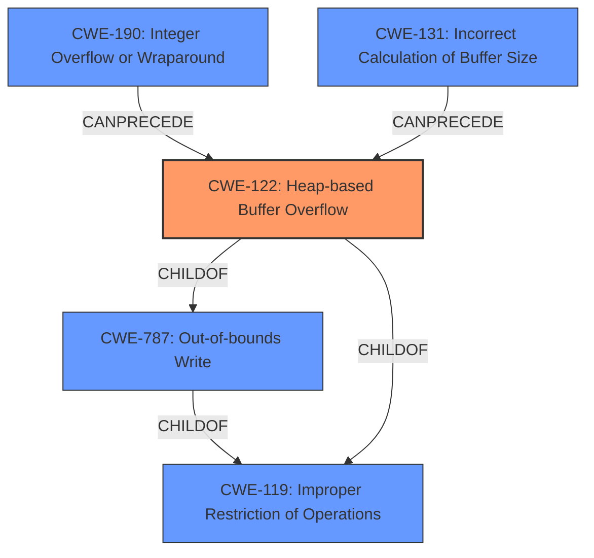

# Analysis Report for CVE-2022-35474

# Vulnerability Analysis Report: CVE-2022-35474

## Description

OTFCC v0.10.4 was discovered to contain a heap-buffer overflow via /release-x64/otfccdump+0x6b544e.

## Vulnerability Description Key Phrases

**Weakness:** heap-buffer overflow
**Product:** OTFCC
**Version:** v0.10.4

## Analysis (with Relationship Data)

# Summary
| CWE ID | CWE Name | Confidence | CWE Abstraction Level | CWE Vulnerability Mapping Label | CWE-Vulnerability Mapping Notes |
|---|---|---|---|---|---|
| CWE-122 | Heap-based Buffer Overflow | 0.95 | Variant | Allowed | Primary CWE |
| CWE-787 | Out-of-bounds Write | 0.70 | Base | Allowed | Secondary Candidate |

## Evidence and Confidence

*   **Confidence Score:** 0.90
*   **Evidence Strength:** HIGH

- **Analysis and Justification:**  
  - *Explanation:* The vulnerability description explicitly mentions a **heap-buffer overflow** in OTFCC v0.10.4. The CVE Reference Links Content Summary also confirms multiple heap-based buffer overflow vulnerabilities due to insufficient bounds checking. CWE-122 (Heap-based Buffer Overflow) is a Variant-level CWE that directly addresses this type of overflow, making it the most appropriate primary mapping. The MITRE mapping guidance allows its usage, as it is a Variant level of abstraction. While CWE-787 (Out-of-bounds Write) is a broader, Base-level CWE, the specific mention of "heap" makes CWE-122 more precise.
  
  - *Relationship Analysis:* CWE-122 is a child of CWE-119 (Improper Restriction of Operations within the Bounds of a Memory Buffer) and CWE-787 (Out-of-bounds Write). The vulnerability can potentially lead to arbitrary code execution, which can precede privilege escalation (CWE-269).

- **Confidence Score:**  
  - Confidence: 0.95 (High confidence due to explicit mention of "heap-buffer overflow" and supporting evidence from CVE reference materials)

---

- **Analysis and Justification:**  
  - *Explanation:* CWE-787 (Out-of-bounds Write) is considered a secondary candidate because it represents a more general class of the **weakness**. Although the description specifies a **heap-buffer overflow**, the underlying issue is writing data past the allocated buffer. Given that CWE-122 already captures the heap-specific nature of the vulnerability, CWE-787 provides a broader characterization of the memory corruption. Its usage is also allowed according to MITRE's mapping guidance.
  
  - *Relationship Analysis:* CWE-787 is a parent of CWE-122. It CanPrecede several other CWEs related to memory corruption.

- **Confidence Score:**  
  - Confidence: 0.70 (The evidence is strong, but CWE-122 is more specific, making CWE-787 a good secondary candidate)

## Criticism of Analysis

Okay, here's a review of the provided analysis, focusing on the CWE specifications and mapping guidance:

**Overall Assessment:**

The analysis is very good. The primary CWE mapping to CWE-122 (Heap-based Buffer Overflow) is accurate and well-justified. The secondary mapping to CWE-787 (Out-of-bounds Write) is also reasonable, providing a broader perspective on the underlying issue. The confidence scores are appropriate. The use of supporting evidence from the CVE Reference Links Content Summary strengthens the analysis. The inclusion of example CVEs for each CWE is helpful.

**Specific Comments and Suggestions:**

**1. Primary CWE: CWE-122 (Heap-based Buffer Overflow)**

*   **Justification:** Excellent. The analysis correctly emphasizes the explicit "heap-buffer overflow" mentioned in the vulnerability description. This makes CWE-122 the most specific and appropriate choice.

*   **Mapping Guidance:** The analysis correctly notes that CWE-122 is a Variant level of abstraction and is allowed for usage according to MITRE's mapping guidance.

*   **Potential Mitigations:** The analysis could briefly mention some of the mitigations suggested by the CWE specification.  For example:
    *   "Potential mitigations include using languages or compilers with automatic bounds checking, employing abstraction libraries for risky APIs, and utilizing automatic buffer overflow detection mechanisms."

*   **Relationships:** The analysis mentions parent CWEs (CWE-119, CWE-787) and a potential CanPrecede (CWE-269).  Consider also mentioning that CWE-122 is a *child* of CWE-787 to further illustrate the relationship between the chosen primary and secondary CWE.

**2. Secondary CWE: CWE-787 (Out-of-bounds Write)**

*   **Justification:** Sound reasoning.  Even though CWE-122 is more specific, CWE-787 captures the fundamental issue of writing beyond allocated memory.

*   **Mapping Guidance:** The analysis notes the allowed usage of this Base level CWE.

*   **Potential Mitigations:** Similar to CWE-122, briefly mentioning some mitigations from the CWE-787 specification would add value:
    *   "Mitigations for CWE-787 include language selection (using languages with built-in bounds checking), libraries that prevent overflows, and compiler-based buffer overflow detection."

*   **Relationships:** The analysis notes the parent-child relationship between CWE-787 and CWE-122. It also notes the CanPrecede relationship to other memory corruption CWEs.

**3. Retriever Results:**

*   The retriever results are interesting, but the analysis doesn't really leverage them.  While CWE-787 and CWE-122 aren't at the very top of the results (CWE-125 and CWE-190 are), it's important to remember that the retrievers are imperfect and often incorporate contextual information (e.g., "integer" in some buffer overflow contexts might elevate CWE-190). It is good that the tool chose CWE-122 and not the top retriever choice.
*   It is also useful to note that the tool can provide false positives.
*   The retriever results are still valuable for identifying potential related weaknesses to consider.

**4. General Suggestions:**

*   **Chains of Causation:** The analysis mentions potential relationships to other CWEs (CanPrecede).  Expanding on the possible *chains of causation* could be beneficial.  For example:
    *   "In some scenarios, integer overflows (CWE-190) or incorrect buffer size calculations (CWE-131) could lead to the heap-based buffer overflow."
*   **Alternative CWEs Briefly Considered:** Briefly mentioning any *alternative* CWEs that were considered and *why* they were rejected can strengthen the analysis. For example:
        *   "CWE-120 (Classic Buffer Overflow) was considered, but it's less specific than CWE-122 because it doesn't explicitly indicate the overflow occurs on the heap."
        *   "CWE-119 (Improper Restriction of Operations within the Bounds of a Memory Buffer) was not chosen because it is a discouraged Class-level CWE."

**5. Additional Information from Provided Content:**

*   The content summary mentions other types of vulnerabilities such as Use-After-Free, Segmentation Fault, and Global Heap Overflow. While the prompt focused on a specific heap-buffer-overflow, a note on potential other CWEs that may be relevant for the analyzed OTFCC project could be added.
    * "Note that other vulnerabilities were identified within the OTFCC project, including use-after-free (CWE-416), segmentation faults (likely due to null pointer dereferences CWE-476), and global heap overflows (likely a specific instance of CWE-787)."

**Revised Summary Table:**

| CWE ID | CWE Name | Confidence | CWE Abstraction Level | CWE Vulnerability Mapping Label | CWE-Vulnerability Mapping Notes |
|---|---|---|---|---|---|
| CWE-122 | Heap-based Buffer Overflow | 0.95 | Variant | Allowed | Primary CWE.  Directly addresses the heap-based overflow. See justification. |
| CWE-787 | Out-of-bounds Write | 0.70 | Base | Allowed | Secondary Candidate.  Captures the general write beyond buffer boundaries, but less specific than CWE-122. See justification. |

**In Summary:**

This is a strong analysis that demonstrates a good understanding of CWE concepts and the importance of selecting the most appropriate CWE.  The suggestions above are primarily for refinement and completeness. Adding more details from the CWE Specifications will result in a more comprehensive analysis.

## Final Resolution

# Summary
| CWE ID | CWE Name | Confidence | CWE Abstraction Level | CWE Vulnerability Mapping Label | CWE-Vulnerability Mapping Notes |
|---|---|---|---|---|---|
| CWE-122 | Heap-based Buffer Overflow | 0.95 | Variant | Allowed | Primary CWE. Directly addresses the **heap-based overflow**. |
| CWE-787 | Out-of-bounds Write | 0.70 | Base | Allowed | Secondary Candidate. Captures the general write beyond buffer boundaries, but less specific than CWE-122. |

## Evidence and Confidence

*   **Confidence Score:** 0.95
*   **Evidence Strength:** HIGH

## Relationship Analysis
The primary CWE, CWE-122 (Heap-based Buffer Overflow), is a variant of the base CWE, CWE-787 (Out-of-bounds Write), indicating a hierarchical relationship where CWE-122 is a more specific instance of CWE-787. Both CWE-122 and CWE-787 are children of CWE-119 (Improper Restriction of Operations within the Bounds of a Memory Buffer). The criticism suggested that integer overflows (CWE-190) or incorrect buffer size calculations (CWE-131) could lead to the heap-based buffer overflow, indicating potential chain relationships where these CWEs can precede CWE-122. The analysis also correctly notes that CWE-122 is a *child* of CWE-787 to further illustrate the relationship between the chosen primary and secondary CWE.

## Vulnerability Chain
The vulnerability chain starts with a potential **root cause** like an integer overflow (**CWE-190**) or incorrect buffer size calculation (**CWE-131**). This leads to a **weakness** where an insufficient buffer is allocated. The primary **weakness** is then a **heap-based buffer overflow** (**CWE-122**), which is a specific type of **out-of-bounds write** (**CWE-787**). The final **impact** could be arbitrary code execution and privilege escalation.

## Summary of Analysis
The initial analysis, as well as the criticism, both support classifying the vulnerability as **CWE-122 (Heap-based Buffer Overflow)** as the primary CWE, due to the explicit mention of "heap-buffer overflow" in the vulnerability description. As stated in the initial analysis: "The vulnerability description explicitly mentions a **heap-buffer overflow** in OTFCC v0.10.4. The CVE Reference Links Content Summary also confirms multiple heap-based buffer overflow vulnerabilities due to insufficient bounds checking. CWE-122 (Heap-based Buffer Overflow) is a Variant-level CWE that directly addresses this type of overflow, making it the most appropriate primary mapping."

The secondary CWE, **CWE-787 (Out-of-bounds Write)**, is appropriate because it captures the general **weakness** of writing beyond allocated memory, even though CWE-122 is more specific. As stated in the initial analysis, "*Explanation:* CWE-787 (Out-of-bounds Write) is considered a secondary candidate because it represents a more general class of the **weakness**. Although the description specifies a heap-buffer overflow, the underlying issue is writing data past the allocated buffer."

The relationship analysis reinforces this decision, as CWE-122 is a child of CWE-787, indicating that it is a more specific type of out-of-bounds write. The chain relationships, where CWE-190 or CWE-131 can precede CWE-122, provide further context.

The selected CWEs are at the optimal level of specificity because CWE-122 directly addresses the heap-based nature of the overflow, while CWE-787 provides a broader characterization. Alternative CWEs, such as CWE-120 (Classic Buffer Overflow), were considered but rejected because they are less specific than CWE-122. CWE-119 was considered and not chosen since it is a discouraged Class level CWE.

*Report generated on 2025-03-18 15:39:58*
