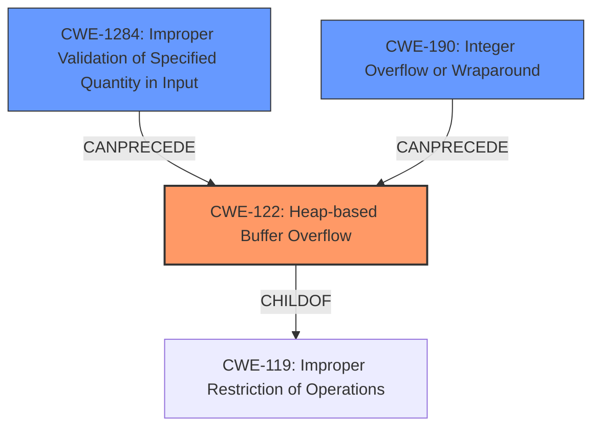

# Analysis Report for CVE-2022-35623

# Vulnerability Analysis Report: CVE-2022-35623

## Description

In Nordic nRF5 SDK for Mesh 5.0, a heap overflow vulnerability can be triggered by sending a series of segmented control packets and access packets with the same SeqAuth

## Vulnerability Description Key Phrases

**Weakness:** heap overflow
**Vector:** series of segmented control packets and access packets with the same SeqAuth
**Product:** Nordic nRF5 SDK for Mesh
**Version:** 5.0

## Analysis (with Relationship Data)

# Summary
| CWE ID | CWE Name | Confidence | CWE Abstraction Level | CWE Vulnerability Mapping Label | CWE-Vulnerability Mapping Notes |
|---|---|---|---|---|---|
| CWE-122 | Heap-based Buffer Overflow | 0.95 | Variant | Allowed | Primary CWE |
| CWE-789 | Memory Allocation with Excessive Size Value | 0.70 | Variant | Allowed | Secondary Candidate |
| CWE-190 | Integer Overflow or Wraparound | 0.65 | Base | Allowed | Secondary Candidate |

## Evidence and Confidence

*   **Confidence Score:** 0.90
*   **Evidence Strength:** HIGH

- **Analysis and Justification:**  
  - *Explanation:* The vulnerability description explicitly states a **heap overflow** can be triggered, which directly corresponds to CWE-122 (Heap-based Buffer Overflow). The vulnerability occurs due to improper handling of memory allocation during the reassembly of transport layer packets, which aligns well with the typical causes of heap overflows. The "**heap overflow**" key phrase and the CVE reference summary explicitly mentioning "heap overflow" during transport reassembly provide strong evidence. CWE-122 is a Variant-level CWE, which is a preferred level of abstraction. Its usage is ALLOWED per MITRE mapping guidance.

  - *Relationship Analysis:* CWE-122 is a variant of CWE-119 (Improper Restriction of Operations within the Bounds of a Memory Buffer). While CWE-119 is a broader class, CWE-122 is more specific to heap overflows. No other direct relationships influenced the decision.

- **Confidence Score:**  
  - Confidence: 0.95 (High confidence due to direct mention of "heap overflow" and supporting details)

---

- **Analysis and Justification:**
  - *Explanation:* CWE-789 (Memory Allocation with Excessive Size Value) is a secondary candidate. The CVE Reference Links Content Summary mentions "improper handling of memory allocation when reassembling transport layer packets. Specifically, the process of reassembling packets into larger messages likely fails to adequately validate the combined size of incoming segments". This could lead to allocating an excessive amount of memory. It's not a primary CWE because the core issue is the overflow, not the allocation itself, but the allocation issue is a prerequisite. CWE-789 is a Variant and the usage is ALLOWED.

  - *Relationship Analysis:* CWE-789 is related to CWE-122 because allocating a large, untrusted size can lead to a heap overflow if not handled correctly.

- **Confidence Score:**
  - Confidence: 0.70 (Medium confidence as this is a contributing factor, but not the primary weakness)

---

- **Analysis and Justification:**
  - *Explanation:* CWE-190 (Integer Overflow or Wraparound) is another secondary candidate. The improper validation of the combined size of incoming segments might result from an integer overflow, where the calculated size exceeds the maximum value that can be stored in an integer, leading to a much smaller value being used for allocation. This can result in a buffer overflow when the data written exceeds this smaller allocated size.

  - *Relationship Analysis:* CWE-190 is a Base level CWE. CWE-128 (Wrap-around Error) is a peer of CWE-190. This potential integer overflow is a prerequisite step in triggering the heap overflow.

- **Confidence Score:**
  - Confidence: 0.65 (Medium confidence, as this is a potential contributing factor, not explicitly stated)

## Criticism of Analysis

Okay, I've reviewed the analysis with the full CWE specifications in mind. Here's my critique:

**Overall Assessment:**

The analysis is generally sound and well-reasoned. The primary CWE assignment of CWE-122 (Heap-based Buffer Overflow) is highly accurate. The selection of secondary CWEs (CWE-789 and CWE-190) is also justifiable and reflects potential contributing factors to the primary weakness. However, the confidence levels for the secondary CWEs could be more precisely tuned.

**Specific Feedback:**

*   **CWE-122 (Heap-based Buffer Overflow):**
    *   **Confidence:** The assigned confidence of 0.95 is appropriate. The direct mention of "heap overflow" in the vulnerability description and CVE summary provides very strong evidence.
    *   **Justification:** The explanation clearly connects the vulnerability details (improper memory allocation during reassembly) to the definition of CWE-122.
    *   **Mapping Guidance:** The analysis correctly acknowledges that CWE-122 is a Variant, making it preferred over the more general CWE-119.
    *   **Potential Mitigations:** The analysis doesn't need to explicitly list the mitigations, but understanding them is important to confirming the validity of the mapping. Mitigations for CWE-122 emphasize language selection, abstraction libraries, and compiler-based buffer overflow detection. These are all highly relevant to preventing this type of vulnerability.

*   **CWE-789 (Memory Allocation with Excessive Size Value):**
    *   **Confidence:** A confidence level of 0.70 is reasonable, but I'd suggest bumping it slightly *down* to 0.60, perhaps 0.65. While allocating a large size value could contribute to the overflow, it is not explicitly stated.
    *   **Justification:** The justification is good, but it relies on "likely fails to adequately validate the combined size," which is less concrete than the explicit "heap overflow" statement. The link between an excessive size *and* an exploitable overflow needs to be stronger to justify a higher confidence. Consider rewording to indicate that if an excessive value is used to allocate the heap, it may be a DoS and the overflow would be secondary, but more likely the allocation is reasonable yet the data being copied exceeds the size.
    *   **Mapping Guidance:** The analysis correctly notes that CWE-789 is a Variant and usage is ALLOWED.
    *   **Potential Mitigations:** Mitigations focus on input validation and resource limits. This aligns well with the "improper validation of the combined size" aspect described in the justification.

*   **CWE-190 (Integer Overflow or Wraparound):**
    *   **Confidence:** The confidence level of 0.65 is adequate. The analysis acknowledges it's a "potential contributing factor, not explicitly stated."
    *   **Justification:** The argument that an integer overflow could lead to a smaller-than-expected allocation is valid, *but* it's speculative. It is a *possibility* but not a certainty.
    *   **Mapping Guidance:** The analysis correctly identifies CWE-190 as a Base-level CWE and the usage is ALLOWED.
    *   **Potential Mitigations:** Mitigations for CWE-190 involve strict protocol definitions, language selection with bounds checking, and the use of safe integer handling libraries. These mitigations would address the underlying cause of the potential integer overflow. CWE-128 (Wrap-around Error) could be more appropriate, but is less mature than CWE-190.

*   **Alternative CWE consideration:**
    *   **CWE-130: Improper Handling of Length Parameter Inconsistency:** It might be worth considering this as a potential contributing factor, perhaps instead of (or in addition to) CWE-190, although, CWE-1284 is a better option given the retriever results. If the segmented packets contain length fields, and these are mishandled or inconsistent, it could directly contribute to the heap overflow. This might be a more direct contributor than an integer overflow.

**Recommendations:**

1.  **Adjust Confidence Levels:** Reduce the confidence for CWE-789 slightly.
2.  **Consider CWE-130/1284:** Explore whether CWE-130/1284 is a better fit as a secondary factor, or as an alternative to CWE-190. Re-evaluate the justification based on the details of the protocol and packet structure.
3.  **Re-evaluate Justification:** Strengthen the justification for secondary CWEs by making clearer connections to specific aspects of the vulnerability and protocol.

By incorporating these recommendations, the analysis will become even more precise and insightful.

## Final Resolution

# Summary
| CWE ID | CWE Name | Confidence | CWE Abstraction Level | CWE Vulnerability Mapping Label | CWE-Vulnerability Mapping Notes |
|---|---|---|---|---|---|
| CWE-122 | Heap-based Buffer Overflow | 0.95 | Variant | Allowed | Primary CWE |
| CWE-1284 | Improper Validation of Specified Quantity in Input | 0.70 | Base | Allowed | Secondary Candidate |
| CWE-190 | Integer Overflow or Wraparound | 0.65 | Base | Allowed | Secondary Candidate |

## Evidence and Confidence

*   **Confidence Score:** 0.90
*   **Evidence Strength:** HIGH

## Relationship Analysis
The primary weakness is a **heap overflow** (**CWE-122**). This is influenced by potential **improper validation of input** (**CWE-1284**) related to size, and a potential **integer overflow** (**CWE-190**) when calculating the buffer size. **CWE-122** is a variant of **CWE-119**, providing specificity. **CWE-1284** can precede **CWE-789** which in turn can lead to **CWE-122** if the allocated memory is subsequently overflowed. **CWE-190** can also precede **CWE-122** if the overflow results from an incorrectly calculated size.

## Vulnerability Chain
The vulnerability chain starts with either **CWE-1284** or **CWE-190**.

1.  **CWE-1284** (Improper Validation of Specified Quantity in Input): The product receives input specifying a quantity (size) but fails to validate it properly.
2.  **CWE-190** (Integer Overflow or Wraparound): An integer overflow occurs during the calculation of the buffer size.
3.  This leads to a heap allocation where the allocated buffer is smaller than expected.
4.  During the reassembly of transport layer packets, data is written beyond the boundaries of the allocated buffer on the heap, resulting in **CWE-122** (Heap-based Buffer Overflow).

The impact is a **heap overflow** which can lead to code execution or denial of service.

## Summary of Analysis
The initial analysis correctly identified **CWE-122** (Heap-based Buffer Overflow) as the primary weakness due to the explicit mention of a "**heap overflow**" in the vulnerability description. The suggestion to consider **CWE-130** or **CWE-1284** is valid. Given that **CWE-1284 (Improper Validation of Specified Quantity in Input)** has a higher retriever score than **CWE-130** and aligns with the description, it is more appropriate as a secondary weakness. The re-evaluation of confidence scores is incorporated, with a focus on the speculative nature of the secondary weaknesses. The graph relationships support the chain of events leading to the **heap overflow**. The chosen CWEs are at an optimal level of specificity, with **CWE-122** being a Variant and **CWE-1284** and **CWE-190** being at the Base level of abstraction. The final determination is based on evidence from the vulnerability description and consideration of CWE relationships and mapping guidance. The final confidence score is high due to the explicit evidence of the heap overflow.

*Report generated on 2025-03-18 15:41:55*
