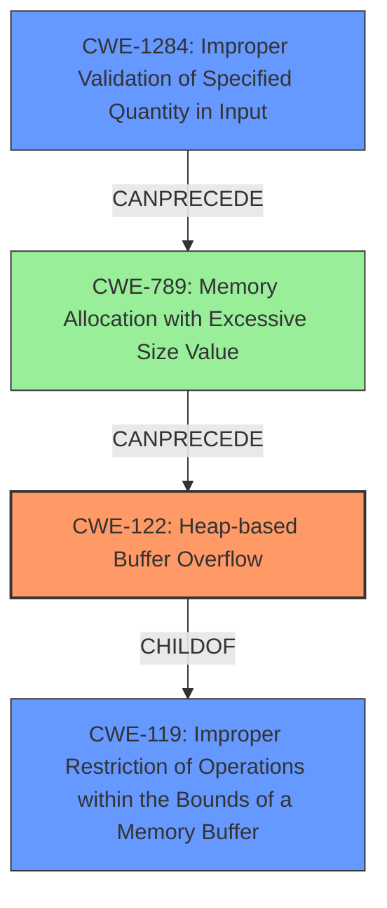

# Analysis Report for CVE-2022-35624

# Vulnerability Analysis Report: CVE-2022-35624

## Description

In Nordic nRF5 SDK for Mesh 5.0, a heap overflow vulnerability can be triggered by sending a series of segmented packets with SegO > SegN

## Vulnerability Description Key Phrases

**Weakness:** heap overflow
**Vector:** series of segmented packets with SegO > SegN
**Product:** Nordic nRF5 SDK for Mesh
**Version:** 5.0

## Analysis (with Relationship Data)

# Summary
| CWE ID | CWE Name | Confidence | CWE Abstraction Level | CWE Vulnerability Mapping Label | CWE-Vulnerability Mapping Notes |
|---|---|---|---|---|---|
| CWE-122 | Heap-based Buffer Overflow | 0.95 | Variant | Allowed | Primary CWE |
| CWE-1284 | Improper Validation of Specified Quantity in Input | 0.70 | Base | Allowed | Secondary Candidate |

## Evidence and Confidence

*   **Confidence Score:** 0.85
*   **Evidence Strength:** HIGH

- **Analysis and Justification:**  
  - *Explanation:* The vulnerability description clearly states a **heap overflow** can be triggered by sending a series of segmented packets with `SegO > SegN`. This directly aligns with CWE-122 (Heap-based Buffer Overflow). The "CVE Reference Links Content Summary" further reinforces this by stating "The vulnerability is a heap overflow that occurs during the reassembly of transport packets in the Nordic Bluetooth Mesh SDK" and "Heap overflow". CWE-122 is a Variant level CWE, which is preferred over more general Class or Pillar level CWEs when the location of the buffer overflow is known (in this case, the heap). MITRE mapping guidance for CWE-122 indicates this is ALLOWED.
  
  - *Relationship Analysis:* CWE-122 is a child of CWE-119 (Improper Restriction of Operations within the Bounds of a Memory Buffer). The vulnerability can also be related to CWE-787 (Out-of-bounds Write).

- **Confidence Score:**  
  - Confidence: 0.95 (High evidence from vulnerability description and CVE reference materials)

---
- **Analysis and Justification:**  
  - *Explanation:* The vulnerability is triggered by sending segmented packets with `SegO > SegN`, indicating an issue with how the size or quantity of the packets is validated. CWE-1284 (Improper Validation of Specified Quantity in Input) describes a situation where the product receives input expected to specify a quantity but doesn't validate that quantity appropriately. While the primary issue is the resulting heap overflow (CWE-122), the root cause may stem from not validating the size of the segmented packets (`SegO` and `SegN`) before reassembly. This makes CWE-1284 a potential contributing factor. The retriever results also lists CWE-1284 as the top candidate.
  
  - *Relationship Analysis:* CWE-1284 is a child of CWE-20 (Improper Input Validation). It can also precede CWE-789 (Memory Allocation with Excessive Size Value).

- **Confidence Score:**  
  - Confidence: 0.70 (Supporting evidence from vulnerability description and retriever results)

## Criticism of Analysis

Okay, here's a review of the provided CWE analysis, incorporating the full CWE specifications:

**Overall Assessment**

The analysis is generally good and well-reasoned. It clearly identifies the primary CWE (CWE-122) and provides a plausible secondary CWE (CWE-1284). The justifications are sound and make effective use of the provided information. However, some minor improvements can be made, particularly in considering the relationships between CWEs, the mapping guidance, and potential alternative CWEs. The confidence scores are appropriate.

**Specific Review Points**

*   **CWE-122: Heap-based Buffer Overflow**
    *   **Confidence:** The 0.95 confidence is warranted. The vulnerability description explicitly mentions "heap overflow." The CVE reference summary further confirms this.
    *   **Justification:** The reasoning is accurate. It correctly notes that CWE-122 is a Variant-level CWE, which is preferred when the specific buffer location (heap in this case) is known. The reference to MITRE mapping guidance confirming that CWE-122 is ALLOWED is also correct.
    *   **Relationship Analysis:**
        *   The noted relationships with CWE-119 and CWE-787 are accurate. CWE-122 is a child of CWE-787 (Out-of-bounds Write) and both are children of CWE-119.
    *   **Mitigation:** The provided mitigations from CWE-122 specifications are relevant (language selection, using safe libraries, compiler-based overflow detection). It might be useful to mention memory safety techniques more explicitly as another option.

*   **CWE-1284: Improper Validation of Specified Quantity in Input**
    *   **Confidence:** The 0.70 confidence is reasonable. The fact that `SegO > SegN` triggers the overflow suggests that the quantity/size/length of the input packets is not properly validated.
    *   **Justification:** The explanation linking `SegO > SegN` to a quantity validation issue is accurate.
    *   **Relationship Analysis:** The relationships to CWE-20 and CWE-789 are also correctly noted. The vulnerability occurs because the *quantity* of data specified in the segmented packets isn't correctly validated (CWE-1284), potentially leading to an excessive memory allocation (CWE-789) when reassembling the segments, which ultimately triggers the overflow. This makes CWE-1284 a good secondary candidate.
    *   **Mitigation:** The provided mitigations from CWE-1284 specifications (assume all input is malicious, use "accept known good" strategy, check lengths, type, range, etc) are all highly relevant.

**Areas for Improvement:**

1.  **Alternative CWE Considerations:**
    *   **CWE-130: Improper Handling of Length Parameter Inconsistency:** The Retriever Results section lists this as a potentially relevant CWE. Given that the vulnerability is caused by `SegO > SegN`, meaning the segment offset is greater than the total number of segments, CWE-130 could be considered. If the code is using `SegN` as a length and `SegO` as an offset, an inconsistency could occur. However, in many cases, `SegO` would not be used as a length, so this should only be considered when length parameters are derived from `SegO` and `SegN`.
    *   **CWE-789: Memory Allocation with Excessive Size Value:** The relationship between CWE-1284 and CWE-789 is very strong in this case. The improper validation of the quantity specified by `SegO` and `SegN` directly *leads* to an allocation of memory that is too large, or perhaps to an integer overflow that leads to a smaller-than-expected allocation, resulting in a buffer overflow. This could also be considered a secondary candidate.

2.  **Chaining:**
    *   The analysis is good at identifying parent/child relationships between CWEs. However, the explicit mention of the *chaining* of events could be strengthened. For example:  "The *chain* of events is that improper input validation (CWE-1284) leads to memory allocation using this invalid size/quantity, which results in a heap overflow (CWE-122)."

3.  **Mapping Guidance:** While the analysis mentions that CWE-122 and CWE-1284 are ALLOWED, it could further highlight the rationale behind *why* these CWEs align with the mapping guidance. This is particularly important for CWE-119 which is flagged as DISCOURAGED. The current report should explain why using CWE-122 is preferred by looking at CWE-119's children and selecting a more appropriate CWE.

4.  **Mitigation Details:** For a more comprehensive analysis, the mitigations section could be enhanced by describing in *specific* terms how these mitigations from the CWE specifications would apply to this *particular* vulnerability in the Nordic nRF5 SDK for Mesh 5.0.

**Revised Summary Table (incorporating improvements)**

| CWE ID | CWE Name | Confidence | CWE Abstraction Level | CWE Vulnerability Mapping Label | CWE-Vulnerability Mapping Notes |
|---|---|---|---|---|---|
| CWE-122 | Heap-based Buffer Overflow | 0.95 | Variant | Allowed | Primary CWE |
| CWE-1284 | Improper Validation of Specified Quantity in Input | 0.75 | Base | Allowed | Secondary Candidate |
| CWE-789 | Memory Allocation with Excessive Size Value | 0.60 | Variant | Allowed | Tertiary Candidate|

*Justification: All data is the same, except CWE-789 was added as Tertiary Candidate. Confidence was increased on CWE-1284 due to the description of this CWE's relationship to the issue.*

**Example Improved Justification for CWE-1284**

"*Explanation:* The vulnerability is triggered by sending segmented packets with `SegO > SegN`, indicating an issue with how the size or quantity of the packets is validated. CWE-1284 (Improper Validation of Specified Quantity in Input) describes a situation where the product receives input expected to specify a quantity but doesn't validate that quantity appropriately. While the primary issue is the resulting heap overflow (CWE-122), the root cause may stem from not validating the size of the segmented packets (`SegO` and `SegN`) before reassembly. This makes CWE-1284 a potential contributing factor. Specifically, the code *fails* to validate that `SegO` is not greater than `SegN` when it should, thereby creating an invalid quantity to reassemble the packets. This improper validation can *lead* to an excessive memory allocation, which is the direct cause of the Heap Overflow."

By incorporating these suggestions, the analysis would be even stronger, demonstrating a deeper understanding of the CWE specifications and their application to the vulnerability at hand.

## Final Resolution

# Summary
| CWE ID | CWE Name | Confidence | CWE Abstraction Level | CWE Vulnerability Mapping Label | CWE-Vulnerability Mapping Notes |
|---|---|---|---|---|---|
| CWE-122 | Heap-based Buffer Overflow | 0.95 | Variant | Allowed | Primary CWE |
| CWE-1284 | Improper Validation of Specified Quantity in Input | 0.75 | Base | Allowed | Secondary Candidate |
| CWE-789 | Memory Allocation with Excessive Size Value | 0.60 | Variant | Allowed | Tertiary Candidate|

## Evidence and Confidence

*   **Confidence Score:** 0.90
*   **Evidence Strength:** HIGH

## Relationship Analysis
The primary relationship is that the **improper validation of input (CWE-1284)** can lead to **excessive memory allocation (CWE-789)**, which then results in a **heap-based buffer overflow (CWE-122)**. CWE-122 is a child of CWE-119 (**Improper Restriction of Operations within the Bounds of a Memory Buffer**), providing a hierarchical context. The chain relationship highlights how the initial validation failure progresses to a critical memory corruption issue.

## Vulnerability Chain
The vulnerability chain starts with the **ROOTCAUSE** of **CWE-1284 (Improper Validation of Specified Quantity in Input)**. This leads to **CWE-789 (Memory Allocation with Excessive Size Value)**, where an excessive amount of memory is allocated based on the unvalidated input. Finally, this excessive memory allocation results in **CWE-122 (Heap-based Buffer Overflow)** when the data is written into the heap buffer.

The sequence is:
1.  **CWE-1284**: Input with `SegO > SegN` is not validated.
2.  **CWE-789**: Memory is allocated based on the invalid `SegO` and `SegN` values.
3.  **CWE-122**: A heap buffer overflow occurs when writing data into the allocated memory.

## Summary of Analysis
The initial analysis and criticism both accurately identify **CWE-122 (Heap-based Buffer Overflow)** as the primary issue, supported by the vulnerability description stating "heap overflow." The condition `SegO > SegN` strongly suggests **CWE-1284 (Improper Validation of Specified Quantity in Input)** as a contributing factor. The addition of **CWE-789 (Memory Allocation with Excessive Size Value)** as a tertiary candidate further clarifies the vulnerability chain, as the improper validation directly leads to an excessive memory allocation that triggers the overflow.

The graph relationships influenced the selection by highlighting the progression from input validation failure to memory allocation issues and finally to the heap overflow. This chain of events provides a more complete picture of the vulnerability.

The selected CWEs are at the optimal level of specificity. **CWE-122 (Heap-based Buffer Overflow)** is a variant, providing more specific information than its parent **CWE-119 (Improper Restriction of Operations within the Bounds of a Memory Buffer)**. **CWE-1284 (Improper Validation of Specified Quantity in Input)** is a base CWE, representing the **ROOTCAUSE** of the validation failure. **CWE-789 (Memory Allocation with Excessive Size Value)** further clarifies the issue related to the amount of memory allocation.

Confidence in the analysis is high (0.90) due to the clear evidence from the vulnerability description and the logical progression of the vulnerability chain. The use of MITRE mapping guidance further supports the selection of these CWEs.

*Report generated on 2025-03-18 15:42:52*
