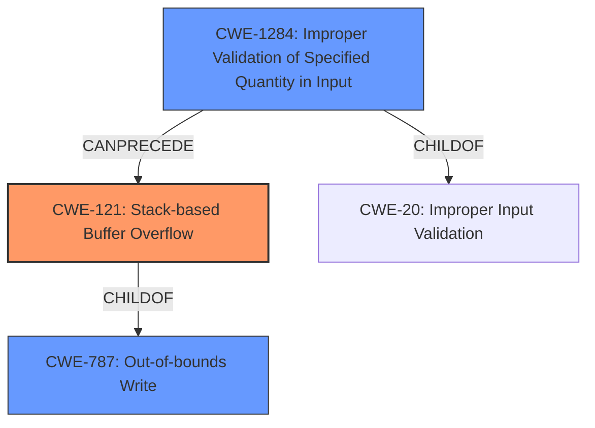

# Final Resolution for CVE-2022-35690

# Summary
| CWE ID | CWE Name | Confidence | CWE Abstraction Level | CWE Vulnerability Mapping Label | CWE-Vulnerability Mapping Notes |
|---|---|---|---|---|---|
| CWE-121 | CWE-121: Stack-based Buffer Overflow | 1.0 | Variant | Primary CWE | Allowed |
| CWE-787 | CWE-787: Out-of-bounds Write | 0.75 | Base | Secondary Candidate | Allowed |
| CWE-1284 | CWE-1284: Improper Validation of Specified Quantity in Input | 0.5 | Base | Secondary Candidate | Allowed |

## Evidence and Confidence

*   **Confidence Score:** 0.9
*   **Evidence Strength:** HIGH

## Relationship Analysis
The primary relationship is that CWE-121 is a variant of the base CWE-787, indicating a specific type of out-of-bounds write. CWE-1284 can precede buffer overflows by not validating input sizes correctly. This shows a potential chain where improper input validation leads to a buffer overflow. Abstraction levels guided the selection; CWE-121 being more specific (Variant) was chosen as primary over the more general CWE-787 (Base) due to the stack-based nature of the overflow described.

## Vulnerability Chain
The vulnerability chain starts with potentially **CWE-1284 (Improper Validation of Specified Quantity in Input)** when a crafted network packet with invalid size parameters is received. This leads to **CWE-121 (Stack-based Buffer Overflow)** because the code copies data from the packet onto the stack without proper size validation. The impact is arbitrary code execution due to the overflow, as stated in the vulnerability description. A missing link is the explicit code that handles the network packet and performs the copy operation.

## Summary of Analysis
The initial analysis and criticism are well-aligned with the vulnerability description. The primary **WEAKNESS** is clearly a **CWE-121 (Stack-based Buffer Overflow)**, given the explicit mention in the description: "Adobe ColdFusion versions Update 14 (and earlier) and Update 4 (and earlier) are affected by a **Stack-based Buffer Overflow** vulnerability." This direct evidence supports the high confidence score. The selection is further justified because network packet processing often involves allocating local variables on the stack, making it susceptible to stack-based overflows when handling untrusted packet data.

The graph relationships reinforce the decision, with CWE-121 being a specific variant of CWE-787. Had the description not mentioned "stack-based", **CWE-787 (Out-of-bounds Write)** would have been a more appropriate choice.

The inclusion of **CWE-1284 (Improper Validation of Specified Quantity in Input)** is based on the understanding that network protocols include length fields, and failing to validate those before copying data could lead to **CWE-121 (Stack-based Buffer Overflow)**. This is a likely scenario given the attack vector (crafted network packet).

The selected CWEs are at the optimal level of specificity. **CWE-121 (Stack-based Buffer Overflow)** is more specific than **CWE-787 (Out-of-bounds Write)**, and **CWE-1284 (Improper Validation of Specified Quantity in Input)** provides a potential root cause for the buffer overflow. The final determination aligns with the provided evidence and the relationships between the CWEs.