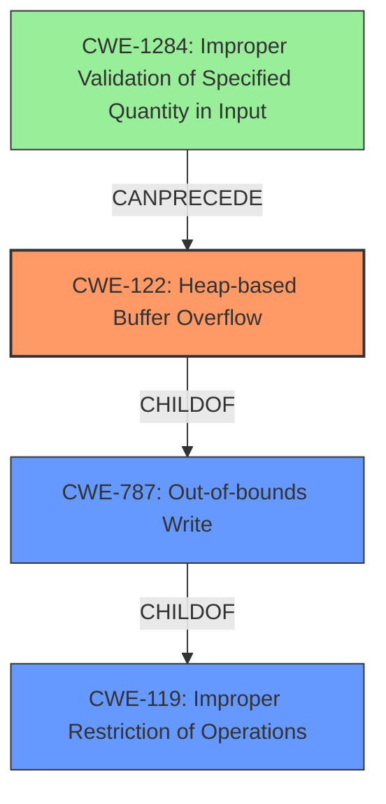

# Analysis Report for CVE-2022-3570

# Vulnerability Analysis Report: CVE-2022-3570

## Description

Multiple heap buffer overflows in tiffcrop.c utility in libtiff library Version 4.4.0 allows attacker to trigger unsafe or out of bounds memory access via crafted TIFF image file which could result into application crash, potential information disclosure or any other context-dependent impact

## Vulnerability Description Key Phrases

**Weakness:** heap buffer overflows
**Impact:** ['application crash', 'information disclosure']
**Vector:** crafted TIFF image file
**Product:** libtiff
**Version:** Version 4.4.0
**Component:** tiffcrop.c utility

## Analysis (with Relationship Data)

# Summary
| CWE ID | CWE Name | Confidence | CWE Abstraction Level | CWE Vulnerability Mapping Label | CWE-Vulnerability Mapping Notes |
|---|---|---|---|---|---|
| CWE-122 | Heap-based Buffer Overflow | 0.95 | Variant | Allowed | Primary CWE |
| CWE-787 | Out-of-bounds Write | 0.70 | Base | Allowed | Secondary Candidate |

## Evidence and Confidence

*   **Confidence Score:** 0.90
*   **Evidence Strength:** HIGH

- **Analysis and Justification:**
  - *Explanation:* The vulnerability description explicitly states "**heap buffer overflows**" in the `tiffcrop.c` utility, which directly corresponds to CWE-122 (Heap-based Buffer Overflow). The CVE Reference Links Content Summary confirms the **root cause** as a **heap buffer overflow** occurring during TIFF image file processing within the `tiffcrop` utility. The impact includes application crashes and potential information disclosure. CWE-122 is a Variant of CWE-119 (Improper Restriction of Operations within the Bounds of a Memory Buffer), providing a more specific classification for this vulnerability. The retriever results also list CWE-122 with a reasonable score. MITRE mapping guidance for CWE-122 indicates this is ALLOWED. CWE-787 is a also relevant but the description focuses on heap allocation making CWE-122 a better fit.
  - *Relationship Analysis:* CWE-122 is a variant of CWE-119 (Improper Restriction of Operations within the Bounds of a Memory Buffer), highlighting the general class of buffer overflow vulnerabilities. CWE-122 is more specific because it explicitly occurs on the heap.

- **Confidence Score:**
  - Confidence: 0.95 (High confidence due to direct evidence from the vulnerability description and CVE reference materials.)

---
- **Analysis and Justification:**
  - *Explanation:* CWE-787 (Out-of-bounds Write) is a candidate because a heap buffer overflow (CWE-122) ultimately leads to writing data outside the allocated buffer. While CWE-122 specifies the location of the overflow (heap), CWE-787 describes the core issue of writing beyond buffer boundaries. CWE-787 is a base level CWE, whereas CWE-122 is a variant. CWE-122 is a better fit because it specifies that the buffer is on the heap.
  - *Relationship Analysis:* CWE-787 is the parent of CWE-122 and a child of CWE-119.

- **Confidence Score:**
  - Confidence: 0.70 (Medium confidence because CWE-122 is a more precise classification, but CWE-787 accurately reflects the mechanism of writing beyond buffer boundaries.)

## Criticism of Analysis

## Critique of the Analysis

The analysis is generally well-reasoned and justified, with a high confidence score for CWE-122. The explanation and justification are clear and provide ample support for the selected CWEs. However, some minor points could be improved for increased accuracy and comprehensiveness.

### Strengths

*   **Clear Justification:** The analysis clearly explains why CWE-122 is the primary CWE, referencing the vulnerability description and CVE details directly.
*   **Relationship Analysis:** The analysis explains the relationship between CWE-122, its parent CWE-119, and child CWE-787.
*   **Confidence Scores:** The confidence scores are appropriately assigned based on the evidence available.
*   **Use of CWE Specifications:** The analysis correctly references and uses the CWE specifications for justification.

### Areas for Improvement

1.  **Retriever Results:** The Retriever Results listed a number of potentially relevant CWEs that were not mentioned in the Analysis. A brief discussion of why these CWEs were not selected would be beneficial. The most relevant results were:

    *   **CWE-193: Off-by-one Error:** While not the primary issue, an off-by-one error could certainly contribute to incorrect buffer sizing, thus leading to a heap buffer overflow.
    *   **CWE-190: Integer Overflow or Wraparound:** An integer overflow during buffer size calculation is a common cause for heap overflows, as noted in the specification for CWE-190.
    *   **CWE-789: Memory Allocation with Excessive Size Value:** This is a relevant CWE, if the allocation size was somehow set incorrectly with a large value, but ultimately the issue seems to be a buffer overflow.
    *   **CWE-131: Incorrect Calculation of Buffer Size:** This is a potential contributing factor as well.

    Addressing these CWEs will improve the comprehensiveness of the analysis.
2.  **Mitigation Strategies:** The analysis does not mention any mitigation strategies. Including relevant mitigations for CWE-122 and CWE-787 would increase the practical value of the analysis. For example, pre-design mitigations such as using a language or compiler with automatic bounds checking, or using a safe memory allocation library could be mentioned. Runtime mitigations, such as AddressSanitizer (ASan) used in the Gitlab issue descriptions, should also be mentioned.

3.  **CWE-119 Discussion:** The CWE specification for CWE-119 indicates that its usage is *Discouraged*. The analysis should include a quick note on why CWE-119 is not directly selected, reinforcing the fact that CWE-122 and CWE-787 are more specific and appropriate.

4.  **CWE Chain:** The description contains the text: `Chain: Multiple heap buffer overflows exist within the tiffcrop.c utility in the libtiff library. These overflows occur during the processing of certain TIFF image files, specifically during conversion subroutines.` The analysis could include a potential CWE chain involving **CWE-1284:** Improper Validation of Specified Quantity in Input leading to **CWE-122:** Heap-based Buffer Overflow.

### Revised Analysis Snippets

Here are some snippets that could be added to address the above points:

*   **Addressing Other Retriever Results:**
    "While the retriever results also suggest CWE-193 (Off-by-one Error), CWE-190 (Integer Overflow or Wraparound), CWE-789 (Memory Allocation with Excessive Size Value) and CWE-131 (Incorrect Calculation of Buffer Size) these are considered contributing factors but not the primary weakness. Integer overflows or off-by-one errors *could* lead to an incorrect buffer size calculation during memory allocation, as can an excessively large allocation, which in turn results in the heap buffer overflow. However, the core issue remains the out-of-bounds write on the heap, which is more directly represented by CWE-122."

*   **CWE-119 Note:**
    "CWE-119 (Improper Restriction of Operations within the Bounds of a Memory Buffer) is a parent of CWE-122 and CWE-787. However, CWE-119 is discouraged to use directly because it is too general. Therefore, the analysis favors the more specific CWE-122 and CWE-787."

*   **Mitigation Strategies:**
    "Potential mitigations for this vulnerability include using programming languages or compilers with automatic bounds checking, utilizing safe memory allocation libraries, and employing runtime buffer overflow detection mechanisms such as AddressSanitizer (ASan). Input validation to ensure that image dimensions and other relevant parameters are within expected bounds can also help prevent the vulnerability (CWE-1284)."

*   **CWE Chain:**
    "A potential CWE chain exists involving **CWE-1284:** Improper Validation of Specified Quantity in Input leading to **CWE-122:** Heap-based Buffer Overflow. If the input TIFF image file contains a malformed or malicious field that is not validated correctly, this could allow for an incorrect buffer size to be calculated by the program, thus leading to an exploitable heap buffer overflow condition."

### Revised Summary

```
# Summary
| CWE ID | CWE Name | Confidence | CWE Abstraction Level | CWE Vulnerability Mapping Label | CWE-Vulnerability Mapping Notes |
|---|---|---|---|---|---|
| CWE-122 | Heap-based Buffer Overflow | 0.95 | Variant | Allowed | Primary CWE |
| CWE-787 | Out-of-bounds Write | 0.70 | Base | Allowed | Secondary Candidate |
```

## Conclusion

The analysis is strong, and the proposed revisions are mainly aimed at improving comprehensiveness and providing more practical insights (mitigation strategies). The primary CWE mapping to CWE-122 is accurate and well-supported.

## Final Resolution

# Summary
| CWE ID | CWE Name | Confidence | CWE Abstraction Level | CWE Vulnerability Mapping Label | CWE-Vulnerability Mapping Notes |
|---|---|---|---|---|---|
| CWE-122 | Heap-based Buffer Overflow | 0.95 | Variant | Allowed | Primary CWE |
| CWE-787 | Out-of-bounds Write | 0.70 | Base | Allowed | Secondary Candidate |
| CWE-1284 | Improper Validation of Specified Quantity in Input | 0.60 | Base | Allowed | Contributing Factor |

## Evidence and Confidence

*   **Confidence Score:** 0.92
*   **Evidence Strength:** HIGH

## Relationship Analysis
The primary **WEAKNESS** is a **CWE-122 (Heap-based Buffer Overflow)**, a variant of **CWE-119 (Improper Restriction of Operations within the Bounds of a Memory Buffer)**. **CWE-787 (Out-of-bounds Write)** is a parent of **CWE-122** and also a child of **CWE-119**, representing the actual mechanism of writing beyond the allocated buffer. **CWE-1284 (Improper Validation of Specified Quantity in Input)** can precede **CWE-122** in a vulnerability chain if the input size isn't validated correctly, leading to an incorrect buffer allocation. The abstraction levels influenced the decision, favoring the variant **CWE-122** for its specificity to heap overflows.



## Vulnerability Chain
The vulnerability chain starts with potentially **CWE-1284 (Improper Validation of Specified Quantity in Input)**, where the TIFF image file contains a malformed field, and the program fails to validate it. This leads to an incorrect buffer size calculation, resulting in **CWE-122 (Heap-based Buffer Overflow)**, causing an **out-of-bounds write (CWE-787)**. The impact is application crashes and potential information disclosure. A missing link, if any, would be the specific code details of the invalid input leading to incorrect buffer size calculation.

## Summary of Analysis
The initial analysis correctly identifies **CWE-122 (Heap-based Buffer Overflow)** as the primary **WEAKNESS**, supported by the vulnerability description stating "multiple **heap buffer overflows** in tiffcrop.c utility". The criticism points out other potentially relevant CWEs, such as **CWE-193 (Off-by-one Error)**, **CWE-190 (Integer Overflow or Wraparound)**, **CWE-789 (Memory Allocation with Excessive Size Value)**, and **CWE-131 (Incorrect Calculation of Buffer Size)**. While these could contribute to the overflow, the core issue is the heap buffer overflow itself. Additionally, **CWE-1284 (Improper Validation of Specified Quantity in Input)** has been added to reflect that improper input validation can lead to the overflow. The graph relationships highlight that **CWE-122** is a specific case of a more general **CWE-787**, while **CWE-1284** can precede **CWE-122** in a vulnerability chain. **CWE-122** is at the optimal level of specificity because it pinpoints the location of the overflow (heap). Mitigation strategies, such as automatic bounds checking, safe memory allocation libraries, and runtime detection mechanisms, would address this vulnerability.


*Report generated on 2025-03-18 15:44:41*
