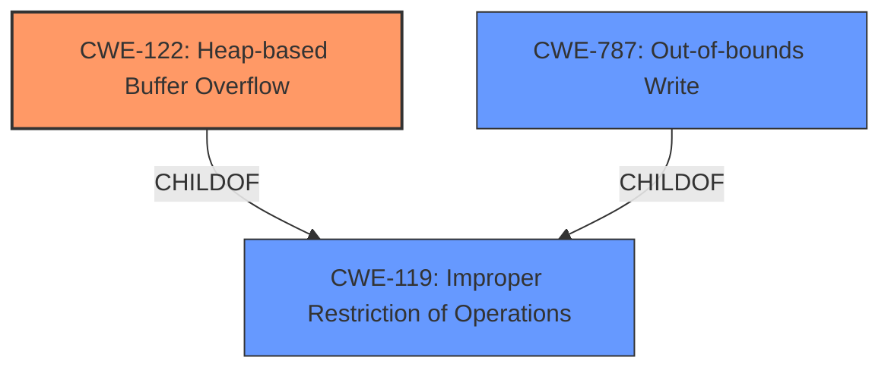

# Final Resolution for CVE-2022-35711

# Summary
| CWE ID | CWE Name | Confidence | CWE Abstraction Level | CWE Vulnerability Mapping Label | CWE-Vulnerability Mapping Notes |
|---|---|---|---|---|---|
| CWE-122 | Heap-based Buffer Overflow | 0.95 | Variant | Primary | Allowed |
| CWE-787 | Out-of-bounds Write | 0.75 | Base | Secondary | Allowed |

## Evidence and Confidence

*   **Confidence Score:** 0.92
*   **Evidence Strength:** HIGH

## Relationship Analysis
The primary relationship impacting the decision is the parent-child relationship between CWE-119 (Improper Restriction of Operations within the Bounds of a Memory Buffer), CWE-787 (**Out-of-bounds Write**), and CWE-122 (**Heap-based Buffer Overflow**). CWE-122 is a variant that is more specific than its parents. Although the description says "Heap-based **Buffer Overflow**" which strongly indicates CWE-122, CWE-787 is also relevant because any buffer overflow results in an out-of-bounds write. No chain relationships were present to add value to this classification.

## Vulnerability Chain
The vulnerability chain starts with a "crafted network packet" being sent to the server. This leads to a **Heap-based Buffer Overflow** (**CWE-122**), which is a specific type of **Out-of-bounds Write** (**CWE-787**). The consequence is arbitrary code execution. There's no information in the vulnerability description to suggest a prior step such as improper input validation.

## Summary of Analysis
The initial analysis correctly identified **CWE-122** (**Heap-based Buffer Overflow**) as the primary **weakness** due to the explicit mention in the vulnerability description: "Adobe ColdFusion versions Update 14 (and earlier) and Update 4 (and earlier) are affected by a **Heap-based Buffer Overflow** vulnerability...". The analysis also accurately included **CWE-787** (**Out-of-bounds Write**) as a secondary **weakness**, acknowledging that a buffer overflow inherently involves writing outside the intended buffer boundaries.

The criticism was valid in suggesting a clearer articulation of the relationship between the CWEs. Specifically, emphasizing that **CWE-122** is a more precise variant of **CWE-787** (and **CWE-119**) strengthens the justification for selecting **CWE-122** as the primary mapping. It also suggested including mitigations and the consideration of contributing factors.

The primary classification remains **CWE-122** because the description explicitly states "**Heap-based Buffer Overflow**". **CWE-787** is a valid secondary classification. The level of specificity is optimal because **CWE-122** is a variant, which is preferred. The evidence provided supports this decision, with a high confidence score.