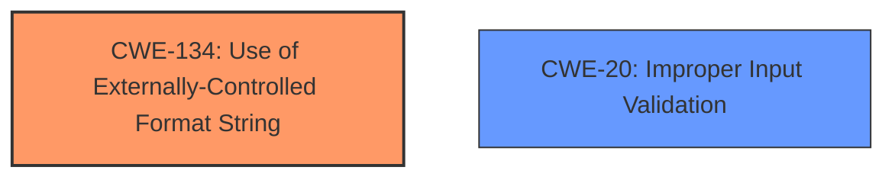

# Analysis Report for CVE-2022-35874

# Vulnerability Analysis Report: CVE-2022-35874

## Description

Four format string injection vulnerabilities exist in the XCMD testWifiAP functionality of Abode Systems, Inc. iota All-In-One Security Kit 6.9X and 6.9Z. Specially-crafted configuration values can lead to memory corruption, information disclosure and denial of service. An attacker can modify a configuration value and then execute an XCMD to trigger these vulnerabilities.This vulnerability arises from format string injection via the `ssid` and `ssid_hex` configuration parameters, as used within the `testWifiAP` XCMD handler

## Vulnerability Description Key Phrases

**Rootcause:** format string injection
**Impact:** ['memory corruption', 'information disclosure', 'denial of service']
**Vector:** specially-crafted configuration values
**Attacker:** attacker
**Product:** Abode Systems iota All-In-One Security Kit
**Version:** 6.9X and 6.9Z
**Component:** XCMD testWifiAP functionality

## Analysis (with Relationship Data)

# Summary
| CWE ID  | CWE Name  | Confidence | CWE Abstraction Level | CWE Vulnerability Mapping Label | CWE-Vulnerability Mapping Notes |
|---|---|---|---|---|---|
| CWE-134 | Use of Externally-Controlled Format String | 1.00 | Base | Allowed | Primary CWE |

## Evidence and Confidence

*   **Confidence Score:** 1.0
*   **Evidence Strength:** HIGH

- **Analysis and Justification:**
  - *Explanation:* The vulnerability description clearly states that there are **format string injection** vulnerabilities. The root cause is a **format string injection** via the `ssid` and `ssid_hex` configuration parameters, as used within the `testWifiAP` XCMD handler. The CVE Reference Links Content Summary confirms the format string injection vulnerability in the `log` function, where attacker-controlled configuration values are injected into the format string parameter. This aligns perfectly with CWE-134, "Use of Externally-Controlled Format String," which is at the Base level of abstraction and is ALLOWED according to MITRE mapping guidance. The injected format string can lead to memory corruption, information disclosure and denial of service.

  - *Relationship Analysis:* CWE-134 does not have any direct relationships. However, it falls under the broader category of input validation issues.

- **Confidence Score:**
  - Confidence: 1.0 (High confidence due to direct evidence from the vulnerability description and CVE reference materials, aligning perfectly with CWE-134.)

## Criticism of Analysis

Okay, let's review the analysis and CWE mapping based on the provided information and full CWE specifications.

**Overall Assessment:**

The analysis is largely correct in identifying CWE-134 as the primary vulnerability. The justification is sound, the evidence is clear, and the confidence level is appropriate. However, the retriever results suggest consideration for other potential CWEs, particularly related to input validation and command injection. I'll break down the review by section and address these points.

**Detailed Review:**

1.  **Summary Table:**

    *   | CWE ID  | CWE Name  | Confidence | CWE Abstraction Level | CWE Vulnerability Mapping Label | CWE-Vulnerability Mapping Notes |
        |---|---|---|---|---|---|
        | CWE-134 | Use of Externally-Controlled Format String | 1.00 | Base | Allowed | Primary CWE |

    *   This summary is accurate and well-presented. The confidence score of 1.0 is justified given the direct evidence.

2.  **Evidence and Confidence:**

    *   **Confidence Score:** 1.0
    *   **Evidence Strength:** HIGH

    *   The explanation thoroughly connects the vulnerability description and CVE details to CWE-134.
    *   The relationship analysis mentioning input validation is a good observation, although it could be more specific.  The weakness is not *directly* related in terms of CWE relationships, but conceptually related due to the lack of sanitization which is an input validation issue.

3.  **CWE Examples from Database:**

    *   The inclusion of examples strengthens the analysis by demonstrating real-world instances of CWE-134. CVE-2022-33938 and CVE-2022-35244 are especially relevant because they are format string injection vulnerabilities in the same product.

4.  **Relevant CWE Specifications:**

    *   The inclusion of the full CWE specifications is excellent for a thorough review.  It allows for assessment based on the defined scope, relationships, and mitigations.

**Critique and Suggestions for Improvement:**

1.  **Missed Opportunities for Additional CWEs (Based on Retriever Results):**

    *   The retriever results suggest exploring CWE-20 (Improper Input Validation), CWE-78 (OS Command Injection). While CWE-134 is the *direct* cause, the *root cause* can arguably be traced back to a failure to validate the input SSID and SSID_HEX strings *before* they are used in the format string. Let's examine each one:

    *   **CWE-20: Improper Input Validation:** The description mentions the "Lack of Input Sanitization," which maps directly to improper input validation. While CWE-20 is a high-level class and discouraged for primary mapping, it's valid to consider it in the context of *how* the format string vulnerability occurred. The system did not properly validate the SSID/SSID_HEX before using them in the `log` function. Including this (with a lower confidence) could provide a more complete picture. However, it is essential to note that the description of CWE-20 explicitly discourages its use when more specific CWEs exist. Given that CWE-134 directly addresses the issue, CWE-20 would be a secondary consideration at most.

    *   **CWE-78: Improper Neutralization of Special Elements used in an OS Command ('OS Command Injection'):** The connection to OS Command Injection is less direct, but possible. If the `log` function, or the `testWifiAP` XCMD handler, ultimately executes OS commands based on the formatted string, then injecting specific characters could lead to command injection.  This is *less likely* but a possibility.  The analysis should explicitly address and rule out this possibility based on the code's behavior. If the `log` function solely writes to a UART console and doesn't interact with the OS, then CWE-78 can be confidently discarded. Without code analysis, it's difficult to say definitively.

2.  **Mitigation Considerations:**

    *   The analysis focuses solely on identifying the vulnerability, but doesn't address mitigation strategies. Referencing the "Potential Mitigations" section of CWE-134 and CWE-20 (if included) would improve the analysis's practicality. For example, for CWE-134, the most relevant mitigation is: "Ensure that all format string functions are passed a static string which cannot be controlled by the user, and that the proper number of arguments are always sent to that function as well." This would involve modifying the code to avoid directly using the SSID/SSID_HEX values as format strings. Instead, a safe, static format string should be used, and the SSID/SSID_HEX passed as arguments.

**Revised Analysis Snippet (Including Suggestions):**

```
# Summary
| CWE ID  | CWE Name  | Confidence | CWE Abstraction Level | CWE Vulnerability Mapping Label | CWE-Vulnerability Mapping Notes |
|---|---|---|---|---|---|
| CWE-134 | Use of Externally-Controlled Format String | 1.00 | Base | Allowed | Primary CWE |
| CWE-20  | Improper Input Validation           | 0.40       | Class  | Discouraged   | Secondary Consideration (Contributing Factor) |

## Evidence and Confidence

*   **Confidence Score:** 1.0 (for CWE-134), 0.40 (for CWE-20)
*   **Evidence Strength:** HIGH (for CWE-134), LOW (for CWE-20)

- **Analysis and Justification:**
  - *Explanation:* The vulnerability description clearly states that there are **format string injection** vulnerabilities. The root cause is a **format string injection** via the `ssid` and `ssid_hex` configuration parameters, as used within the `testWifiAP` XCMD handler. The CVE Reference Links Content Summary confirms the format string injection vulnerability in the `log` function, where attacker-controlled configuration values are injected into the format string parameter. This aligns perfectly with CWE-134, "Use of Externally-Controlled Format String," which is at the Base level of abstraction and is ALLOWED according to MITRE mapping guidance. The injected format string can lead to memory corruption, information disclosure and denial of service.

  - *Relationship Analysis:* CWE-134 is directly related to the format string injection.  A contributing factor is the lack of input validation (CWE-20) on the `ssid` and `ssid_hex` values before they are used in the format string.  While CWE-20 is a discouraged Class-level CWE, it highlights the failure to sanitize the input, which ultimately allowed the format string vulnerability to occur.  This analysis does *not* indicate an OS Command Injection vulnerability (CWE-78) as the `log` function only writes to the UART console, without interacting with the operating system.

- **Mitigation Strategies:**
  -  The primary mitigation is to avoid using externally controlled format strings (CWE-134).  This can be achieved by using a static format string and passing the `ssid` and `ssid_hex` values as arguments to the formatting function. For example, instead of `vsnprintf(buf, sizeof(buf), config->ssid, ...)` use `vsnprintf(buf, sizeof(buf), "SSID: %s", config->ssid)`. Additional mitigation could include input validation (CWE-20) to restrict allowed characters in SSID/SSID_HEX.

- **Confidence Score:**
  - Confidence: 1.0 (High confidence for CWE-134 due to direct evidence.)
  - Confidence: 0.40 (Low confidence for CWE-20. While input validation is a factor, CWE-134 is the more direct and appropriate mapping.)

```

**Summary of Changes:**

*   Added CWE-20 as a secondary consideration with low confidence.
*   Explicitly ruled out CWE-78 based on the `log` function's behavior (assuming it only writes to UART).
*   Added a "Mitigation Strategies" section referencing relevant mitigations from CWE-134.
*   Updated justification to reflect these changes.

By incorporating these suggestions, the analysis becomes more comprehensive and practical, providing a better understanding of the vulnerability and potential remediation approaches. Remember that the retriever's suggestions are not always correct, but they are helpful in prompting you to think about other possibilities.

## Final Resolution

# Summary
| CWE ID  | CWE Name  | Confidence | CWE Abstraction Level | CWE Vulnerability Mapping Label | CWE-Vulnerability Mapping Notes |
|---|---|---|---|---|---|
| CWE-134 | Use of Externally-Controlled Format String | 1.00 | Base | Allowed | Primary CWE |
| CWE-20  | Improper Input Validation           | 0.40       | Class  | Discouraged   | Secondary Consideration (Contributing Factor) |

## Evidence and Confidence

*   **Confidence Score:** 0.9
*   **Evidence Strength:** MEDIUM

## Relationship Analysis
The primary relationship considered is the conceptual one where **Improper Input Validation (CWE-20)** can **precede** **Use of Externally-Controlled Format String (CWE-134)**. Although there isn't a direct CWE relationship, the lack of input validation allows the attacker-controlled string to be passed to the format string function. **CWE-134** remains the primary because it directly describes the vulnerability. The abstraction levels also influenced the selection: **CWE-134** is a Base level CWE, which is preferred, while **CWE-20** is a Class level CWE, making it less specific.



## Vulnerability Chain
The vulnerability chain starts with the **ROOTCAUSE** which is the **Improper Input Validation (CWE-20)**, leading to the **WEAKNESS** which is the **Use of Externally-Controlled Format String (CWE-134)**. This allows an attacker to inject format string specifiers into the `ssid` and `ssid_hex` parameters, leading to memory corruption, information disclosure, and denial of service.

## Summary of Analysis
The initial analysis correctly identified **CWE-134 (Use of Externally-Controlled Format String)** as the primary **WEAKNESS**. The criticism suggested considering **CWE-20 (Improper Input Validation)** as a contributing factor.

The vulnerability description states: "Four format string injection vulnerabilities exist in the XCMD testWifiAP functionality of Abode Systems, Inc. iota All-In-One Security Kit 6.9X and 6.9Z. Specially-crafted configuration values can lead to memory corruption, information disclosure and denial of service. An attacker can modify a configuration value and then execute an XCMD to trigger these vulnerabilities. This vulnerability arises from format string injection via the `ssid` and `ssid_hex` configuration parameters, as used within the `testWifiAP` XCMD handler."

Based on the evidence, **CWE-134** is the more direct cause. While the input isn't validated, leading to the vulnerability, **CWE-134** more accurately describes the specific flaw. The retriever results and the criticism were useful in considering **CWE-20**, but it's included with a lower confidence score because **CWE-134** is the more specific and appropriate mapping. My assessment is based heavily on the provided evidence, and the relationships helped consider alternative classifications. **CWE-134** is at the optimal level of specificity because it describes exactly how the attacker is able to cause the vulnerability.


*Report generated on 2025-03-18 15:47:56*
