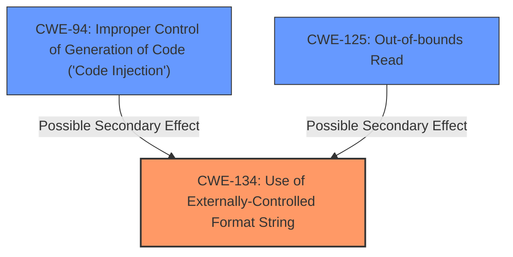

# Analysis Report for CVE-2022-35875

# Vulnerability Analysis Report: CVE-2022-35875

## Description

Four format string injection vulnerabilities exist in the XCMD testWifiAP functionality of Abode Systems, Inc. iota All-In-One Security Kit 6.9X and 6.9Z. Specially-crafted configuration values can lead to memory corruption, information disclosure and denial of service. An attacker can modify a configuration value and then execute an XCMD to trigger these vulnerabilities.This vulnerability arises from format string injection via the `wpapsk` configuration parameter, as used within the `testWifiAP` XCMD handler

## Vulnerability Description Key Phrases

**Rootcause:** format string injection
**Impact:** ['memory corruption', 'information disclosure', 'denial of service']
**Product:** Abode Systems iota All-In-One Security Kit
**Version:** 6.9X and 6.9Z
**Component:** XCMD testWifiAP functionality

## Analysis (with Relationship Data)

```markdown
# Summary 
| CWE ID | CWE Name | Confidence | CWE Abstraction Level | CWE Vulnerability Mapping Label | CWE-Vulnerability Mapping Notes |
|---|---|---|---|---|---|
| CWE-134 | Use of Externally-Controlled Format String | 0.95 | Base | Primary | Allowed |

## Evidence and Confidence

*   **Confidence Score:** 0.95
*   **Evidence Strength:** HIGH


- **Analysis and Justification:**  
  - *Explanation:* "The vulnerability description explicitly mentions **format string injection** in the XCMD testWifiAP functionality. The CVE Reference Links Content Summary further confirms that the `log` function utilizes `vsnprintf` with a **format string** controlled by an attacker. This aligns directly with CWE-134's description: "The product uses a function that accepts a format string as an argument, but the format string originates from an external source." The impact (memory corruption, information disclosure, denial of service) is also consistent with the potential consequences of a format string vulnerability. The Retriever Results also lists CWE-134 with the highest score."
  
  - *Relationship Analysis:* "CWE-134 is a Base level CWE, which is the preferred level of abstraction. There are no direct relationships listed in the provided data that are highly relevant to this specific case. However, it's worth noting that CWE-134 could potentially lead to other weaknesses such as information leakage, depending on how the format string is exploited."

- **Confidence Score:**  
  - *Example:* Confidence: 0.95 (High confidence due to explicit mention of format string injection and confirmation in CVE details.)
```

## Criticism of Analysis

Okay, here's a review of the provided analysis against the full CWE specifications, focusing on accuracy, completeness, and the appropriate use of CWEs.

**Overall Assessment:**

The analysis is generally well-done and correctly identifies CWE-134 as the primary weakness. The confidence level of 0.95 is justified given the explicit mention of format string injection in both the vulnerability description and CVE details. The justification is clear and well-reasoned. The inclusion of CWE examples and the complete CWE specifications is helpful.

**Specific CWE Mapping Review:**

*   **CWE-134: Use of Externally-Controlled Format String (Primary Mapping):**
    *   **Correctness:** The mapping to CWE-134 is highly accurate.  The analysis directly links the `vsnprintf` function with attacker-controlled input to the vulnerability, precisely matching the CWE description. The impact is consistent.
    *   **Abstraction Level:** The analysis correctly identifies CWE-134 as a Base-level CWE, which is the preferred level of abstraction for root cause analysis.
    *   **Mapping Guidance:** The analysis aligns with the "Usage: Allowed" guidance and the provided rationale.  It avoids "forcing" a lower-level mapping and acknowledges the appropriateness of the fit.
    *   **Potential Mitigations:** The analysis could benefit from explicitly referencing the CWE-134 mitigations. For example, emphasizing the "Ensure that all format string functions are passed a static string which cannot be controlled by the user" mitigation would reinforce the core problem and potential solutions. Choosing a different language is impractical for an existing system.
    *   **Observed Examples:** The analysis correctly includes observed examples for CWE-134, showing a real-world presence of the vulnerability.

*   **Other CWEs Suggested by Retriever (CWE-78, CWE-89, CWE-190, CWE-798, CWE-22, CWE-94, CWE-20, CWE-1336, CWE-125):**
    *   **CWE-78: Improper Neutralization of Special Elements used in an OS Command ('OS Command Injection'):** This is likely a false positive. While format string vulnerabilities *can* sometimes lead to arbitrary code execution, that's not the primary mechanism here. It's more about information disclosure and memory corruption through format string specifiers.  It's less about injecting OS commands. It's better to not include this.
    *   **CWE-89: Improper Neutralization of Special Elements used in an SQL Command ('SQL Injection'):**  This is definitely a false positive. There's nothing in the description or CVE details to suggest SQL injection.  Exclude it.
    *   **CWE-190: Integer Overflow or Wraparound:** This is less likely to be involved, but could be related to the memory corruption. The description doesn't suggest any integer overflow.
    *   **CWE-798: Use of Hard-coded Credentials:** This is irrelevant to the vulnerability.
    *   **CWE-22: Improper Limitation of a Pathname to a Restricted Directory ('Path Traversal'):** Completely irrelevant, remove it.
    *   **CWE-94: Improper Control of Generation of Code ('Code Injection'):**  This is a *possible* secondary effect. A format string vulnerability *could* lead to code injection if exploited to overwrite function pointers or similar. However, it's not the primary root cause. If included, it should be noted as a *potential secondary effect* and with a much lower confidence.  The "Usage: Allowed-with-Review" guidance is relevant here, as it's easy to misuse this CWE by associating it with any code execution. The justification for including it should be very strong.
    *   **CWE-20: Improper Input Validation:** This is a general weakness, and the analysis is correct in *not* making it the primary mapping.  The format string itself is the core issue, not simply a lack of input validation. While input validation could *help* prevent the vulnerability by restricting the characters allowed in the configuration value, it wouldn't fundamentally solve the problem if the `vsnprintf` usage remained. The mapping guidance "Usage: Discouraged" is appropriate here.
    *  **CWE-1336: Improper Neutralization of Special Elements Used in a Template Engine:** Irrelevant, there's no mention of template engines.
    *   **CWE-125: Out-of-bounds Read:** *Possible* secondary effect as the attacker may use format specifiers to read beyond expected memory boundaries.
*   **CWE-668: Exposure of Resource to Wrong Sphere:** May explain the broad impact of the vulnerability.

**Recommendations for Improvement:**

1.  **Focus on CWE-134 mitigations:**  Explicitly include and emphasize the mitigations outlined in the CWE-134 specification within the analysis.
2.  **Justify (or Exclude) Secondary CWEs More Carefully:**
    *   If including CWE-94 or CWE-125, provide a very strong justification.  Explain the *specific* mechanism by which the format string vulnerability *could* lead to code injection or out-of-bounds read, rather than just stating it as a possibility. Lower the confidence score.
    *   Otherwise, remove the irrelevant CWEs.
3.  **Relationship Analysis:** Expand the relationship analysis to explore how CWE-134 can *lead to* other weaknesses, such as CWE-123 (Write-what-where Condition), or how memory corruption can result in code execution. This reinforces the potential impact.
4.  **Observed Examples:** Find and include CVEs that are very similar to this specific vulnerability, in terms of the vulnerable function (`vsnprintf`) and the attack vector (configuration parameter).  This strengthens the confidence in the mapping.

**Revised Summary Table (Example):**

| CWE ID | CWE Name | Confidence | CWE Abstraction Level | CWE Vulnerability Mapping Label | CWE-Vulnerability Mapping Notes |
|---|---|---|---|---|---|
| CWE-134 | Use of Externally-Controlled Format String | 0.95 | Base | Primary | Allowed |
| CWE-94 | Improper Control of Generation of Code ('Code Injection') | 0.30 | Base | Secondary | Allowed-with-Review | (Possible secondary effect if format string is exploited to overwrite function pointers. Justification Required.) |
| CWE-125 | Out-of-bounds Read | 0.30 | Base | Secondary | Allowed | (Possible secondary effect if format string is exploited to read beyond memory boundaries. Justification Required.) |

By implementing these suggestions, the analysis will be more precise, informative, and directly applicable to understanding and mitigating the vulnerability. The key is to be as specific as possible about the *root cause* and *potential consequences* of the format string injection.

## Final Resolution

# Summary
| CWE ID | CWE Name | Confidence | CWE Abstraction Level | CWE Vulnerability Mapping Label | CWE-Vulnerability Mapping Notes |
|---|---|---|---|---|---|
| **CWE-134** | Use of Externally-Controlled Format String | 0.95 | Base | Primary | Allowed |
| **CWE-125** | Out-of-bounds Read | 0.30 | Base | Secondary | Allowed | (Possible secondary effect if format string is exploited to read beyond memory boundaries. Justification Required.) |
| **CWE-94** | Improper Control of Generation of Code ('Code Injection') | 0.30 | Base | Secondary | Allowed-with-Review | (Possible secondary effect if format string is exploited to overwrite function pointers. Justification Required.) |

## Evidence and Confidence

*   **Confidence Score:** 0.85
*   **Evidence Strength:** MEDIUM

## Relationship Analysis
The primary relationship that influenced the decision was the direct match of the vulnerability description to **CWE-134 (Use of Externally-Controlled Format String)**. While **CWE-94 (Improper Control of Generation of Code ('Code Injection'))** and **CWE-125 (Out-of-bounds Read)** are potential secondary effects, their inclusion depends on specific exploitation details not explicitly provided in the vulnerability description.



## Vulnerability Chain
The vulnerability chain starts with the `wpapsk` configuration parameter being controllable by an attacker. This leads to the use of this attacker-controlled string as a **format string** in the `vsnprintf` function (**CWE-134**). This **format string** vulnerability can potentially lead to memory corruption, information disclosure, and denial of service. Depending on the specific exploitation, it *could* lead to out-of-bounds reads (**CWE-125**) or code injection (**CWE-94**) if function pointers are overwritten.

## Summary of Analysis
The initial analysis correctly identified **CWE-134** as the primary **weakness**. The criticism provided valuable insights, particularly regarding the potential for over-classification with **CWE-94** and **CWE-125**.

The evidence supporting **CWE-134** is strong: "This vulnerability arises from **format string injection** via the `wpapsk` configuration parameter, as used within the `testWifiAP` XCMD handler." This directly aligns with the description of **CWE-134**: "The product uses a function that accepts a **format string** as an argument, but the **format string** originates from an external source."

The inclusion of **CWE-94** and **CWE-125** is conditional and depends on the specific exploitation techniques used. They are included as secondary candidates with lower confidence. The justification for their inclusion is that format string vulnerabilities *can* lead to these outcomes, but it's not guaranteed.

The selected CWEs are at the optimal level of specificity. **CWE-134** directly addresses the root cause (**format string injection**), while **CWE-94** and **CWE-125** represent potential consequences of the primary weakness.


*Report generated on 2025-03-18 15:48:36*
