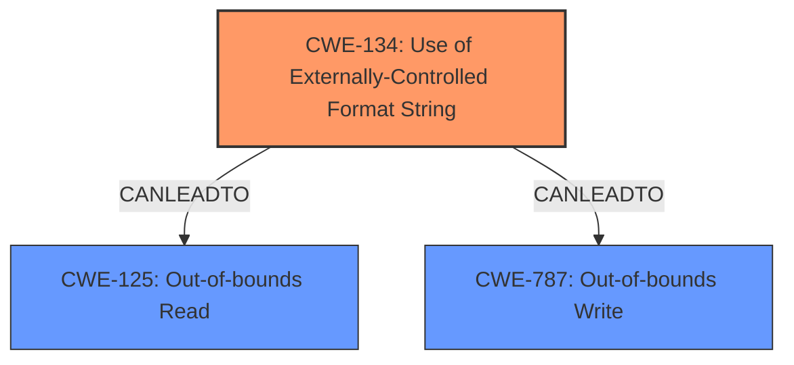

# Final Resolution for CVE-2022-35876

# Summary
| CWE ID  | CWE Name                                                                                   | Confidence | CWE Abstraction Level | CWE Vulnerability Mapping Label | CWE-Vulnerability Mapping Notes |
| :-------- | :----------------------------------------------------------------------------------------- | :---------- | :-------------------- | :------------------------------ | :-------------------------------- |
| CWE-134 | Use of Externally-Controlled Format String                                                 | 1.0         | Base                  | Primary CWE                     | Allowed                           |
| CWE-125 | Out-of-bounds Read                                                                         | 0.80        | Base                  | Secondary Candidate             | Allowed                           |
| CWE-787 | Out-of-bounds Write                                                                        | 0.75        | Base                  | Secondary Candidate             | Allowed                           |

## Evidence and Confidence

*   **Confidence Score:** 0.9
*   **Evidence Strength:** HIGH

## Relationship Analysis
The primary CWE is CWE-134 (**Use of Externally-Controlled Format String**), which is a base class. The secondary candidates are CWE-125 (**Out-of-bounds Read**) and CWE-787 (**Out-of-bounds Write**), also base classes. There are no direct hierarchical relationships between these CWEs. However, a vulnerability chain exists where CWE-134 can lead to CWE-125 (information disclosure) or CWE-787 (memory corruption). There are no peer relationships between the selected CWEs. The abstraction levels are appropriate as they are at the Base level.

## Vulnerability Chain
The vulnerability chain starts with user-controlled configuration values being used as a format string in the `testWifiAP` XCMD handler. This leads to CWE-134 (**Use of Externally-Controlled Format String**). Exploitation of this **weakness** can result in CWE-125 (**Out-of-bounds Read**) for information disclosure or CWE-787 (**Out-of-bounds Write**) for memory corruption. The initial **flaw** is the lack of sanitization of the format string.

## Summary of Analysis
The initial analysis and criticism both agree on CWE-134 as the primary **root cause**. The criticism provides valuable suggestions for strengthening the justification for the secondary candidates, CWE-125 and CWE-787, and suggests considering alternative CWEs like CWE-200 (Information Exposure). The analysis is based on the vulnerability description that explicitly mentions format string injection, memory corruption, and information disclosure. The graph relationships confirm that CWE-134 can lead to CWE-125 and CWE-787.

The final selection of CWEs is justified as follows:
- CWE-134 is the direct **root cause** of the vulnerability, as confirmed by the vulnerability description and the CVE reference.
- CWE-125 and CWE-787 are potential impacts of exploiting CWE-134, as described in the vulnerability description.
- The abstraction levels are appropriate as they are at the Base level, providing sufficient specificity.

The selected CWEs are at the optimal level of specificity because they accurately represent the **root cause** and potential impacts of the vulnerability based on the available evidence.