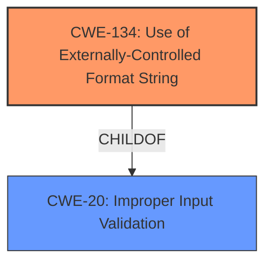

# Analysis Report for CVE-2022-35878

# Vulnerability Analysis Report: CVE-2022-35878

## Description

Four format string injection vulnerabilities exist in the UPnP logging functionality of Abode Systems, Inc. iota All-In-One Security Kit 6.9Z and 6.9X. A specially-crafted UPnP negotiation can lead to memory corruption, information disclosure, and denial of service. An attacker can host a malicious UPnP service to trigger these vulnerabilities.This vulnerability arises from format string injection via `ST` and `Location` HTTP response headers, as used within the `DoEnumUPnPService` action handler.

## Vulnerability Description Key Phrases

**Rootcause:** format string injection
**Impact:** ['memory corruption', 'information disclosure', 'denial of service']
**Attacker:** attacker
**Product:** Abode Systems iota All-In-One Security Kit
**Version:** 6.9Z and 6.9X
**Component:** UPnP logging functionality

## Analysis (with Relationship Data)

# Summary
| CWE ID | CWE Name | Confidence | CWE Abstraction Level | CWE Vulnerability Mapping Label | CWE-Vulnerability Mapping Notes |
|---|---|---|---|---|---|
| CWE-134 | Use of Externally-Controlled Format String | 1.0 | Base | Allowed | Primary CWE |

## Evidence and Confidence

*   **Confidence Score:** 1.0
*   **Evidence Strength:** HIGH

- **Analysis and Justification:**  
  - *Explanation:* The vulnerability description explicitly states "**format string injection** vulnerabilities exist in the UPnP logging functionality". The CVE reference summary also indicates that "The `log` function uses `vsnprintf` to format log messages, and the format string parameter is derived from network inputs." This perfectly aligns with CWE-134 [Use of Externally-Controlled Format String], where the format string originates from an external source (network input). The impact includes memory corruption, information disclosure, and denial of service, all typical consequences of format string vulnerabilities. The MITRE mapping guidance for CWE-134 indicates this is ALLOWED.

  - *Relationship Analysis:* No direct relationships were found but CWE-134 is a child of CWE-20, which is a broad category. The vulnerability details specifically point to format string usage, making CWE-134 a more precise match.

- **Confidence Score:**  
  - *Example:* Confidence: 1.0 (Explicit mention of format string injection, strong alignment with CWE definition)

## Criticism of Analysis

Okay, let's review the provided analysis and CWE specifications.

**Overall Assessment:**

The analysis correctly identifies CWE-134 (Use of Externally-Controlled Format String) as the primary vulnerability. The confidence score is justified given the clear evidence in the vulnerability description and CVE reference summary. The analysis also appropriately acknowledges that CWE-134 is a child of the broader CWE-20 (Improper Input Validation), but correctly prioritizes the more specific CWE-134.

**Detailed Critique:**

1.  **CWE-134: Use of Externally-Controlled Format String**

    *   **Correctness:** The mapping to CWE-134 is accurate and well-supported by the provided information. The vulnerability description explicitly mentions "format string injection," and the CVE summary details that the format string parameter to `vsnprintf` originates from network inputs.
    *   **Abstraction Level:** The Base level of abstraction (CWE-134) is appropriate, as it directly represents the root cause.
    *   **Mapping Guidance:** The analysis correctly notes that the MITRE mapping guidance allows the use of CWE-134.
    *   **Mitigations:** The analysis doesn't explicitly discuss mitigations, but the CWE specifications provide relevant mitigations:
        *   **Requirement:** Choose a language without format string issues. (Not always feasible).
        *   **Implementation:** Use static format strings, avoid the `%n` operator.  This is the most relevant mitigation for this specific vulnerability.
        *   **Build/Compilation:** Use high warning levels.
    *   **Evidence Strength:** The evidence strength is high, as the root cause is explicitly stated.
    *   **Relationship Analysis:** The relationship to CWE-20 is acknowledged and correctly addressed.

2.  **Other CWEs Identified by Retrievers (but *not* selected as primary by the Analysis):**

    Let's look at why the other CWEs in the retriever results are less suitable, using the CWE Specifications:

    *   **CWE-89: Improper Neutralization of Special Elements used in an SQL Command ('SQL Injection')** - This is incorrect. This is not a SQL injection vulnerability. The injection is in the *format string* used in logging, not an SQL query.
    *   **CWE-190: Integer Overflow or Wraparound** - While a format string vulnerability *could* lead to an integer overflow *in some circumstances* (e.g., by manipulating the number of bytes written using format specifiers), it's not the primary cause. The core issue is the attacker's control over the format string itself.
    *   **CWE-78: Improper Neutralization of Special Elements used in an OS Command ('OS Command Injection')** - Similar to SQL injection, this is not a command injection vulnerability.  The vulnerability is not about constructing and executing OS commands, but about influencing the *format string* passed to a logging function.
    *   **CWE-1286: Improper Validation of Syntactic Correctness of Input** - This is indirectly related but not the core issue. The input is not validated to ensure it doesn't contain malicious format string specifiers. This is a consequence, not the primary weakness. While input validation is missing, the *specific* type of improper input is control over a format string.
    *   **CWE-798: Use of Hard-coded Credentials** - This is irrelevant to the vulnerability being described.
    *   **CWE-121: Stack-based Buffer Overflow** - Format string bugs *can* lead to buffer overflows, but it's not a guaranteed outcome. The primary issue is the information disclosure and ability to read/write memory *through the format string functionality itself*.
    *   **CWE-94: Improper Control of Generation of Code ('Code Injection')** - This is loosely related, but less precise than CWE-134.  While format string injection *can* be used to achieve arbitrary code execution, it doesn't always result in directly generating code. Focus is on manipulating control flow.
    *   **CWE-20: Improper Input Validation** - This is a parent class of CWE-134 and is too broad. While the input *should* be validated, the specific failure is not validating the *format string* aspect of the input. The description lacks the specificity that CWE-134 provides.  CWE-20's usage is discouraged when more specific CWEs exist.
    *   **CWE-125: Out-of-bounds Read** - A format string vulnerability can lead to information disclosure by reading from arbitrary memory locations, which could be out-of-bounds. However, the core problem is not the out-of-bounds read itself, but the attacker's ability to control the read's location via format string specifiers.

**Improvements:**

*   **Mitigation Emphasis:** While the analysis is correct in its primary CWE identification, it could be improved by *explicitly* mentioning the most relevant mitigation: *ensuring that all format string functions are passed a static string which cannot be controlled by the user, and that the proper number of arguments are always sent to that function as well*.
*   **Chain/Composite Possibilities:** It *might* be worth briefly mentioning (though not mapping to) the *potential* chaining to buffer overflows (CWE-121 or CWE-120) or out-of-bounds reads (CWE-125) as a *possible* consequence of successful exploitation of the format string vulnerability. But that's secondary.
*   **Retriever Result Justification:** A short paragraph explaining why the other retriever results are *not* the primary CWE, referencing the CWE specifications, would strengthen the analysis.

**Conclusion:**

The analysis is largely correct and well-justified. The identification of CWE-134 is accurate, and the analysis appropriately handles the relationship with CWE-20. The potential improvements would involve explicitly highlighting the most relevant mitigation and providing a short justification for excluding the other CWEs suggested by the retrievers. Overall, it's a good analysis.

## Final Resolution

# Summary
| CWE ID | CWE Name | Confidence | CWE Abstraction Level | CWE Vulnerability Mapping Label | CWE-Vulnerability Mapping Notes |
|---|---|---|---|---|---|
| CWE-134 | Use of Externally-Controlled Format String | 1.0 | Base | Allowed | Primary CWE |

## Evidence and Confidence

*   **Confidence Score:** 1.0
*   **Evidence Strength:** HIGH

## Relationship Analysis
The primary relationship considered was the parent-child relationship between CWE-134 and CWE-20. CWE-134 is a child of CWE-20 (Improper Input Validation). The analysis correctly identifies CWE-134 as the more specific and appropriate choice. There are no chain relationships applicable in this case, as CWE-134 directly represents the root cause. The abstraction level of Base for CWE-134 is optimal for root cause mapping.

## Vulnerability Chain
The vulnerability chain starts with the **WEAKNESS** of using an externally-controlled format string (CWE-134). This leads to the ability to inject format string specifiers, enabling memory corruption, information disclosure, and denial of service. The root cause is the lack of sanitization of the format string from network inputs.

## Summary of Analysis
The initial analysis and criticism both converge on the correct classification of CWE-134 as the primary **ROOTCAUSE**. The vulnerability description explicitly mentions "format string injection", and the CVE summary details the format string parameter to `vsnprintf` originates from network inputs, providing strong evidence. The analysis appropriately explains why other CWEs suggested by retrievers are less suitable, referencing the CWE specifications. The selected CWE is at the optimal level of specificity (Base).

The selection is based on the evidence "**format string injection vulnerabilities exist in the UPnP logging functionality**" and "**The `log` function uses `vsnprintf` to format log messages, and the format string parameter is derived from network inputs.**" These statements directly align with the definition of CWE-134.

*Report generated on 2025-03-18 15:50:47*
