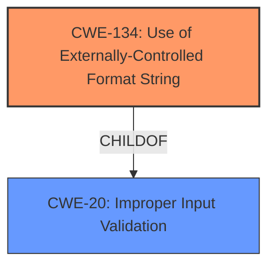

# Final Resolution for CVE-2022-35878

# Summary
| CWE ID | CWE Name | Confidence | CWE Abstraction Level | CWE Vulnerability Mapping Label | CWE-Vulnerability Mapping Notes |
|---|---|---|---|---|---|
| CWE-134 | Use of Externally-Controlled Format String | 1.0 | Base | Allowed | Primary CWE |

## Evidence and Confidence

*   **Confidence Score:** 1.0
*   **Evidence Strength:** HIGH

## Relationship Analysis
The primary relationship considered was the parent-child relationship between CWE-134 and CWE-20. CWE-134 is a child of CWE-20 (Improper Input Validation). The analysis correctly identifies CWE-134 as the more specific and appropriate choice. There are no chain relationships applicable in this case, as CWE-134 directly represents the root cause. The abstraction level of Base for CWE-134 is optimal for root cause mapping.

## Vulnerability Chain
The vulnerability chain starts with the **WEAKNESS** of using an externally-controlled format string (CWE-134). This leads to the ability to inject format string specifiers, enabling memory corruption, information disclosure, and denial of service. The root cause is the lack of sanitization of the format string from network inputs.

## Summary of Analysis
The initial analysis and criticism both converge on the correct classification of CWE-134 as the primary **ROOTCAUSE**. The vulnerability description explicitly mentions "format string injection", and the CVE summary details the format string parameter to `vsnprintf` originates from network inputs, providing strong evidence. The analysis appropriately explains why other CWEs suggested by retrievers are less suitable, referencing the CWE specifications. The selected CWE is at the optimal level of specificity (Base).

The selection is based on the evidence "**format string injection vulnerabilities exist in the UPnP logging functionality**" and "**The `log` function uses `vsnprintf` to format log messages, and the format string parameter is derived from network inputs.**" These statements directly align with the definition of CWE-134.