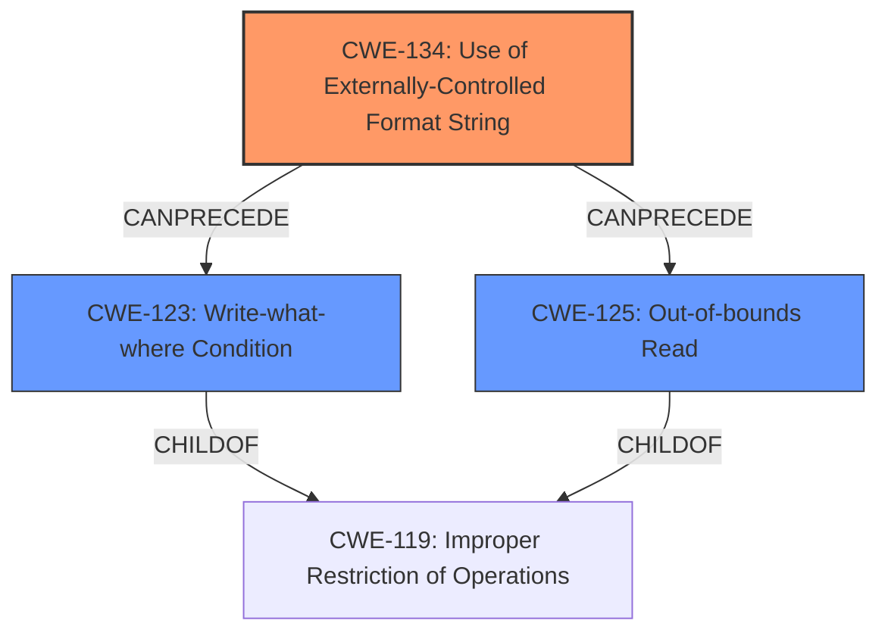

# Analysis Report for CVE-2022-35879

# Vulnerability Analysis Report: CVE-2022-35879

## Description

Four format string injection vulnerabilities exist in the UPnP logging functionality of Abode Systems, Inc. iota All-In-One Security Kit 6.9Z and 6.9X. A specially-crafted UPnP negotiation can lead to memory corruption, information disclosure, and denial of service. An attacker can host a malicious UPnP service to trigger these vulnerabilities.This vulnerability arises from format string injection via `controlURL` XML tag, as used within the `DoUpdateUPnPbyService` action handler.

## Vulnerability Description Key Phrases

**Rootcause:** format string injection
**Impact:** ['memory corruption', 'information disclosure', 'denial of service']
**Vector:** specially-crafted UPnP negotiation
**Attacker:** attacker
**Product:** Abode Systems iota All-In-One Security Kit
**Version:** 6.9Z and 6.9X
**Component:** UPnP logging functionality

## Analysis (with Relationship Data)

# Summary
| CWE ID | CWE Name | Confidence | CWE Abstraction Level | CWE Vulnerability Mapping Label | CWE-Vulnerability Mapping Notes |
|---|---|---|---|---|---|
| CWE-134 | Use of Externally-Controlled Format String | 1.0 | Base | Allowed | The primary weakness is **format string injection** via the `controlURL` XML tag, aligning directly with CWE-134. |
| CWE-79 | Improper Neutralization of Input During Web Page Generation ('Cross-site Scripting') | 0.4 | Base | Allowed | The description mentions information disclosure which could lead to Cross-Site Scripting, but this is a secondary concern. |
| CWE-119 | Buffer Copy without Checking Size of Input ('Classic Buffer Overflow') | 0.4 | Class | Discouraged | The description mentions memory corruption, so this is considered as a potential secondary impact. |

## Evidence and Confidence

*   **Confidence Score:** 0.9
*   **Evidence Strength:** HIGH

- **Analysis and Justification:**  
  - *Explanation:* The vulnerability is a **format string injection** in the UPnP logging functionality. The `controlURL` XML tag is used to pass data to the `log` function, which in turn passes this data to `vsnprintf` without proper sanitization. This aligns precisely with CWE-134 (Use of Externally-Controlled Format String), where an externally-controlled string is used as a format string. The "Retriever Results" also lists CWE-134 as the top match with a score of 1.0774. The MITRE mapping guidance for CWE-134 indicates this is ALLOWED. Although other CWEs like CWE-78 (Improper Neutralization of Special Elements used in an OS Command) are listed, the vulnerability is directly related to format string usage rather than OS command execution. The evidence clearly points to CWE-134 as the primary weakness.

  - *Relationship Analysis:* CWE-134 does not have direct parent-child relationships. It is related to CWE-74 (Improper Neutralization of Special Elements) as a contributing weakness.

- **Confidence Score:**  
  - Confidence: 1.0 (High evidence from technical description, CVE reference materials, and Retriever Results)

---
- **Analysis and Justification:**  
  - *Explanation:* Information disclosure is mentioned in the description as an impact of the vulnerability. While not the primary weakness, the **format string injection** can be leveraged to leak sensitive information, potentially leading to Cross-Site Scripting (XSS). CWE-79 (Improper Neutralization of Input During Web Page Generation ('Cross-site Scripting')) is considered a secondary candidate because leaked information might be used in a web context. This is a possible but less direct consequence of the primary vulnerability.
  - *Relationship Analysis:* CWE-79 is a child of CWE-74 (Improper Neutralization of Special Elements) and peer of CWE-352 (Cross-Site Request Forgery).

- **Confidence Score:**  
  - Confidence: 0.4 (Low evidence, secondary impact)

---
- **Analysis and Justification:**  
  - *Explanation:* The description mentions memory corruption as one of the impacts. This suggests the possibility of a buffer overflow due to the uncontrolled nature of the format string. CWE-119 (Buffer Copy without Checking Size of Input ('Classic Buffer Overflow')) is included as a possible secondary impact, but the primary cause remains the **format string injection**. The Retriever Results lists CWE-119 but it is discouraged for being commonly misused.
  - *Relationship Analysis:* CWE-119 is a child of CWE-20 (Improper Input Validation).

- **Confidence Score:**  
  - Confidence: 0.4 (Low evidence, secondary impact)

## Criticism of Analysis

Okay, I've reviewed the provided analysis and the full CWE specifications for each mentioned CWE. Here's a critique of the analysis, focusing on the accuracy, completeness, and use of CWE's mapping guidance and mitigation information:

**Overall Assessment**

The analysis is generally good and identifies the most likely root cause (CWE-134) correctly. The justifications are well-reasoned and reference the provided information. However, the secondary CWE assignments (CWE-79, CWE-119) could be improved by considering more specific and related CWEs, and by more carefully considering the mapping guidance for each CWE.

**Detailed Review by CWE**

**1. CWE-134: Use of Externally-Controlled Format String**

*   **CWE Score in Analysis:** 1.0
*   **Assessment:** This is the most accurate and well-supported assignment. The vulnerability description clearly points to a format string injection vulnerability, and the analysis correctly identifies `controlURL` as the source of externally controlled data. The use of `vsnprintf` is a strong indicator.
*   **Mapping Guidance:** The analysis notes that the MITRE mapping guidance for CWE-134 is ALLOWED. This is correct.
*   **Potential Mitigations:** The analysis didn't mention mitigations, but it should have. Given the specifications:
    *   "Ensure that all format string functions are passed a static string which cannot be controlled by the user, and that the proper number of arguments are always sent to that function as well. If at all possible, use functions that do not support the %n operator in format strings."  This is the primary mitigation and directly addresses the vulnerability.
    *   Choose a language not subject to this flaw.
*   **Critique:** Excellent identification and justification for the primary CWE. The inclusion of mitigations would strengthen this section. Confidence score is appropriate.

**2. CWE-79: Improper Neutralization of Input During Web Page Generation ('Cross-site Scripting')**

*   **CWE Score in Analysis:** 0.4
*   **Assessment:** The justification is weak. While information disclosure *could* lead to XSS in some scenarios, it's not a direct or likely consequence of a format string vulnerability in the *UPnP logging functionality of a security kit*. It is *highly* unlikely that leaked stack memory from the device's UART console would find its way into a web page served to a user, which is the core of CWE-79. This connection is too tenuous. The UART console is only visible with physical access, further diminishing the likelihood of XSS.
*   **Mapping Guidance:** The analysis doesn't consider whether the components fit the definition of Web Page generation, which should have greatly lowered the confidence.
*   **Potential Mitigations:** Since the vulnerability is not related to Web Page generation, this mitigation is not applicable.
*   **Critique:** The connection to XSS is very weak and unsupported. This CWE should be removed, or the score should be near zero. The retriever results also doesn't highly correlate this CWE.

**3. CWE-119: Buffer Copy without Checking Size of Input ('Classic Buffer Overflow')**

*   **CWE Score in Analysis:** 0.4
*   **Assessment:** This assignment is also questionable. While memory corruption is a possible outcome of a format string vulnerability, directly mapping it to a "classic buffer overflow" (CWE-119) is misleading. A format string vulnerability can cause memory corruption through arbitrary writes, but it's not the same as simply copying data into a buffer without bounds checking.
*   **Mapping Guidance:** The analysis *partially* considers the mapping guidance, mentioning that the Retriever results lists this entry but discouraged its use as being commonly misused. As specified in the description, CWE-119 is usually misused in low-information vulnerability reports.
*   **Potential Mitigations:** Mitigation is relevant, but applied to the root cause of CWE-134, it would prevent memory corruption.
*   **Critique:**  While memory corruption is an impact, CWE-119 is too general and doesn't accurately represent the root cause.  More specific CWEs related to memory corruption from arbitrary writes should be considered (see Recommendations below). Score should be lower and justification less confident.

**Recommendations for Improvement**

1.  **Remove CWE-79:** The connection to XSS is too weak and speculative. It distracts from the core issue.

2.  **Replace/Remove CWE-119:**
    *   CWE-123 "Write-what-where Condition" might be a more accurate alternative to CWE-119. This captures the fact that format string vulnerabilities allow for arbitrary writes to memory.
    *   Consider adding CWE-125 "Out-of-bounds Read", given the information disclosure impact.

3.  **Incorporate Mitigations:** Add a "Mitigation" section to the primary CWE-134 analysis, drawing directly from the CWE specifications.  This demonstrates a thorough understanding of the vulnerability.

4.  **Strengthen Justifications:** Review and strengthen the justifications for all CWE assignments, ensuring they directly relate to the vulnerability description and considering the mapping guidance provided within the CWE specifications.

5.  **Consult Attack Patterns:** Review CAPEC entries related to format string vulnerabilities to further refine understanding of the attack vectors and consequences.

By implementing these recommendations, the analysis would become more accurate, complete, and align better with the intended use of the CWE framework. The key is to move beyond simply identifying potential impacts and focusing on the *root cause* and how it directly leads to those impacts.

## Final Resolution

# Summary
| CWE ID | CWE Name | Confidence | CWE Abstraction Level | CWE Vulnerability Mapping Label | CWE-Vulnerability Mapping Notes |
|---|---|---|---|---|---|
| CWE-134 | Use of Externally-Controlled Format String | 0.95 | Base | Allowed | The primary weakness is **format string injection** via the `controlURL` XML tag. |
| CWE-123 | Write-what-where Condition | 0.6 | Base | Allowed | The **format string injection** can be leveraged for arbitrary writes to memory. |
| CWE-125 | Out-of-bounds Read | 0.5 | Base | Allowed | The **format string injection** can be leveraged to leak sensitive information. |

## Evidence and Confidence

*   **Confidence Score:** 0.8
*   **Evidence Strength:** MEDIUM

## Relationship Analysis
The primary **weakness** is CWE-134, which has no direct parent-child relationships. CWE-123 and CWE-125 are added as secondary **weaknesses**. CWE-123 is a child of CWE-119, and CWE-125 is also a child of CWE-119. The relationship between CWE-134 and CWE-123 is that the former can precede the latter, as a **format string vulnerability** can lead to arbitrary writes. The decision to select CWE-123 and CWE-125 was influenced by the critique, which suggested these as more accurate representations of the impacts of the **format string vulnerability**.

## Vulnerability Chain
The vulnerability chain starts with CWE-134 (**Use of Externally-Controlled Format String**), where the `controlURL` XML tag is used to pass data to the `log` function and then to `vsnprintf` without sanitization. This leads to CWE-123 (**Write-what-where Condition**) because the **format string vulnerability** allows for arbitrary writes to memory. It also leads to CWE-125 (**Out-of-bounds Read**) because the same vulnerability can be leveraged to leak sensitive information.

## Summary of Analysis
The initial analysis correctly identified CWE-134 as the primary **weakness**. The criticism highlighted that CWE-79 and CWE-119 were not the most appropriate secondary CWEs. The analysis is updated to remove CWE-79 and replace CWE-119 with CWE-123 and CWE-125, as suggested by the criticism.

The evidence for CWE-134 is strong, as stated in the initial analysis: "The vulnerability is a **format string injection** in the UPnP logging functionality. The `controlURL` XML tag is used to pass data to the `log` function, which in turn passes this data to `vsnprintf` without proper sanitization. This aligns precisely with CWE-134".

The decision to include CWE-123 and CWE-125 is based on the critique's suggestion that these are more accurate representations of the impacts of the **format string vulnerability**. The vulnerability description states that "A specially-crafted UPnP negotiation can lead to memory corruption, information disclosure, and denial of service." Memory corruption aligns with CWE-123, and information disclosure aligns with CWE-125.

The selected CWEs are at the optimal level of specificity. CWE-134 is a Base-level CWE, which is preferred for mapping to the root cause. CWE-123 and CWE-125 are also Base-level CWEs, providing a detailed view of the impacts of the vulnerability.

*Report generated on 2025-03-18 15:51:55*
