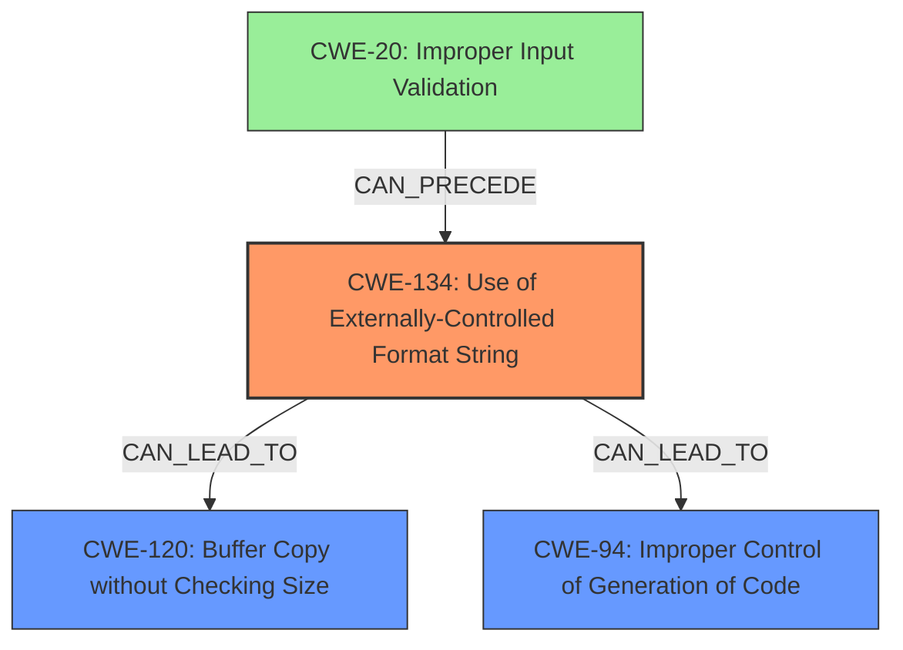

# Final Resolution for CVE-2022-35880

# Summary
| CWE ID | CWE Name | Confidence | CWE Abstraction Level | CWE Vulnerability Mapping Label | CWE-Vulnerability Mapping Notes |
|---|---|---|---|---|---|
| CWE-134 | Use of Externally-Controlled Format String | 1.0 | Base | Allowed | Primary CWE |
| CWE-120 | Buffer Copy without Checking Size of Input ('Classic Buffer Overflow') | 0.7 | Base | Allowed-with-Review | Secondary Candidate |
| CWE-94 | Improper Control of Generation of Code ('Code Injection') | 0.6 | Base | Allowed-with-Review | Secondary Candidate |
| CWE-20 | Improper Input Validation | 0.5 | Class | Discouraged | Secondary Candidate |

## Evidence and Confidence

*   **Confidence Score:** 0.85
*   **Evidence Strength:** MEDIUM

## Relationship Analysis
The primary **WEAKNESS** is clearly **CWE-134** (Use of Externally-Controlled Format String). This leads to several potential consequences. **CWE-120** (Buffer Copy without Checking Size) and **CWE-94** (Code Injection) are potential impacts that can follow from **CWE-134**. **CWE-20** (Improper Input Validation) is a parent of **CWE-134** and contributes to the root cause, as it represents the lack of validation that allows the format string to be controlled externally. The base level CWEs are preferred over class level CWEs when applicable.

## Vulnerability Chain
The vulnerability chain starts with **CWE-20** (Improper Input Validation) where the application fails to validate the UPnP negotiation input, specifically the `NewInternalClient` XML tag. This leads to **CWE-134** (Use of Externally-Controlled Format String), as the unvalidated input is then used as a format string in the `vsnprintf` function. This, in turn, can result in **CWE-120** (Buffer Copy without Checking Size) if the format string writes beyond buffer boundaries. Also, this can result in **CWE-94** (Code Injection) because format string vulnerability allows arbitrary memory writes.

## Summary of Analysis
The initial analysis correctly identified **CWE-134** as the primary **ROOTCAUSE**. The inclusion of **CWE-116** was weak, as the description does not explicitly state any encoding issues. However, the retriever results provided additional context. After analyzing the retriever results, **CWE-120** and **CWE-94** were considered as secondary candidates because format string vulnerabilities can cause memory corruption and arbitrary memory writes. **CWE-20** was also considered as a secondary candidate because it describes how the uncontrolled input got into the application to begin with.

The decision is based on:

*   Explicit mention of "**format string injection**" in the vulnerability description, strongly suggesting **CWE-134**.
*   The use of `vsnprintf` with attacker-controlled input, confirming **CWE-134**.
*   The possibility of memory corruption and code execution due to the **format string injection**, leading to the inclusion of **CWE-120** and **CWE-94**
*   The vulnerability description specifies the lack of validation on the `NewInternalClient` XML tag.

The selected CWEs are at the optimal level of specificity because:

*   **CWE-134** is a Base level CWE, directly addressing the **ROOTCAUSE** of the vulnerability.
*   **CWE-120**, **CWE-94**, and **CWE-20** are more specific than higher-level classifications like **CWE-74** (Improper Neutralization).