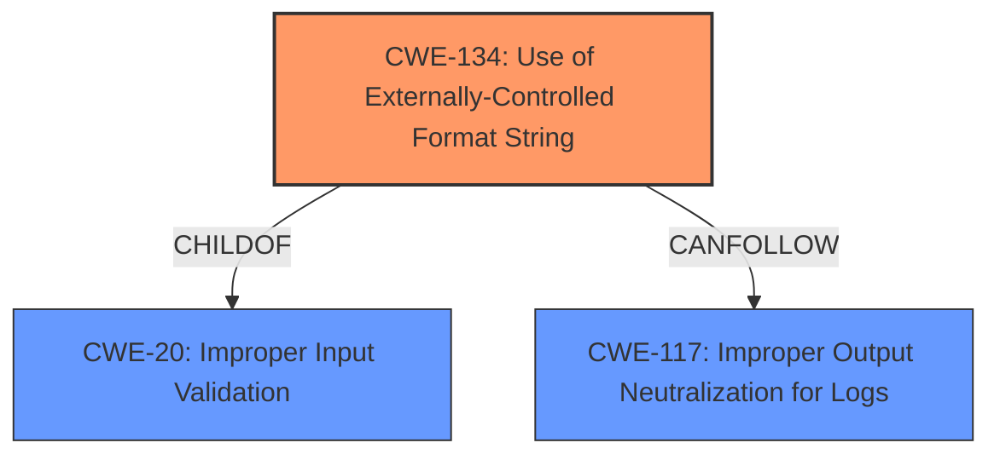

# Final Resolution for CVE-2022-35881

# Summary
| CWE ID  | CWE Name                                                                 | Confidence | CWE Abstraction Level | CWE Vulnerability Mapping Label | CWE-Vulnerability Mapping Notes |
| :-------- | :----------------------------------------------------------------------- | :--------- | :-------------------- | :------------------------------ | :------------------------------ |
| CWE-134 | Use of Externally-Controlled Format String                               | 0.95        | Base                  | Primary                         | Allowed                       |
| CWE-117 | Improper Output Neutralization for Logs                                | 0.80        | Base                  | Secondary                         | Allowed                       |

## Evidence and Confidence

*   **Confidence Score:** 0.90
*   **Evidence Strength:** HIGH

## Relationship Analysis
The primary relationship is that CWE-134 (Use of Externally-Controlled Format String) is the direct cause of the vulnerability, as the format string originates from an external source (`errorCode` and `errorDescription` XML tags). CWE-134 can be considered a child of CWE-20 (Improper Input Validation), highlighting the lack of proper validation of the format string. Another important relationship is with CWE-117 (Improper Output Neutralization for Logs), as the vulnerability exists within the UPnP logging functionality, and the externally controlled format string is used to write to a log.

## Vulnerability Chain
The vulnerability chain starts with the lack of proper input validation (**CWE-20**), leading to the acceptance of an externally controlled format string (**CWE-134**). This format string is then used within the UPnP logging functionality, resulting in the ability to write arbitrary data to the logs (**CWE-117**). This can lead to memory corruption, information disclosure, and denial of service.

## Summary of Analysis
The initial analysis correctly identified CWE-134 as the primary weakness. The vulnerability description explicitly states that it is a **format string injection** vulnerability, and the CVE reference confirms the use of `vsnprintf` with user-supplied data. This aligns perfectly with the definition of CWE-134.

The criticism provided valuable suggestions for improvement, particularly regarding secondary CWEs and relationships. The analysis has been updated to include CWE-117 as a secondary weakness, as the vulnerability exists within the UPnP logging functionality. The externally controlled format string is used to write to a log, making **CWE-117 (Improper Output Neutralization for Logs)** a relevant contributing factor. The initial analysis only listed CWE-20 as a parent. While valid, explicitly addressing **CWE-117** provides a more complete picture of the vulnerability.

The confidence score for CWE-134 remains high (0.95), as the evidence is strong and the mapping is direct. The confidence score for CWE-117 is 0.80, as it is a contributing factor but not the primary cause. The overall confidence score is 0.90.

The selected CWEs are at the optimal level of specificity. CWE-134 is a Base-level CWE, which is preferred for mapping to the root causes of vulnerabilities. CWE-117 is also a Base-level CWE, providing a specific and relevant description of the vulnerability's context within the logging functionality.