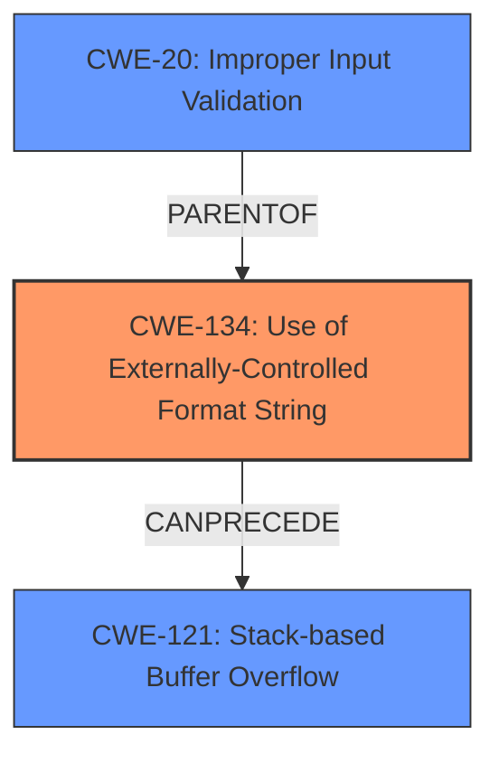

# Final Resolution for CVE-2022-35886

# Summary
| CWE ID | CWE Name | Confidence | CWE Abstraction Level | CWE Vulnerability Mapping Label | CWE-Vulnerability Mapping Notes |
|---|---|---|---|---|---|
| CWE-134 | Use of Externally-Controlled Format String | 1.0 | Base | Allowed | Primary CWE |
| CWE-20 | Improper Input Validation | 0.9 | Class | Discouraged | Secondary CWE - Root cause enabling CWE-134 |
| CWE-121 | Stack-based Buffer Overflow | 0.7 | Base | Allowed | Secondary CWE - Consequence of CWE-134 |

## Evidence and Confidence

*   **Confidence Score:** 0.9
*   **Evidence Strength:** HIGH

## Relationship Analysis
The primary **WEAKNESS** is CWE-134, which stems from a lack of input validation (CWE-20). The exploitation of CWE-134 can lead to CWE-121. CWE-20 is a parent of CWE-134, indicating that the absence of input validation is the root cause that enables the format string vulnerability. CWE-134 can precede CWE-121 because the format string vulnerability allows an attacker to write arbitrary data to memory, potentially overflowing a buffer.

## Vulnerability Chain
The vulnerability chain begins with **CWE-20** (Improper Input Validation) on the `default_key_id` and `key` HTTP parameters. This allows an attacker to inject format string specifiers. The injected format string is then used in a `log` function, leading to **CWE-134** (Use of Externally-Controlled Format String). Exploitation of the **CWE-134** vulnerability can then lead to **CWE-121** (Stack-based Buffer Overflow) if the attacker writes more data than the allocated buffer size.

## Summary of Analysis
The initial analysis correctly identified **CWE-134** as the primary **WEAKNESS**. The criticism highlighted the importance of considering related CWEs, particularly the root cause (improper input validation) and potential consequences (buffer overflow).

The vulnerability description states: "Four format string injection vulnerabilities exist in the web interface /action/wirelessConnect functionality of Abode Systems, Inc. iota All-In-One Security Kit 6.9Z and 6.9X. A specially-crafted HTTP request can lead to memory corruption, information disclosure and denial of service. An attacker can make an authenticated HTTP request to trigger these vulnerabilities.This vulnerability arises from format string injection via the `default_key_id` and `key` HTTP parameters, as used within the `/action/wirelessConnect` handler." This directly supports the classification of **CWE-134**.

The graph relationships influenced the selection of secondary CWEs. **CWE-20** was selected because it is a parent of **CWE-134**, representing the root cause. **CWE-121** was selected because it can be a consequence of exploiting **CWE-134**.

The selected CWEs are at the optimal level of specificity. **CWE-134** is a Base CWE, which is the preferred level for mapping. **CWE-20** is a Class CWE, but it is included because it directly contributes to the vulnerability by representing the lack of input validation. **CWE-121** is a Base CWE and represents a concrete consequence of the **format string vulnerability**.