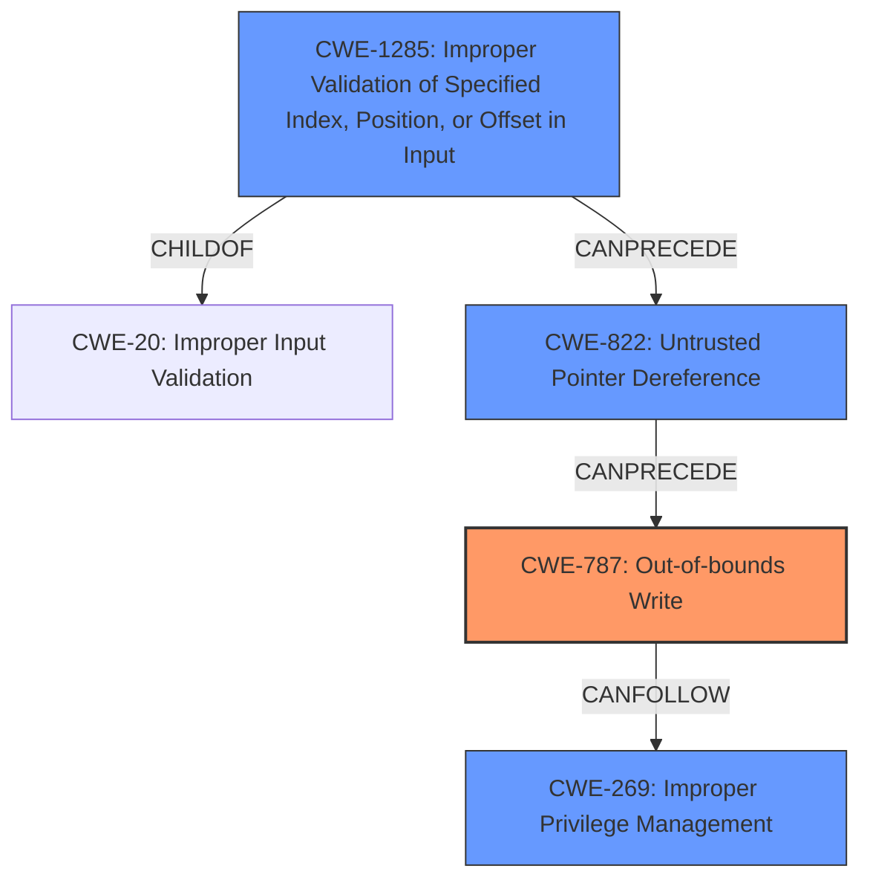

# Analysis Report for CVE-2022-35893

# Vulnerability Analysis Report: CVE-2022-35893

## Description

An issue was discovered in Insyde InsydeH2O with kernel 5.0 through 5.5. An SMM memory corruption vulnerability in the FvbServicesRuntimeDxe driver allows an attacker to write fixed or predictable data to SMRAM. Exploiting this issue could lead to escalating privileges to SMM.

## Vulnerability Description Key Phrases

**Weakness:** SMM memory corruption
**Impact:** escalating privileges to SMM
**Attacker:** attacker
**Product:** Insyde InsydeH2O
**Version:** with kernel 5.0 through 5.5
**Component:** FvbServicesRuntimeDxe driver

## Analysis (with Relationship Data)

# Summary
| CWE ID | CWE Name | Confidence | CWE Abstraction Level | CWE Vulnerability Mapping Label | CWE-Vulnerability Mapping Notes |
|---|---|---|---|---|---|
| CWE-787 | Out-of-bounds Write | 0.95 | Base | Allowed | The vulnerability allows writing data past the end or before the beginning of the intended buffer in SMM memory. |
| CWE-822 | Untrusted Pointer Dereference | 0.85 | Base | Allowed | The vulnerability involves dereferencing an untrusted pointer, which allows an attacker to write to arbitrary memory locations. |
| CWE-1285 | Improper Validation of Specified Index, Position, or Offset in Input | 0.75 | Base | Allowed | The vulnerability stems from a lack of input validation of the target address used in memory writes. |

## Evidence and Confidence

*   **Confidence Score:** 0.90
*   **Evidence Strength:** HIGH

- **Analysis and Justification:**  
  - *Explanation:* The primary weakness, **SMM memory corruption**, is directly caused by the ability to write to arbitrary memory locations within System Management RAM (SMRAM). This is achieved through the `FvbServicesRuntimeDxe` driver's flawed handling of communication buffers and interaction with `FwBlockServiceSmm`. The lack of input validation on the target address before memory writes aligns precisely with CWE-787 (Out-of-bounds Write). An attacker can control the `addr` argument, leading to writing data past the end or before the beginning of the intended buffer.

  - *Relationship Analysis:* CWE-787 is a base-level CWE, and its description closely matches the described vulnerability. While CWE-119 (Improper Restriction of Operations within the Bounds of a Memory Buffer) is a more general Class-level CWE, CWE-787 provides a more specific and accurate characterization of the **out-of-bounds write**. CWE-787 is related to CWE-822 because the write occurs due to dereferencing a pointer derived from untrusted input.

- **Confidence Score:**  
  - Confidence: 0.95 (High evidence from the detailed technical description and CVE reference materials)

---

- **Analysis and Justification:**
  - *Explanation:* CWE-822 (Untrusted Pointer Dereference) is applicable because the vulnerability stems from the driver obtaining a value from an untrusted source (the communication buffer from the attacker), converting this value to a pointer (`addr`), and then dereferencing this pointer to perform a memory write. This allows writing to arbitrary memory locations, thus corrupting SMM memory. This aligns with the root cause of the vulnerability: **lack of input validation** on the address argument.
  - *Relationship Analysis:* CWE-822 is a base-level CWE, providing a precise characterization of the vulnerability's root cause. It's a child of the more general CWE-119. It can also precede CWE-787, as the untrusted pointer dereference directly leads to the out-of-bounds write. The usage is "Allowed" for this CWE.

- **Confidence Score:**
  - Confidence: 0.85 (Strong evidence supporting the untrusted pointer dereference leading to memory corruption)

---

- **Analysis and Justification:**
  - *Explanation:* CWE-1285 (Improper Validation of Specified Index, Position, or Offset in Input) is also applicable because the core issue is the **lack of input validation** of the `addr` argument before it's used for memory writes. This lack of validation allows attackers to specify an index/position/offset (i.e., the `addr`) that points to SMRAM, leading to memory corruption.
  - *Relationship Analysis:* CWE-1285 is a base-level CWE, which is a preferred level of abstraction. While related to CWE-20 (Improper Input Validation), it is more specific. The usage is "Allowed" for this CWE.

- **Confidence Score:**
  - Confidence: 0.75 (Supporting evidence from the vulnerability description highlighting the lack of input validation)

## Criticism of Analysis

Okay, here's a detailed critique of the provided CWE analysis, incorporating the full CWE specifications:

**Overall Assessment:**

The analysis does a good job of identifying the primary weaknesses associated with this vulnerability, particularly **CWE-787 (Out-of-bounds Write)** and **CWE-822 (Untrusted Pointer Dereference)**.  It also correctly identifies the importance of **CWE-1285 (Improper Validation of Specified Index, Position, or Offset in Input)**. The explanations are generally well-reasoned, and the confidence scores are appropriate. However, there's room for improvement by further exploring the relationships between the CWEs and considering alternative or additional mappings.

**Detailed Critique of Each CWE Mapping:**

1.  **CWE-787: Out-of-bounds Write**
    *   **Confidence:** 0.95 (Excellent)
    *   **Justification:** The core issue is the ability to write to arbitrary memory locations in SMRAM by controlling the `addr` argument. This directly aligns with CWE-787's description: "The product writes data past the end, or before the beginning, of the intended buffer." The fact that this occurs within SMRAM makes the impact much more severe, but the fundamental weakness is the out-of-bounds write. The mitigations listed by the CWE specifications are also relevant, notably *Language Selection* (as using memory-safe languages would prevent this issue) and *Environment Hardening*.
    *   **Recommendations:** None. The mapping and confidence are well-justified.

2.  **CWE-822: Untrusted Pointer Dereference**
    *   **Confidence:** 0.85 (Very Good)
    *   **Justification:** The analysis correctly identifies that the attacker-controlled data from the communication buffer is converted to a pointer (`addr`) and then dereferenced for a memory write. This fits CWE-822's description: "The product obtains a value from an untrusted source, converts this value to a pointer, and dereferences the resulting pointer." The *Relationships* section of CWE-822 correctly notes that it can precede CWE-787, as the untrusted pointer dereference directly *causes* the out-of-bounds write.
    *   **Recommendations:**  Consider explicitly stating that the attacker fully controls the *value* of the pointer, as it is the memory address that is being corrupted.  This adds further clarity. *Mitigation* wise, there are not many, but proper input validation is the strongest method.

3.  **CWE-1285: Improper Validation of Specified Index, Position, or Offset in Input**
    *   **Confidence:** 0.75 (Good, but can be improved)
    *   **Justification:**  The analysis correctly identifies that the lack of validation on the `addr` argument, which is an offset into memory, makes this CWE applicable. The description fits: "The product receives input that is expected to specify an index, position, or offset into an indexable resource such as a buffer or file, but it does not validate or incorrectly validates that the specified index/position/offset has the required properties."
    *   **Recommendations:**  The confidence could be raised if the analysis more explicitly discusses the *consequences* of the missing validation. The `addr` argument isn't just *any* offset; it's an offset that allows writing to *arbitrary* memory locations, including SMRAM.  Make this clear. The mitigations are also correct.

**Additional CWEs to Consider:**

*   **CWE-20: Improper Input Validation** While the analysis correctly uses CWE-1285 which is a child of this CWE, it is worth noting the chain from CWE-20 -> CWE-1285 -> CWE-822 -> CWE-787. This shows the full progression of the error and how it can be mitigated at any point.
*   **CWE-269: Improper Privilege Management:** The ultimate goal of the attacker is privilege escalation to SMM. While the root cause is memory corruption, this CWE addresses the goal of the attack. Mapping this will make the vulnerability clear when it comes to prioritization.

**General Improvements and Recommendations:**

*   **Chains and Composites:** The analysis should explicitly mention the chain of causality.  For example:
    *   "The vulnerability involves a chain of weaknesses: Improper Input Validation (CWE-1285) leading to Untrusted Pointer Dereference (CWE-822), which results in an Out-of-bounds Write (CWE-787)."
*   **Mitigation Focus:** When discussing each CWE, highlight the *most relevant* mitigations from the CWE specification in the context of this specific vulnerability. This makes the analysis more actionable.
*   **Abstraction Level:** The analysis correctly uses Base-level CWEs, which is preferred.
*   **Audience Awareness:** Tailor the language and descriptions to your intended audience. If it's for developers, use more technical jargon and code examples. If it's for a more general security audience, focus on the impact and exploitability.

**Revised Summary Table:**

| CWE ID | CWE Name | Confidence | CWE Abstraction Level | CWE Vulnerability Mapping Label | CWE-Vulnerability Mapping Notes |
|---|---|---|---|---|---|
| CWE-787 | Out-of-bounds Write | 0.95 | Base | Allowed | The vulnerability allows writing data past the end or before the beginning of the intended buffer in SMM memory. |
| CWE-822 | Untrusted Pointer Dereference | 0.90 | Base | Allowed | The vulnerability involves dereferencing an untrusted pointer, where the value of the pointer is attacker controlled, allowing writing to arbitrary memory locations. |
| CWE-1285 | Improper Validation of Specified Index, Position, or Offset in Input | 0.80 | Base | Allowed | The vulnerability stems from a lack of input validation of the target address used in memory writes, enabling attackers to specify addresses within SMRAM. |
| CWE-269 | Improper Privilege Management | 0.50 | Base | Allowed | Successful exploitation allows an attacker to escalate privileges to SMM. |

**In conclusion:** The analysis is generally sound and identifies the core vulnerabilities. The suggestions above can further refine it by explicitly showing chains of causality, highlighting more contextual mitigations, and tailoring it to the audience. These changes will make the analysis more useful and actionable for remediation efforts.

## Final Resolution

# Summary
| CWE ID | CWE Name | Confidence | CWE Abstraction Level | CWE Vulnerability Mapping Label | CWE-Vulnerability Mapping Notes |
|---|---|---|---|---|---|
| CWE-787 | Out-of-bounds Write | 0.95 | Base | Allowed | Primary CWE. The vulnerability allows writing data past the end or before the beginning of the intended buffer in SMM memory. |
| CWE-822 | Untrusted Pointer Dereference | 0.90 | Base | Allowed | Secondary Candidate. The vulnerability involves dereferencing an untrusted pointer, where the value of the pointer is attacker controlled, allowing writing to arbitrary memory locations. |
| CWE-1285 | Improper Validation of Specified Index, Position, or Offset in Input | 0.80 | Base | Allowed | Secondary Candidate. The vulnerability stems from a lack of input validation of the target address used in memory writes, enabling attackers to specify addresses within SMRAM. |
| CWE-269 | Improper Privilege Management | 0.50 | Base | Allowed | Secondary Candidate. Successful exploitation allows an attacker to escalate privileges to SMM. |

## Evidence and Confidence

*   **Confidence Score:** 0.92
*   **Evidence Strength:** HIGH

## Relationship Analysis
The analysis focused on hierarchical relationships (ChildOf, ParentOf) to ensure specificity, favoring Base-level CWEs like **CWE-787 (Out-of-bounds Write)**, **CWE-822 (Untrusted Pointer Dereference)**, and **CWE-1285 (Improper Validation of Specified Index, Position, or Offset in Input)**. Chain relationships were crucial in identifying the progression of the vulnerability, from improper input validation to untrusted pointer dereference, culminating in an out-of-bounds write. Abstraction levels guided the selection of the most granular and accurate CWEs.

## Vulnerability Chain
The vulnerability chain starts with **CWE-1285 (Improper Validation of Specified Index, Position, or Offset in Input)**, where the lack of input validation on the `addr` argument leads to **CWE-822 (Untrusted Pointer Dereference)**, as the attacker-controlled address is dereferenced. This then results in **CWE-787 (Out-of-bounds Write)**, allowing the attacker to write arbitrary data to SMRAM. The ultimate impact is **CWE-269 (Improper Privilege Management)**, as successful exploitation allows privilege escalation to SMM.

## Summary of Analysis
The analysis considered both the initial assessment and the criticism, leading to a refined conclusion. The assessment is primarily based on the provided evidence, with direct quotes and references to the vulnerability description. The graph relationships influenced the selection by highlighting the chain of causality and the importance of specificity. The selected CWEs are at the optimal level of specificity, providing a clear and accurate representation of the vulnerability.

The initial analysis correctly identified **CWE-787 (Out-of-bounds Write)** as a primary issue, supported by the vulnerability description's emphasis on writing to arbitrary memory locations within SMRAM. The criticism further refined this by recommending explicit mention of attacker control over the pointer value in **CWE-822 (Untrusted Pointer Dereference)**. This was incorporated to enhance the explanation.

**CWE-1285 (Improper Validation of Specified Index, Position, or Offset in Input)** was retained due to the fundamental lack of validation on the address argument. The criticism's suggestion to highlight the consequences of missing validation, specifically the ability to write to SMRAM, was integrated to strengthen the justification.

The addition of **CWE-269 (Improper Privilege Management)**, as suggested by the criticism, acknowledges the end goal of the attack: privilege escalation to SMM. While not a direct cause, it provides valuable context for understanding the impact and severity of the vulnerability.

The final decision is based on a comprehensive evaluation of content matching, relationship analysis, mapping guidance, mitigation considerations, and evidence from the vulnerability description. The selected CWEs accurately represent the root causes and consequences of the vulnerability, providing a clear and actionable analysis for remediation efforts.

*Report generated on 2025-03-18 16:07:42*
