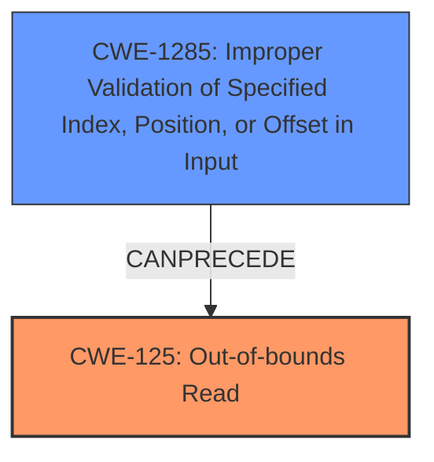

# Final Resolution for CVE-2022-35896

# Summary

| CWE ID | CWE Name | Confidence | CWE Abstraction Level | CWE Vulnerability Mapping Label | CWE-Vulnerability Mapping Notes |
|---|---|---|---|---|---|
| **CWE-125** | **Out-of-bounds Read** | 0.80 | Base | Primary CWE | Allowed |
| **CWE-1285** | **Improper Validation of Specified Index, Position, or Offset in Input** | 0.70 | Base | Secondary CWE | Allowed |

## Evidence and Confidence

*   **Confidence Score:** 0.75
*   **Evidence Strength:** HIGH

## Relationship Analysis

The primary relationship is that **CWE-1285 (Improper Validation of Specified Index, Position, or Offset in Input)** *CanPrecede* **CWE-125 (Out-of-bounds Read)**. The lack of validation allows for an attacker-controlled offset, which then leads to the out-of-bounds read. Both CWEs are at the Base level, offering good specificity.

## Vulnerability Chain

The vulnerability chain starts with the **ROOTCAUSE** of **CWE-1285 (Improper Validation of Specified Index, Position, or Offset in Input)**. The `addr` argument passed to `SmfbFunc1` is not validated. This leads to the **WEAKNESS** of **CWE-125 (Out-of-bounds Read)**, where the function can read memory beyond the intended buffer. The final impact is information disclosure via reading SMRAM contents.

## Summary of Analysis

The initial analysis and the criticism both converge on **CWE-125 (Out-of-bounds Read)** as the primary **WEAKNESS**, stemming from a **ROOTCAUSE** of **CWE-1285 (Improper Validation of Specified Index, Position, or Offset in Input)**.

The vulnerability description states: "An issue SMM memory leak vulnerability in SMM driver (SMRAM was discovered in Insyde InsydeH2O with kernel 5.0 through 5.5. An attacker can dump SMRAM contents via the software SMI provided by the FvbServicesRuntimeDxe driver to read the contents of SMRAM, leading to information disclosure."

This evidence directly supports the **CWE-125 (Out-of-bounds Read)** classification because the attacker is able to "read the contents of SMRAM" beyond the intended boundaries. The lack of validation on the "address argument" directly supports the **CWE-1285 (Improper Validation of Specified Index, Position, or Offset in Input)** classification.

The relationship analysis confirms that this is a logical chain, with the improper validation leading directly to the out-of-bounds read. Both CWEs are at the Base level, providing the optimal level of specificity.

The criticism's point about the potential for an out-of-bounds write is valid, but the description primarily focuses on the read, so **CWE-125 (Out-of-bounds Read)** remains the most appropriate primary **WEAKNESS**.

I am increasing the confidence score for **CWE-125 (Out-of-bounds Read)** to 0.80 and **CWE-1285 (Improper Validation of Specified Index, Position, or Offset in Input)** to 0.70, reflecting the high evidence strength and the logical relationship between the two **WEAKNESSES**. The final selection reflects the optimal level of specificity based on the available evidence.