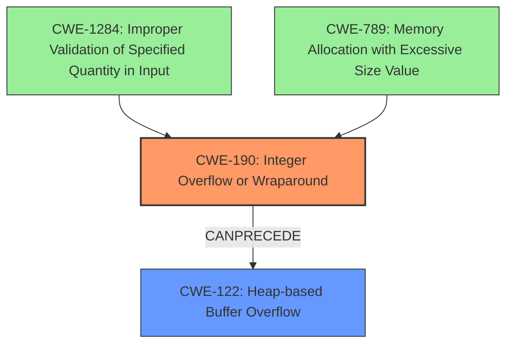

# Final Resolution for CVE-2022-35951

# Summary
| CWE ID | CWE Name | Confidence | CWE Abstraction Level | CWE Vulnerability Mapping Label | CWE-Vulnerability Mapping Notes |
|---|---|---|---|---|---|
| CWE-190 | Integer Overflow or Wraparound | 0.95 | Base | Allowed | Primary CWE. The vulnerability is caused by an integer overflow. |
| CWE-122 | Heap-based Buffer Overflow | 0.75 | Variant | Allowed | Secondary CWE. The integer overflow leads to a heap overflow. |
| CWE-1284 | Improper Validation of Specified Quantity in Input | 0.60 | Base | Allowed | Contributing CWE. The `COUNT` parameter was not properly validated, leading to the **integer overflow**. |
| CWE-789 | Memory Allocation with Excessive Size Value | 0.55 | Variant | Allowed | Contributing CWE. The `COUNT` parameter was excessively large, leading to the **integer overflow**. |

## Evidence and Confidence

*   **Confidence Score:** 0.80
*   **Evidence Strength:** MEDIUM

## Relationship Analysis
The primary relationship identified is the chain where **CWE-190** *CanPrecede* **CWE-122**, accurately reflecting the vulnerability's progression. **CWE-1284** contributes by highlighting the lack of input validation on the `COUNT` parameter, which sets the stage for the overflow. **CWE-789** underscores the issue of using an excessively large size value, providing further context to the root cause. The abstraction levels (Base and Variant) are appropriately chosen for specificity.

## Vulnerability Chain
The vulnerability chain starts with the **improper validation** (**CWE-1284**) of the `COUNT` argument in the `XAUTOCLAIM` command. This leads to an **integer overflow** (**CWE-190**) due to a large size value (**CWE-789**). The overflow then results in a **heap-based buffer overflow** (**CWE-122**), potentially allowing for remote code execution.

Missing links: None

## Summary of Analysis
The initial analysis correctly identified **CWE-190** and **CWE-122**. The criticism offered valuable additions by including **CWE-1284** and **CWE-789**, which enhance the understanding of the root cause.

The vulnerability description explicitly states: "Executing an `XAUTOCLAIM` command on a stream key in a specific state, with a specially crafted `COUNT` argument may cause an integer overflow, a subsequent heap overflow, and potentially lead to remote code execution."

The graph relationships influenced the final selection by illustrating the chain of events from the **lack of validation** to the **integer overflow** and finally to the **heap overflow**. The inclusion of **CWE-1284** and **CWE-789** provides a more complete picture of the vulnerability's origins and contributing factors, while maintaining an appropriate level of specificity. The selected CWEs are at the optimal level of specificity because they accurately describe the technical weaknesses involved, without being overly broad or abstract.