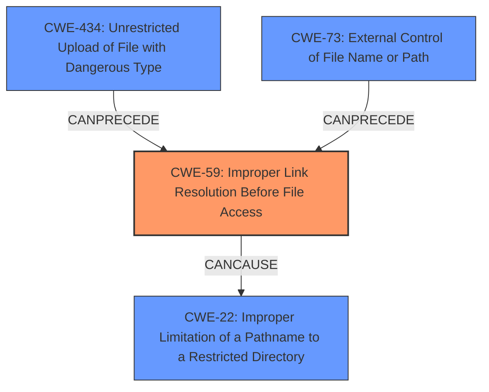

# Analysis Report for CVE-2022-3607

# Vulnerability Analysis Report: CVE-2022-3607

## Description

Failure to Sanitize Special Elements into a Different Plane (Special Element Injection) in GitHub repository octoprint/octoprint prior to 1.8.3.

## Vulnerability Description Key Phrases

**Rootcause:** Special Element Injection
**Product:** octoprint/octoprint
**Version:** prior to 1.8.3

## Analysis (with Relationship Data)

# Summary
| CWE ID | CWE Name | Confidence | CWE Abstraction Level | CWE Vulnerability Mapping Label | CWE-Vulnerability Mapping Notes |
|---|---|---|---|---|---|
| CWE-59 | Improper Link Resolution Before File Access ('Link Following') | 0.95 | Base | Allowed | Primary CWE |
| CWE-22 | Improper Limitation of a Pathname to a Restricted Directory ('Path Traversal') | 0.85 | Base | Allowed | Secondary Candidate |
| CWE-434 | Unrestricted Upload of File with Dangerous Type | 0.75 | Base | Allowed | Secondary Candidate |
| CWE-73 | External Control of File Name or Path | 0.70 | Base | Allowed | Secondary Candidate |

## Evidence and Confidence

*   **Confidence Score:** 0.90
*   **Evidence Strength:** HIGH

- **Analysis and Justification:**  
  - *Explanation:* The vulnerability description highlights the ability to include directory-traversing symbolic links within uploaded language packs in OctoPrint. This allows an attacker to bypass intended restrictions and access arbitrary files on the server's file system when backups are created. The core issue is that the application does not properly handle symbolic links within the uploaded archive, leading to **improper link resolution** when processing the archive contents. This aligns directly with the characteristics of CWE-59. Specifically, the software fails to prevent a filename from identifying a link or shortcut that resolves to an unintended resource (files outside the intended directory). The description details that the `_validate_archive_name` function was modified to check if the path constructed by joining the archive entry name to the target path starts with the target directory, preventing access outside the target directory. The fix itself reinforces the classification as CWE-59 as it addresses the link resolution issue.

  - *Relationship Analysis:* CWE-59 is a Base level CWE, which is appropriate for mapping root causes. It is related to CWE-22 (Path Traversal) because the symbolic link is used to traverse outside of the intended directory. CWE-59 CanFollow CWE-73 (External Control of File Name or Path) as the filename is externally controlled and used to access a file. The MITRE mapping guidance for CWE-59 states that it is ALLOWED for this type of vulnerability.

- **Confidence Score:**  
  - Confidence: 0.95 (High confidence due to explicit description of symbolic link usage for path traversal)

---

- **Analysis and Justification:**  
  - *Explanation:* The vulnerability involves path traversal through the use of symbolic links within the uploaded archives, allowing access to files outside the intended directory. While CWE-59 focuses on the improper resolution of links, CWE-22 addresses the **improper limitation of a pathname to a restricted directory**. The archive is intended to contain files within a specific directory, but the symbolic links allow the attacker to access files outside of this restricted area. The uploaded language pack is not properly validated, so the attacker can escape the targeted directory.

  - *Relationship Analysis:* CWE-22 is a parent of CWE-23 (Relative Path Traversal) and CWE-36 (Absolute Path Traversal). It is also related to CWE-59 since the symlink is a mechanism for path traversal. While CWE-59 is a more precise match, CWE-22 captures the broader issue of path traversal.

- **Confidence Score:**  
  - Confidence: 0.85 (High confidence as path traversal is a clear aspect of the vulnerability)

---

- **Analysis and Justification:**  
  - *Explanation:* The vulnerability description mentions the upload of a malicious language pack. While the primary issue is the symbolic link and path traversal, there's an element of allowing the upload of a file that has potentially dangerous content (the symbolic link itself). CWE-434 addresses the **unrestricted upload of a file with a dangerous type**, and while not the primary weakness, it's a contributing factor. An attacker uploads a crafted language pack containing malicious symlinks, so the file upload aspect can't be ignored.

  - *Relationship Analysis:* CWE-434 is a Base level CWE. It can precede CWE-59 as the file upload is a prerequisite for the link following vulnerability.

- **Confidence Score:**  
  - Confidence: 0.75 (Moderate confidence as the file upload aspect is secondary to the path traversal)

---

- **Analysis and Justification:**  
  - *Explanation:* CWE-73 (External Control of File Name or Path) applies because the filenames within the uploaded archive are under the control of the attacker, and these filenames (including the symbolic links) are used to access files on the server. The system uses external input (filenames in the archive) to construct a pathname, but it doesn't properly prevent malicious filenames from identifying unintended resources. This is less specific than CWE-59, which directly addresses the link resolution, but still relevant.

  - *Relationship Analysis:* CWE-73 is a parent of several CWEs related to file access, including CWE-59. It CanFollow CWE-20 (Improper Input Validation) as the lack of input validation allows for external control of the filename. The description focuses on the symlink resolution, making CWE-59 a better primary match.

- **Confidence Score:**  
  - Confidence: 0.70 (Moderate confidence as the external control of the filename contributes to the vulnerability, but is not the main issue)

## Criticism of Analysis

Okay, here's a detailed critique of the CWE analysis, taking into account the full CWE specifications you provided.

**Overall Assessment:**

The analysis is well-structured, thorough, and demonstrates a good understanding of the vulnerability and the relevant CWEs. The use of confidence scores and evidence strength is helpful. The justification for each CWE mapping is clear and includes relationship analysis.  The inclusion of known examples from the CWE database helps to solidify the mappings. Overall a very solid analysis.

**Specific CWE Mappings Critique:**

**1. CWE-59: Improper Link Resolution Before File Access ('Link Following')**

*   **Confidence:** 0.95
*   **Assessment:** **Correct and well-justified.** This is the most accurate primary CWE. The explanation clearly articulates why the vulnerability is rooted in the failure to prevent a filename from identifying a symbolic link that resolves to an unintended resource. The reference to the `_validate_archive_name` function being the location of the fix further reinforces this.

*   **Mapping Guidance Compliance:** Follows the "Allowed" usage as per the CWE specification.
*   **Mitigation Appropriateness:** The provided mitigations from CWE-59 are suitable. Separation of privilege (limiting access rights) is a key mitigation strategy.
*   **Relationships:** The relationships to CWE-706 and CWE-73 are correctly identified.

**2. CWE-22: Improper Limitation of a Pathname to a Restricted Directory ('Path Traversal')**

*   **Confidence:** 0.85
*   **Assessment:** **Correct, but secondary to CWE-59.** The vulnerability *does* result in path traversal, but the *mechanism* of traversal is the improper link resolution. CWE-22 captures the effect, while CWE-59 captures the cause. So, a solid secondary candidate.

*   **Mapping Guidance Compliance:** Follows the "Allowed" usage.
*   **Mitigation Appropriateness:** The provided mitigations are relevant, especially input validation and the use of path canonicalization functions.
*   **Relationships:** The analysis correctly notes the relationship to CWE-23, CWE-36, and CWE-73 and its relation to CWE-59.

**3. CWE-434: Unrestricted Upload of File with Dangerous Type**

*   **Confidence:** 0.75
*   **Assessment:** **Acceptable as a contributing factor, but not a primary weakness.** The analysis correctly identifies that the ability to upload a malicious language pack is a component of the vulnerability. The weakness isn't that *any* file upload is dangerous, but specifically a zip file containing the malicious payload (symlink).

*   **Mapping Guidance Compliance:** Follows the "Allowed" usage.
*   **Mitigation Appropriateness:** The suggested mitigations (generating unique filenames, limiting acceptable objects) are relevant but not the *most* effective in this particular case. More targeted validation of the archive contents is crucial.
*   **Relationships:** The CanFollow to CWE-73 is sound, as is the chaining relationship with incomplete denylists.

**4. CWE-73: External Control of File Name or Path**

*   **Confidence:** 0.70
*   **Assessment:** **Correct as a general contributor but less specific than CWE-59 or CWE-22.** The filenames within the uploaded archive *are* under the attacker's control, and this control is used to access files. However, the *improper link resolution* is the more precise weakness.

*   **Mapping Guidance Compliance:** Follows the "Allowed" usage.
*   **Mitigation Appropriateness:** The suggested mitigations (mapping fixed input values, using a jail) are generally sound but less directly applicable than those for CWE-59.
*   **Relationships:** The analysis accurately notes the CanPrecede relationships and the better fit of CWE-59 as a primary match.

**Suggestions for Improvement:**

1.  **Prioritization of CWEs:** While the confidence scores are useful, consider explicitly stating why CWE-59 is the *primary* CWE and the others are *secondary*.  Emphasize the causal relationship: the improper handling of symlinks (CWE-59) is the direct cause of the path traversal (CWE-22), which then leads to potential information disclosure.
2.  **CWE-20 Analysis:** The retriever results identify **CWE-75: Failure to Sanitize Special Elements into a Different Plane (Special Element Injection)** and similar CWEs. While the decision to not include **CWE-20: Improper Input Validation** is reasonable given that a more specific CWE was chosen, it could be beneficial to add a quick note explaining that choice, particularly in light of the retriever result of CWE-75.

**Recommendations**

The analysis is strong. Minor tweaks to emphasize the primary causal factor (CWE-59) and a brief note about why CWE-20/CWE-75 were not chosen will improve it.  Overall, the CWE selections are appropriate and well-defended.

## Final Resolution

# Summary
| CWE ID | CWE Name | Confidence | CWE Abstraction Level | CWE Vulnerability Mapping Label | CWE-Vulnerability Mapping Notes |
|---|---|---|---|---|---|
| CWE-59 | Improper Link Resolution Before File Access ('Link Following') | 0.95 | Base | Allowed | Primary CWE |
| CWE-22 | Improper Limitation of a Pathname to a Restricted Directory ('Path Traversal') | 0.85 | Base | Allowed | Secondary Candidate |
| CWE-434 | Unrestricted Upload of File with Dangerous Type | 0.75 | Base | Allowed | Secondary Candidate |
| CWE-73 | External Control of File Name or Path | 0.70 | Base | Allowed | Secondary Candidate |

## Evidence and Confidence

*   **Confidence Score:** 0.95
*   **Evidence Strength:** HIGH

## Relationship Analysis
The primary CWE is CWE-59 (**CWE-59: Improper Link Resolution Before File Access ('Link Following')**), a Base level CWE that accurately reflects the root cause. The secondary CWEs contribute to the overall vulnerability. CWE-22 (**CWE-22: Improper Limitation of a Pathname to a Restricted Directory ('Path Traversal')**) captures the effect of the improper link resolution. CWE-434 (**CWE-434: Unrestricted Upload of File with Dangerous Type**) highlights the initial attack vector, and CWE-73 (**CWE-73: External Control of File Name or Path**) represents the attacker's ability to control file names within the uploaded archive.

## Vulnerability Chain
The vulnerability chain starts with the **unrestricted upload of a file with a dangerous type** (CWE-434), specifically a language pack containing malicious symbolic links. The attacker gains **external control of the file names** (CWE-73) within the archive, allowing them to create symbolic links that point to arbitrary files on the system. The application then **improperly resolves these links** (CWE-59), leading to **path traversal** (CWE-22) and potentially unauthorized file access.

## Summary of Analysis
The initial analysis and criticism are both strong and well-justified. The primary **WEAKNESS** is the **improper link resolution** (CWE-59), which is the direct cause of the vulnerability. The provided evidence clearly supports this classification, as the vulnerability description explicitly mentions the use of symbolic links to bypass intended restrictions. The fix implemented in the `_validate_archive_name` function, which checks if the path constructed by joining the archive entry name to the target path starts with the target directory, further reinforces this classification.

The graph relationships influenced the final selection by highlighting the causal chain of events. The upload of the malicious file (CWE-434) allows the attacker to control the file names (CWE-73), which then leads to the improper link resolution (CWE-59) and path traversal (CWE-22).

The selected CWEs are at the optimal level of specificity. CWE-59 is a Base level CWE that directly addresses the **root cause** of the vulnerability. While other CWEs, such as CWE-22, CWE-434, and CWE-73, are contributing factors, they are less specific and do not fully capture the essence of the vulnerability.

The retriever results also identified CWE-75 (**CWE-75: Failure to Sanitize Special Elements into a Different Plane (Special Element Injection)**) and similar CWEs. While relevant, these are broader and less precise than CWE-59, which focuses specifically on the **improper link resolution**.

*Report generated on 2025-03-17 04:27:47*
