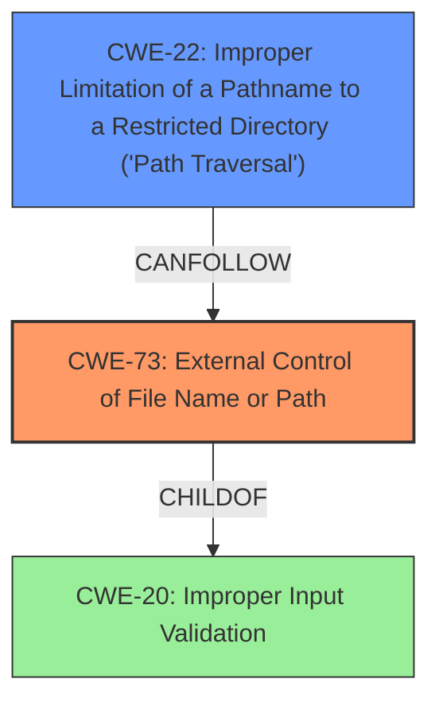

# Final Resolution for CVE-2022-36302

# Summary
| CWE ID | CWE Name | Confidence | CWE Abstraction Level | CWE Vulnerability Mapping Label | CWE-Vulnerability Mapping Notes |
|---|---|---|---|---|---|
| CWE-73 | External Control of File Name or Path | 0.9 | Base | Allowed | The product allows user input to control or influence paths or file names that are used in filesystem operations. |
| CWE-22 | Improper Limitation of a Pathname to a Restricted Directory ('Path Traversal') | 0.5 | Base | Allowed | The product uses external input to construct a pathname that is intended to identify a file or directory that is located underneath a restricted parent directory, but the product does not properly neutralize special elements within the pathname that can cause the pathname to resolve to a location that is outside of the restricted directory. *Conditional: only if path traversal is confirmed*. |

## Evidence and Confidence

*   **Confidence Score:** 0.85
*   **Evidence Strength:** MEDIUM

## Relationship Analysis
The primary relationship considered was the potential for **CWE-22 (Path Traversal)** as a consequence of **CWE-73 (External Control of File Name or Path)**. While **CWE-73** allows for external control, **CWE-22** only becomes relevant if this control is used to traverse outside the intended directory. The relationship analysis influenced the decision to keep **CWE-22** as a secondary candidate with lowered confidence, pending more explicit evidence of path traversal. The abstraction levels (Base for both CWEs) are appropriate for identifying the **root cause**.

## Vulnerability Chain
The vulnerability chain starts with the **ROOTCAUSE** of **CWE-73 (External Control of File Name or Path)**, where the application allows user-controlled input to influence file paths. If this input is not properly validated, it *could* lead to **CWE-22 (Path Traversal)**, allowing an attacker to access sensitive information. The missing link is explicit confirmation of path traversal. If traversal is possible, the final impact would be information disclosure.

## Summary of Analysis
The initial analysis correctly identified **CWE-73 (External Control of File Name or Path)** as the primary **WEAKNESS**. The criticism correctly pointed out that **CWE-641 (Improper Restriction of Names for Files and Other Resources)** is not the primary issue.

The decision to keep **CWE-22 (Path Traversal)** as a secondary candidate is based on the vulnerability description mentioning "access different resources, which may contain sensitive information." This *could* imply path traversal, but it's not explicitly stated. Therefore, the confidence is lowered. The graph relationships influenced this decision by highlighting the potential chain from **CWE-73** to **CWE-22**.

The selected CWEs are at the optimal level of specificity because **CWE-73** directly addresses the **file path manipulation** issue, and **CWE-22** represents a potential consequence, pending further evidence.