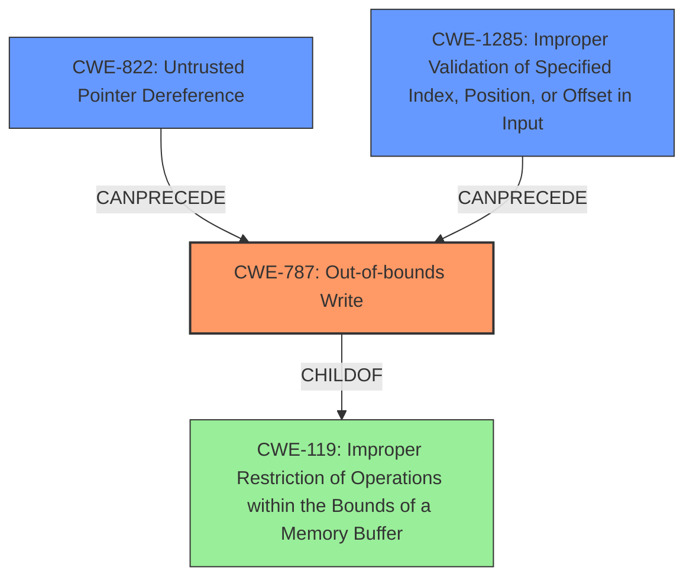

# Final Resolution for CVE-2022-36448

# Summary

| CWE ID | CWE Name | Confidence | CWE Abstraction Level | CWE Vulnerability Mapping Label | CWE-Vulnerability Mapping Notes |
|---|---|---|---|---|---|
| CWE-787 | Out-of-bounds Write | 0.95 | Base | Allowed | Primary CWE. The vulnerability involves writing to a memory location outside the intended buffer. |
| CWE-822 | Untrusted Pointer Dereference | 0.75 | Base | Allowed | Secondary CWE. The vulnerability uses an address from NVRAM without proper validation, which can lead to dereferencing an untrusted pointer. |
| CWE-1285 | Improper Validation of Specified Index, Position, or Offset in Input | 0.65 | Base | Allowed | Secondary CWE. The vulnerability lacks proper validation of the address from the `IhisiParamBuffer` NVRAM variable, which is used as an offset. |

## Evidence and Confidence

*   **Confidence Score:** 0.85
*   **Evidence Strength:** HIGH

## Relationship Analysis
The primary relationship is that **CWE-822** (Untrusted Pointer Dereference) and **CWE-1285** (Improper Validation of Specified Index, Position, or Offset in Input) both **CANPRECEDE** **CWE-787** (Out-of-bounds Write). The untrusted pointer, combined with a lack of validation, directly leads to the out-of-bounds write. **CWE-787** is a **CHILDOF** **CWE-119** (Improper Restriction of Operations within the Bounds of a Memory Buffer), providing a broader context, but **CWE-787** is more specific and thus more appropriate.

## Vulnerability Chain
The vulnerability chain begins with data from the `IhisiParamBuffer` NVRAM variable being read and used as an address. This address is not validated (**CWE-1285**). The code then treats this unvalidated data as a pointer and attempts to dereference it (**CWE-822**). Because the address is untrusted and unvalidated, this leads to writing data outside of the intended buffer boundaries (**CWE-787**), resulting in memory corruption in SMM. The impact of this memory corruption is privilege escalation and arbitrary code execution.

## Summary of Analysis
The initial analysis and criticism are largely correct. The primary vulnerability is indeed **CWE-787** (Out-of-bounds Write), and the contributing factors are **CWE-822** (Untrusted Pointer Dereference) and **CWE-1285** (Improper Validation of Specified Index, Position, or Offset in Input).

The assessment is based on the provided evidence, specifically: "An issue was discovered in Insyde InsydeH2O with kernel 5.0 through 5.5. There is an **SMM memory corruption** vulnerability in the Software SMI handler in the PnpSmm driver." The vulnerability description explicitly mentions memory corruption, and the CVE summary confirms that the `IhisiParamBuffer` is used as the address for the write without proper validation.

The graph relationships confirm that **CWE-822** and **CWE-1285** can logically precede **CWE-787**. The abstraction levels are appropriate; all three CWEs are at the Base level, which is preferred for root cause analysis.

The confidence in **CWE-822** and **CWE-1285** has been slightly increased to 0.75 and 0.65 respectively, based on the more detailed reframing and justifications suggested in the criticism. Specifically, the addition of the phrase, "The data from the `IhisiParamBuffer` NVRAM variable is treated as a pointer, and the code attempts to dereference it to write a value," strengthens the justification for **CWE-822**. Additionally, reframing the description of **CWE-1285** to state, "The `IhisiParamBuffer` NVRAM variable contains an address that acts as an offset into memory. The handler fails to validate that this offset points to a legitimate and safe memory region," more directly links the vulnerability to the "offset" aspect of the CWE.

The selected CWEs are at the optimal level of specificity. While **CWE-119** (Improper Restriction of Operations within the Bounds of a Memory Buffer) is a parent of **CWE-787**, it is too broad. Similarly, while more specific variants of buffer overflows (like stack-based or heap-based) could be considered, the provided information does not indicate whether the overflow is stack-based or heap-based. Therefore, **CWE-787** is the most accurate and specific classification.