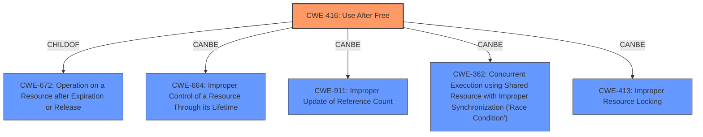

# Analysis Report for CVE-2022-3654

# Vulnerability Analysis Report: CVE-2022-3654

## Description

Use after free in Layout in Google Chrome prior to 107.0.5304.62 allowed a remote attacker to potentially exploit heap corruption via a crafted HTML page. (Chromium security severity High)

## Vulnerability Description Key Phrases

**Rootcause:** use after free
**Weakness:** heap corruption
**Vector:** crafted HTML page
**Attacker:** remote attacker
**Product:** Google Chrome
**Version:** prior to 107.0.5304.62
**Component:** Layout

## Analysis (with Relationship Data)

# Summary
| CWE ID | CWE Name | Confidence | CWE Abstraction Level | CWE Vulnerability Mapping Label | CWE-Vulnerability Mapping Notes |
|---|---|---|---|---|---|
| CWE-416 | Use After Free | 1.0 | Variant | Allowed | Primary CWE |

## Evidence and Confidence

*   **Confidence Score:** 1.0
*   **Evidence Strength:** HIGH

- **Analysis and Justification:**  
  - *Explanation:* The vulnerability description explicitly states a "**use after free**" (**UAF**) condition exists in the Layout component of Google Chrome. The CVE Reference Links Content Summary also highlights the "**use-after-free (UAF)**" as the **root cause** of the vulnerability. This aligns directly with CWE-416 (Use After Free), which describes the condition where a product reuses or references memory after it has been freed. The **heap corruption** mentioned further suggests memory management issues consistent with UAF. The Retriever Results also lists CWE-416 as the top candidate with a score of 0.8291, and the Usage is ALLOWED.

  - *Relationship Analysis:* CWE-416 is a variant-level CWE, providing a specific description of the memory management error. While CWE-672 (Operation on Resource after Expiry) is a parent class, CWE-416 provides a more precise characterization of the vulnerability. CWE-416 can lead to exploitable conditions like arbitrary code execution.

- **Confidence Score:**  
  - Confidence: 1.0 (Strong direct evidence from vulnerability description and reference materials)

## Criticism of Analysis

## Critique of the Analysis

The analysis provided is generally well-reasoned and arrives at the correct primary CWE mapping (CWE-416). The confidence score of 1.0 is justified given the explicit mention of "use after free" in the vulnerability description. The explanation provided is clear and accurate. However, some minor improvements and considerations can be made:

**Strengths:**

*   **Correct Primary CWE:** The identification of CWE-416 as the primary weakness is accurate and well-supported by the vulnerability description and reference content.
*   **High Confidence Justification:** The rationale for a confidence score of 1.0 is strong, stemming from the direct textual evidence.
*   **Clear Explanation:** The explanation is straightforward, easy to understand, and adequately justifies the CWE mapping.
*   **Relationship Analysis:** The discussion of the relationship between CWE-416 and other potentially related CWEs (like CWE-672) is helpful in clarifying the specific nature of the vulnerability.
*   **Utilizing the provided resources:** The analysis effectively uses the given vulnerability description, CVE Reference Links Content Summary, and Retriever Results to support its conclusion.

**Areas for Improvement and Further Consideration:**

1.  **Heap Corruption Context:** While CWE-416 is the direct cause, the description mentions "heap corruption." This hints at potential secondary weaknesses or contributing factors that could be explored. Although not a direct *cause*, it is more of a *consequence* of UAF. It highlights memory management issues, but a separate CWE isn't warranted since heap corruption, in this case, is a result of the UAF. However, mentioning it in the explanation is still good.

2.  **Potential Contributing Factors:**
    *   The analysis could briefly acknowledge possible contributing factors to the UAF. Without more information, it's difficult to say definitively, but possibilities include:
        *   **CWE-664: Improper Control of a Resource Through its Lifetime:** A general category for resource management issues.
        *   **CWE-911: Improper Update of Reference Count:** If reference counting is used for memory management in the Layout component, incorrect updates could lead to premature freeing.  The Retriever Results listed this as the 5th candidate with a high individual graph score of 1.0.
        *   **CWE-362: Concurrent Execution using Shared Resource with Improper Synchronization ('Race Condition'):** Race conditions can lead to UAFs if a resource is freed by one thread while another thread is still using it. The Retriever Results listed this as the 3rd candidate with a combined score of 0.7313.
        *   **CWE-413: Improper Resource Locking:** If resource locking is required to protect memory but is missing, it can lead to a UAF.
        While these are possible contributing factors, they are speculative without deeper analysis of the code. However, acknowledging them and stating *why* they are less likely to be primary weaknesses can strengthen the analysis.

3.  **Mitigation Strategies:** The analysis could be enhanced by briefly discussing relevant mitigation strategies, as provided in the CWE-416 specification. For example:

    *   Language Selection: Using languages with automatic memory management (like Java or Go) can prevent UAF vulnerabilities.  However, this isn't always feasible for performance-critical components.
    *   Nulling Pointers: Setting pointers to NULL after freeing memory can help prevent accidental reuse, although this is not a foolproof solution.

4.  **Relationship to CWE-672 (Operation on Resource after Expiration or Release):** While the analysis correctly identifies CWE-416 as a child of CWE-672, further discussion could clarify why CWE-416 is more appropriate. CWE-672 is a more abstract class, while CWE-416 specifies the concrete type of expiration/release issue.
    The Mapping Guidance of CWE-672 states: **Usage:** Allowed-with-Review, **Rationale:** This CWE entry is a Class and might have Base-level children that would be more appropriate. The Analysis did well to chose the Variant level CWE-416 which is more appropriate.

5. **CWE Examples from Database:** The "Known Examples for CWE-416" section is valuable. It highlights that UAFs often occur in conjunction with race conditions (CWE-362) or improper resource locking (CWE-413), reinforcing the potential for these contributing factors.

**Specific Suggestions:**

*   **Expand Explanation:** Add a sentence or two acknowledging the "heap corruption" aspect and explaining that it's a consequence of the UAF, rather than a separate root cause.
*   **Acknowledge Potential Contributing Factors:** Briefly mention CWE-664, CWE-911, CWE-362 and CWE-413 as possible contributing factors, but explain why the direct UAF (CWE-416) is the primary concern given the provided information.
*   **Discuss Mitigation:** Include a brief discussion of potential mitigation strategies from the CWE-416 specification, such as language selection or nulling pointers.

**Revised Summary Table (incorporating suggestions):**

| CWE ID | CWE Name | Confidence | CWE Abstraction Level | CWE Vulnerability Mapping Label | CWE-Vulnerability Mapping Notes |
|---|---|---|---|---|---|
| CWE-416 | Use After Free | 1.0 | Variant | Allowed | Primary CWE. Heap corruption is a consequence of the UAF. Possible contributing factors could include CWE-664, CWE-911, CWE-362, or CWE-413, but the direct UAF is the primary issue. Mitigation strategies include using memory-safe languages and nulling pointers after freeing memory.|

**Conclusion:**

The analysis is sound and accurately identifies CWE-416 as the primary weakness. The suggested improvements would further strengthen the analysis by providing a more comprehensive understanding of the vulnerability's context, potential contributing factors, and mitigation strategies. The review is comprehensive.

## Final Resolution

# Summary
| CWE ID | CWE Name | Confidence | CWE Abstraction Level | CWE Vulnerability Mapping Label | CWE-Vulnerability Mapping Notes |
|---|---|---|---|---|---|
| CWE-416 | Use After Free | 1.0 | Variant | Allowed | Primary CWE. Heap corruption is a consequence of the **UAF**. Possible contributing factors could include CWE-664, CWE-911, CWE-362, or CWE-413, but the direct **UAF** is the primary issue. Mitigation strategies include using memory-safe languages and nulling pointers after freeing memory.|

## Evidence and Confidence

*   **Confidence Score:** 1.0
*   **Evidence Strength:** HIGH

## Relationship Analysis
The primary relationship considered was the parent-child relationship between CWE-672 (Operation on a Resource after Expiration or Release) and CWE-416 (**Use After Free**). Although CWE-672 is a parent class, CWE-416 provides a more precise characterization of the vulnerability. The analysis also considered the potential for related weaknesses like CWE-664 (Improper Control of a Resource Through its Lifetime), CWE-911 (Improper Update of Reference Count), CWE-362 (Concurrent Execution using Shared Resource with Improper Synchronization), and CWE-413 (Improper Resource Locking) to contribute to the vulnerability, acknowledging that race conditions or locking issues could potentially lead to the **UAF**. However, these are speculative without more information.

## Vulnerability Chain
The vulnerability chain starts with a memory management error, specifically a **use-after-free** (**UAF**) condition (CWE-416). This occurs when memory is freed but then accessed again. The consequence of this is **heap corruption**, which can then be exploited by an attacker to potentially execute arbitrary code.
**Root Cause:** CWE-416 (**Use After Free**)
**Impact:** Heap corruption, potential arbitrary code execution

## Summary of Analysis
The initial analysis was accurate in identifying CWE-416 as the primary **weakness**, based on the explicit mention of "**use after free**" in the vulnerability description. The critique provided suggestions for improvement, including acknowledging the "**heap corruption**" aspect and mentioning potential contributing factors. The final determination affirms CWE-416 as the most appropriate classification because of the direct evidence.
The graph relationships influenced the decision by highlighting the connection between CWE-416 and its parent class, CWE-672, as well as potential contributing factors like race conditions and locking issues. However, the primary focus remains on the **UAF** due to its direct presence in the vulnerability description.
The selected CWE is at the optimal level of specificity because it is a variant-level CWE that accurately describes the memory management error, while also acknowledging potential contributing factors and consequences. The mapping guidance for CWE-416 indicates that its Usage is Allowed, further supporting its selection.
The evidence is strong: "Use after free in Layout in Google Chrome prior to 107.0.5304.62 allowed a remote attacker to potentially exploit heap corruption via a crafted HTML page."

*Report generated on 2025-03-18 16:14:10*
