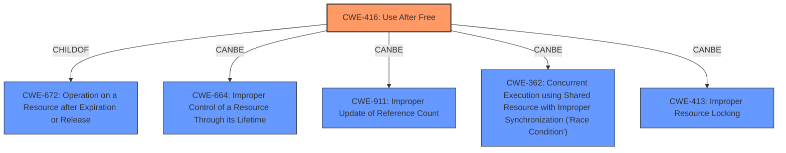

# Final Resolution for CVE-2022-3654

# Summary
| CWE ID | CWE Name | Confidence | CWE Abstraction Level | CWE Vulnerability Mapping Label | CWE-Vulnerability Mapping Notes |
|---|---|---|---|---|---|
| CWE-416 | Use After Free | 1.0 | Variant | Allowed | Primary CWE. Heap corruption is a consequence of the **UAF**. Possible contributing factors could include CWE-664, CWE-911, CWE-362, or CWE-413, but the direct **UAF** is the primary issue. Mitigation strategies include using memory-safe languages and nulling pointers after freeing memory.|

## Evidence and Confidence

*   **Confidence Score:** 1.0
*   **Evidence Strength:** HIGH

## Relationship Analysis
The primary relationship considered was the parent-child relationship between CWE-672 (Operation on a Resource after Expiration or Release) and CWE-416 (**Use After Free**). Although CWE-672 is a parent class, CWE-416 provides a more precise characterization of the vulnerability. The analysis also considered the potential for related weaknesses like CWE-664 (Improper Control of a Resource Through its Lifetime), CWE-911 (Improper Update of Reference Count), CWE-362 (Concurrent Execution using Shared Resource with Improper Synchronization), and CWE-413 (Improper Resource Locking) to contribute to the vulnerability, acknowledging that race conditions or locking issues could potentially lead to the **UAF**. However, these are speculative without more information.

## Vulnerability Chain
The vulnerability chain starts with a memory management error, specifically a **use-after-free** (**UAF**) condition (CWE-416). This occurs when memory is freed but then accessed again. The consequence of this is **heap corruption**, which can then be exploited by an attacker to potentially execute arbitrary code.
**Root Cause:** CWE-416 (**Use After Free**)
**Impact:** Heap corruption, potential arbitrary code execution

## Summary of Analysis
The initial analysis was accurate in identifying CWE-416 as the primary **weakness**, based on the explicit mention of "**use after free**" in the vulnerability description. The critique provided suggestions for improvement, including acknowledging the "**heap corruption**" aspect and mentioning potential contributing factors. The final determination affirms CWE-416 as the most appropriate classification because of the direct evidence.
The graph relationships influenced the decision by highlighting the connection between CWE-416 and its parent class, CWE-672, as well as potential contributing factors like race conditions and locking issues. However, the primary focus remains on the **UAF** due to its direct presence in the vulnerability description.
The selected CWE is at the optimal level of specificity because it is a variant-level CWE that accurately describes the memory management error, while also acknowledging potential contributing factors and consequences. The mapping guidance for CWE-416 indicates that its Usage is Allowed, further supporting its selection.
The evidence is strong: "Use after free in Layout in Google Chrome prior to 107.0.5304.62 allowed a remote attacker to potentially exploit heap corruption via a crafted HTML page."