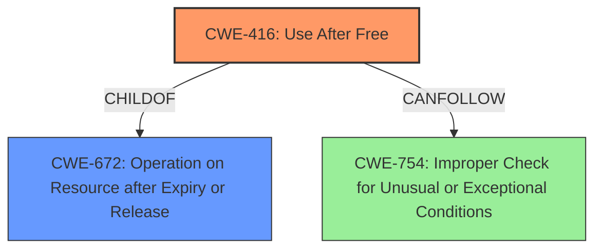

# Analysis Report for CVE-2022-3657

# Vulnerability Analysis Report: CVE-2022-3657

## Description

Use after free in Extensions in Google Chrome prior to 107.0.5304.62 allowed an attacker who convinced a user to install a malicious extension to potentially exploit heap corruption via a crafted Chrome Extension. (Chromium security severity Medium)

## Vulnerability Description Key Phrases

**Rootcause:** use after free
**Weakness:** heap corruption
**Vector:** crafted Chrome Extension
**Attacker:** attacker
**Product:** Google Chrome
**Version:** prior to 107.0.5304.62
**Component:** Extensions

## Analysis (with Relationship Data)

# Summary
| CWE ID | CWE Name | Confidence | CWE Abstraction Level | CWE Vulnerability Mapping Label | CWE-Vulnerability Mapping Notes |
|---|---|---|---|---|---|
| CWE-416 | Use After Free | 1.0 | Variant | Primary | Allowed |

## Evidence and Confidence

*   **Confidence Score:** 1.0
*   **Evidence Strength:** HIGH

- **Analysis and Justification:**
  - *Explanation:* The vulnerability description explicitly states "**use after free**" as the root cause, and "**heap corruption**" as a weakness in Extensions in Google Chrome. The CVE Reference Links Content Summary reiterates "**Use after free**" as the root cause. CWE-416 (Use After Free) is a Variant-level CWE that accurately describes this vulnerability where memory is reused after being freed, potentially leading to **heap corruption**. The retriever results also list CWE-416 as the top match. The MITRE mapping guidance for CWE-416 indicates that its usage is ALLOWED.
  
  - *Relationship Analysis:* CWE-416 is a variant of CWE-672 (Operation on Resource after Expiry). It can lead to other issues like CWE-754 (Exception Errors).

- **Confidence Score:**
  - Confidence: 1.0 (Explicit mention of 'use after free' in the description and reference summary.)

## Criticism of Analysis

Okay, here's a review of the provided analysis, incorporating the full CWE specifications you've provided.

**Overall Assessment:**

The analysis is excellent. It correctly identifies CWE-416 (Use After Free) as the primary CWE with a high degree of confidence (1.0). The reasoning is sound, explicitly linking the vulnerability description to the definition of CWE-416. The inclusion of observed examples and relevant CWE specifications strengthens the analysis.

**Detailed Review:**

**1. CWE-416 Mapping:**

*   **Correctness:** The mapping to CWE-416 is highly accurate.  The description explicitly mentions "use after free," making this a clear and direct match.  The fact that the vulnerability leads to "heap corruption" aligns with the potential consequences of a UAF.
*   **Abstraction Level:** The analysis correctly identifies CWE-416 as a "Variant" level CWE. According to the CWE specifications, the mapping guidance for CWE-416 is "Allowed" because it is at the Variant level, which is preferred.
*   **Confidence:** The confidence score of 1.0 is justified, given the explicit mention of "use after free."
*   **Mitigations:** The analysis doesn't directly include mitigations, but the CWE specification provides useful guidance here:
    *   **Language Selection:**  Choosing a language with automatic memory management (Mitigation 1) is a strong architectural defense.
    *   **Setting Pointers to NULL:** The second mitigation, setting pointers to NULL after freeing them, is a common but not foolproof technique. It's rightly noted that this is less effective with complex data structures.

**2. Consideration of Other CWEs (and why they weren't selected):**

The analysis mentions other CWEs considered by the retriever, specifically:

*   **CWE-362 (Race Condition):** While race conditions can *lead* to UAF vulnerabilities (as shown in several of the Observed Examples for CWE-416), a race condition is not explicitly mentioned in the vulnerability description. If the analysis *did* determine that a race condition was a factor, it could be included as a *secondary* CWE, illustrating a chain of vulnerabilities. However, without more evidence, excluding it is the right call.
*   **CWE-787 (Out-of-bounds Write) and CWE-122 (Heap-based Buffer Overflow):**  While heap corruption is mentioned, it's a *consequence* of the UAF, not the primary weakness. A UAF *can* lead to an out-of-bounds write or a heap overflow if the freed memory is reallocated and then improperly written to. However, the root cause is still the UAF.
*   **CWE-672 (Operation on Resource after Expiration or Release):** CWE-672 is a *Class*-level CWE. The mapping guidance for CWE-672 is "Allowed-with-Review" with the advice to examine children of this entry to see if there is a better fit. Because CWE-416 is a *child* of CWE-672 and accurately describes the vulnerability, the selection of CWE-416 is better, making the analysis correct.

**3. Chains and Relationships:**

*   The analysis briefly mentions relationships, stating that CWE-416 is a variant of CWE-672 and can lead to other issues like CWE-754 (Improper Check for Unusual or Exceptional Conditions). This is valuable context. The specifications for CWE-416 explicitly list CWE-754 as something it `CanFollow`. If the analysis had more information on an unhandled exception, it could be included as a *secondary* CWE.

**4. Suggested Improvements (Minor):**

*   **Expand Mitigation Section:** While the primary focus is on identifying the CWE, briefly mentioning relevant mitigations from the CWE specification would add value.  For example, noting that using a language with automatic memory management is a good architectural defense.
*   **Explicitly State Exclusion Reasoning:** While the analysis hints at why other CWEs were not selected, a more direct statement, such as "While heap corruption is a potential consequence, it is the UAF that is the root cause, making CWE-416 the most accurate mapping," would further strengthen the justification.

**Conclusion:**

The analysis is accurate, well-reasoned, and demonstrates a good understanding of CWE. The mapping to CWE-416 is correct and justified. The suggested improvements are minor and aimed at further strengthening the analysis.

## Final Resolution

# Summary
| CWE ID | CWE Name | Confidence | CWE Abstraction Level | CWE Vulnerability Mapping Label | CWE-Vulnerability Mapping Notes |
|---|---|---|---|---|---|
| CWE-416 | Use After Free | 1.0 | Variant | Primary | Allowed |

## Evidence and Confidence

*   **Confidence Score:** 1.0
*   **Evidence Strength:** HIGH

## Relationship Analysis
The primary relationship influencing the decision is that CWE-416 (Use After Free) is a variant of CWE-672 (Operation on Resource after Expiry or Release). While CWE-672 could be considered, CWE-416 provides a more specific and accurate representation of the vulnerability. The relationship `CanFollow` from CWE-416 to CWE-754 (Improper Check for Unusual or Exceptional Conditions) suggests a potential vulnerability chain where the use-after-free could lead to unexpected program states and exceptions, however, there is no evidence of this from the vulnerability description.

## Vulnerability Chain
The vulnerability chain consists of the following:
1.  A malicious extension is installed by a user.
2.  The extension triggers a **use-after-free** (**CWE-416**) condition.
3.  The **use-after-free** leads to **heap corruption**.

There are no apparent missing links, given the information available.

## Summary of Analysis
The initial analysis is accurate and well-justified. The vulnerability description explicitly states "**use after free**" as the root cause.
The CVE Reference Links Content Summary also reiterates "**Use after free**" as the root cause.
CWE-416 (Use After Free) is a Variant-level CWE that accurately describes this vulnerability where memory is reused after being freed, potentially leading to **heap corruption**. The retriever results also list CWE-416 as the top match. The MITRE mapping guidance for CWE-416 indicates that its usage is ALLOWED.

The graph relationships confirm that CWE-416 is the optimal choice due to its specificity as a variant of a more general class (CWE-672). Other CWEs, like CWE-362 (Race Condition) or CWE-787 (Out-of-bounds Write), are not directly supported by the vulnerability description, which focuses on the **use-after-free** condition as the primary issue. The level of specificity is appropriate because the description explicitly mentions "**use after free**," making it a clear and direct match.

*Report generated on 2025-03-18 16:14:48*
