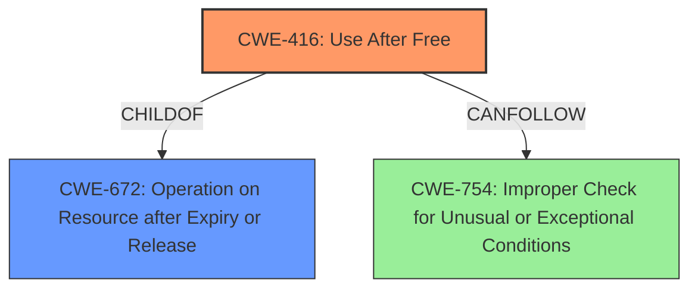

# Final Resolution for CVE-2022-3657

# Summary
| CWE ID | CWE Name | Confidence | CWE Abstraction Level | CWE Vulnerability Mapping Label | CWE-Vulnerability Mapping Notes |
|---|---|---|---|---|---|
| CWE-416 | Use After Free | 1.0 | Variant | Primary | Allowed |

## Evidence and Confidence

*   **Confidence Score:** 1.0
*   **Evidence Strength:** HIGH

## Relationship Analysis
The primary relationship influencing the decision is that CWE-416 (Use After Free) is a variant of CWE-672 (Operation on Resource after Expiry or Release). While CWE-672 could be considered, CWE-416 provides a more specific and accurate representation of the vulnerability. The relationship `CanFollow` from CWE-416 to CWE-754 (Improper Check for Unusual or Exceptional Conditions) suggests a potential vulnerability chain where the use-after-free could lead to unexpected program states and exceptions, however, there is no evidence of this from the vulnerability description.

## Vulnerability Chain
The vulnerability chain consists of the following:
1.  A malicious extension is installed by a user.
2.  The extension triggers a **use-after-free** (**CWE-416**) condition.
3.  The **use-after-free** leads to **heap corruption**.

There are no apparent missing links, given the information available.

## Summary of Analysis
The initial analysis is accurate and well-justified. The vulnerability description explicitly states "**use after free**" as the root cause.
The CVE Reference Links Content Summary also reiterates "**Use after free**" as the root cause.
CWE-416 (Use After Free) is a Variant-level CWE that accurately describes this vulnerability where memory is reused after being freed, potentially leading to **heap corruption**. The retriever results also list CWE-416 as the top match. The MITRE mapping guidance for CWE-416 indicates that its usage is ALLOWED.

The graph relationships confirm that CWE-416 is the optimal choice due to its specificity as a variant of a more general class (CWE-672). Other CWEs, like CWE-362 (Race Condition) or CWE-787 (Out-of-bounds Write), are not directly supported by the vulnerability description, which focuses on the **use-after-free** condition as the primary issue. The level of specificity is appropriate because the description explicitly mentions "**use after free**," making it a clear and direct match.