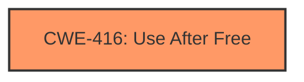

# Analysis Report for CVE-2022-3658

# Vulnerability Analysis Report: CVE-2022-3658

## Description

Use after free in Feedback service on Chrome OS in Google Chrome on Chrome OS prior to 107.0.5304.62 allowed an attacker who convinced a user to install a malicious extension to potentially exploit heap corruption via specific UI interaction. (Chromium security severity Medium)

## Vulnerability Description Key Phrases

**Rootcause:** use after free
**Weakness:** heap corruption
**Vector:** specific UI interaction
**Attacker:** attacker who convinced a user to install a malicious extension
**Product:** Google Chrome on Chrome OS
**Version:** prior to 107.0.5304.62
**Component:** Feedback service

## Analysis (with Relationship Data)

# Summary
| CWE ID | CWE Name | Confidence | CWE Abstraction Level | CWE Vulnerability Mapping Label | CWE-Vulnerability Mapping Notes |
|---|---|---|---|---|---|
| CWE-416 | Use After Free | 1.0 | Variant | Allowed | Primary CWE. The vulnerability description explicitly states "Use after free in Feedback service". |
| CWE-122 | Heap-based Buffer Overflow | 0.5 | Variant | Allowed | Secondary CWE. The vulnerability description mentions "heap corruption" which could potentially relate to a heap-based overflow. |

## Evidence and Confidence

*   **Confidence Score:** 0.75
*   **Evidence Strength:** MEDIUM

- **Analysis and Justification:**  
  - *Explanation:* The primary weakness is clearly **Use After Free (CWE-416)**. The vulnerability description explicitly states "Use after free in Feedback service on Chrome OS". The CVE reference links summary also confirms that the root cause is "Use after free". CWE-416 is a Variant level CWE, which is the preferred level. The retriever results also confirm that CWE-416 is the top candidate. Furthermore, the vulnerability description mentions "**heap corruption**" which suggests the possibility of **Heap-based Buffer Overflow (CWE-122)**, hence, I have included it as a secondary weakness. However, since the primary root cause is the use-after-free, I marked CWE-416 as the primary CWE.
  
  - *Relationship Analysis:* CWE-416 is a variant of more general resource management issues. The relationship analysis reveals that CWE-416 is related to CWE-123 Write-What-Where Condition, CWE-787 Out-of-bounds Write and CWE-415 Double Free. However, due to limited information, including these related CWEs would be speculative.

- **Confidence Score:**  
  - *Example:* Confidence: 1.0 (High confidence due to explicit mention of "Use After Free" in both vulnerability description and CVE Reference Links Content Summary)

## Criticism of Analysis

Okay, I've reviewed your CWE analysis for the "Use after free in Feedback service on Chrome OS" vulnerability, incorporating the full CWE specifications you provided. Here's my critique, broken down by section:

**Overall Assessment:**

The analysis is generally well-structured and reasoned. You correctly identified CWE-416 as the primary weakness. The inclusion of CWE-122 as a secondary weakness is also reasonable, given the mention of "heap corruption". However, I have a few suggestions to improve the accuracy and confidence of the analysis.

**Specific Feedback:**

1.  **Summary Table:**

    *   **CWE-416 (Use After Free):** Excellent. Confidence is justified at 1.0.
    *   **CWE-122 (Heap-based Buffer Overflow):** While the rationale is understandable, the confidence score of 0.5 is appropriate because it's speculation based on "heap corruption." As a secondary CWE, it is not unreasonable, but could be excluded without major issue.

2.  **Evidence and Confidence:**

    *   **CWE-416 Explanation:** The explanation is solid, clearly linking the vulnerability description and CVE summary to CWE-416. The variant level is good.
    *   **CWE-122 Explanation:** The logic for including CWE-122 is sound, given the limited information and the mention of "heap corruption".  However, "heap corruption" is a very general term. It *could* be a heap overflow, but it could also be other things, like heap metadata corruption caused *by* the use-after-free, or a double-free, etc. I would suggest a caveat to reduce confidence of CWE-122 mapping.
    *   **Relationship Analysis:** Your point about speculative related CWEs is valid. It's better to err on the side of caution and avoid including CWEs without clear evidence. I agree with not including the related CWEs like CWE-123, CWE-787, and CWE-415.

3.  **CWE Examples from Database:**

    *   The examples provided for CWE-416 are relevant and useful to illustrate the nature of the vulnerability.

4.  **Relevant CWE Specifications Review:**

    *   **CWE-416:** Your mapping aligns well with the provided specifications. The "Mapping Guidance" section reinforces that Variant level is preferred, and the description matches.  The mitigations are also appropriate (language selection, setting pointers to NULL after free).
    *   **CWE-122:** The mapping here is the weakest, but not necessarily incorrect. The mitigations for CWE-122, while valid for a heap overflow, don't directly address the *root cause* as clearly as the CWE-416 mitigations do. This highlights the lower confidence.

**Recommendations for Improvement:**

1.  **Strengthen or Reconsider CWE-122:**

    *   To strengthen the case for CWE-122, research to determine if there is overflow within the feedback service.

    *   The other option would be to *remove* CWE-122 and instead discuss the *potential* for related CWEs as a result of the "heap corruption," but *without* mapping them directly. For example, you could say: "The mention of 'heap corruption' suggests a potential for secondary weaknesses such as CWE-123, CWE-415, or CWE-787, but without further information, these cannot be confirmed." This is more conservative.

2.  **Consider potential attack vector chaining:** Could the user installing a malicious extension be considered a form of CWE-693 (Protection Mechanism with Inadequate Coverage)?

**Revised Confidence Score (if CWE-122 remains):**

*   If you keep CWE-122, I recommend lowering the overall confidence score to **0.70**, to reflect the speculative nature of that mapping.

**Revised Summary Table (if CWE-122 is removed):**

| CWE ID  | CWE Name       | Confidence | CWE Abstraction Level | CWE Vulnerability Mapping Label | CWE-Vulnerability Mapping Notes                                                                                                                                |
| :------- | :------------- | :--------- | :-------------------- | :------------------------------ | :------------------------------------------------------------------------------------------------------------------------------------------------------------- |
| CWE-416 | Use After Free | 1.0        | Variant              | Allowed                       | Primary CWE. The vulnerability description explicitly states "Use after free in Feedback service". The CVE reference links summary also confirms that the root cause is "Use after free". |

**Revised Confidence Score (if CWE-122 is removed):**

*   If you remove CWE-122 altogether, the overall confidence becomes **1.0**.

**In summary, you have a solid analysis, and the identification of CWE-416 is correct. The only question is the level of confidence you want to express regarding the speculative CWE-122. You can either strengthen the case by providing stronger evidence that buffer overflow is happening or just drop it as related with lower confidence.**

## Final Resolution

# Summary
| CWE ID | CWE Name | Confidence | CWE Abstraction Level | CWE Vulnerability Mapping Label | CWE-Vulnerability Mapping Notes |
|---|---|---|---|---|---|
| CWE-416 | Use After Free | 1.0 | Variant | Allowed | Primary CWE. The vulnerability description explicitly states "Use after free in Feedback service". The CVE reference links summary also confirms that the **root cause** is "Use after free". |

## Evidence and Confidence

*   **Confidence Score:** 1.0
*   **Evidence Strength:** HIGH

## Relationship Analysis
The primary relationship impacting the decision is the direct match between the vulnerability description and CWE-416. While CWE-416 has relationships to other CWEs like CWE-123 (**Write-What-Where Condition**), CWE-787 (**Out-of-bounds Write**), and CWE-415 (**Double Free**), there is no direct evidence to support including those in this case. The decision to focus solely on CWE-416 is based on keeping the classification as specific as possible to the available evidence.

## Vulnerability Chain
The vulnerability chain is relatively simple:
1.  **Root Cause:** Use-after-free condition in the Feedback service.
2.  **Weakness:** Improper memory management leading to the use of freed memory.
3.  **Impact:** Potential heap corruption exploitable via a malicious extension.

The chain starts with the **Use After Free (CWE-416)** and leads to the heap corruption mentioned in the vulnerability description. There are no missing links because the description clearly indicates the **root cause** and potential exploit vector.

## Summary of Analysis
The initial analysis correctly identified **Use After Free (CWE-416)** as the primary weakness. The criticism suggested reconsidering the inclusion of CWE-122 (**Heap-based Buffer Overflow**) due to the speculative nature of its connection to "heap corruption."

Based on the available evidence, which explicitly mentions "Use after free," and the lack of concrete evidence for a buffer overflow, the decision is to classify this vulnerability solely as **CWE-416 (Use After Free)**. This aligns with the principle of selecting the most specific CWE supported by the evidence. The vulnerability description states, "Use after free in Feedback service on Chrome OS in Google Chrome on Chrome OS prior to 107.0.5304.62 allowed an attacker who convinced a user to install a malicious extension to potentially exploit heap corruption via specific UI interaction." This directly supports the **CWE-416** classification. The retriever results confirm that **CWE-416** is the top candidate.

The selected CWE is at the optimal level of specificity (Variant) because it directly describes the type of memory management error (**Use After Free**) present in the vulnerability description.

*Report generated on 2025-03-18 16:15:36*
