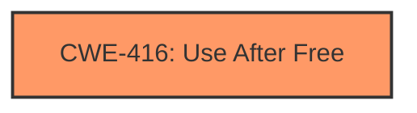

# Final Resolution for CVE-2022-3658

# Summary
| CWE ID | CWE Name | Confidence | CWE Abstraction Level | CWE Vulnerability Mapping Label | CWE-Vulnerability Mapping Notes |
|---|---|---|---|---|---|
| CWE-416 | Use After Free | 1.0 | Variant | Allowed | Primary CWE. The vulnerability description explicitly states "Use after free in Feedback service". The CVE reference links summary also confirms that the **root cause** is "Use after free". |

## Evidence and Confidence

*   **Confidence Score:** 1.0
*   **Evidence Strength:** HIGH

## Relationship Analysis
The primary relationship impacting the decision is the direct match between the vulnerability description and CWE-416. While CWE-416 has relationships to other CWEs like CWE-123 (**Write-What-Where Condition**), CWE-787 (**Out-of-bounds Write**), and CWE-415 (**Double Free**), there is no direct evidence to support including those in this case. The decision to focus solely on CWE-416 is based on keeping the classification as specific as possible to the available evidence.

## Vulnerability Chain
The vulnerability chain is relatively simple:
1.  **Root Cause:** Use-after-free condition in the Feedback service.
2.  **Weakness:** Improper memory management leading to the use of freed memory.
3.  **Impact:** Potential heap corruption exploitable via a malicious extension.

The chain starts with the **Use After Free (CWE-416)** and leads to the heap corruption mentioned in the vulnerability description. There are no missing links because the description clearly indicates the **root cause** and potential exploit vector.

## Summary of Analysis
The initial analysis correctly identified **Use After Free (CWE-416)** as the primary weakness. The criticism suggested reconsidering the inclusion of CWE-122 (**Heap-based Buffer Overflow**) due to the speculative nature of its connection to "heap corruption."

Based on the available evidence, which explicitly mentions "Use after free," and the lack of concrete evidence for a buffer overflow, the decision is to classify this vulnerability solely as **CWE-416 (Use After Free)**. This aligns with the principle of selecting the most specific CWE supported by the evidence. The vulnerability description states, "Use after free in Feedback service on Chrome OS in Google Chrome on Chrome OS prior to 107.0.5304.62 allowed an attacker who convinced a user to install a malicious extension to potentially exploit heap corruption via specific UI interaction." This directly supports the **CWE-416** classification. The retriever results confirm that **CWE-416** is the top candidate.

The selected CWE is at the optimal level of specificity (Variant) because it directly describes the type of memory management error (**Use After Free**) present in the vulnerability description.