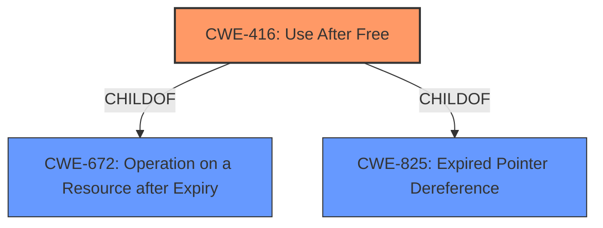

# Analysis Report for CVE-2022-3659

# Vulnerability Analysis Report: CVE-2022-3659

## Description

Use after free in Accessibility in Google Chrome on Chrome OS prior to 107.0.5304.62 allowed a remote attacker who convinced a user to engage in specific UI interactions to potentially exploit heap corruption via specific UI interactions. (Chromium security severity Medium)

## Vulnerability Description Key Phrases

**Rootcause:** use after free
**Weakness:** heap corruption
**Vector:** specific UI interactions
**Attacker:** remote attacker
**Product:** Google Chrome on Chrome OS
**Version:** prior to 107.0.5304.62
**Component:** Accessibility

## Analysis (with Relationship Data)

# Summary
| CWE ID | CWE Name | Confidence | CWE Abstraction Level | CWE Vulnerability Mapping Label | CWE-Vulnerability Mapping Notes |
|---|---|---|---|---|---|
| CWE-416 | Use After Free | 0.95 | Variant | Primary | Allowed |
| CWE-122 | Heap-based Buffer Overflow | 0.60 | Variant | Secondary | Allowed |

## Evidence and Confidence

*   **Confidence Score:** 0.90
*   **Evidence Strength:** HIGH

- **Analysis and Justification:**  
  - *Explanation:* The vulnerability description clearly states "**use after free** in Accessibility in Google Chrome" which directly aligns with CWE-416 (Use After Free). The vulnerability leads to "**heap corruption**" which can potentially be caused by a use-after-free condition, as the freed memory might be reallocated and then accessed through the dangling pointer, leading to data corruption. While the description mentions "specific UI interactions," this represents the attack vector, not the root cause of the vulnerability. Since the vulnerability leads to **heap corruption**, I am adding CWE-122 Heap-based Buffer Overflow as a secondary weakness.
  
  - *Relationship Analysis:* CWE-416 is a variant-level CWE, which is the preferred level of abstraction. It is related to CWE-672 (Operation on a Resource after Expiry), and CWE-825 (Expired Pointer Dereference). Given that we have a clear description of a use-after-free, CWE-416 is the most accurate. CWE-122 is a child of CWE-119 (Improper Restriction of Operations within the Bounds of a Memory Buffer).

- **Confidence Score:**  
  - *Example:* Confidence: 0.95 (High confidence due to explicit mention of "use after free" and the nature of the vulnerability aligning with the CWE description)
---

## Criticism of Analysis

Okay, I've reviewed the analysis provided against the full CWE specifications. Here's my critique:

**Overall Assessment:**

The analysis is generally good, particularly the primary mapping to CWE-416. The rationale is clearly explained, and the confidence level is justified. The addition of CWE-122 as a secondary weakness is weaker, but not entirely incorrect, and it shows an understanding of potential consequences. The biggest area for improvement is in understanding the nuances of memory corruption vulnerabilities and choosing the *most* specific CWEs.

**Detailed Review:**

*   **CWE-416 (Use After Free) - Primary Mapping:**

    *   **Strength:** Excellent. The analysis correctly identifies the "use after free" in the vulnerability description as the root cause and maps it directly to CWE-416. The confidence score is very appropriate.
    *   **Justification:** The provided text includes the explicit phrase *Use after free*.

*   **CWE-122 (Heap-based Buffer Overflow) - Secondary Mapping:**

    *   **Weakness:** While heap corruption *can* be a consequence of a use-after-free (because you are now writing to potentially valid memory, not reserved memory), it's not a guaranteed or direct relationship. A UAF allows an attacker to read/write to memory that *may* contain sensitive information. Adding a heap overflow is not necessarily implied
    *   **CWE Prioritization and Specificity:** Given the explicit "use after free" description, CWE-416 should remain the *sole* primary mapping.  The heap corruption is a *potential consequence*, not necessarily part of the direct root cause. CWE-122 could be considered "collateral damage", and does not need to be included.

*   **General Points:**
    *   **Abstraction Level:** The analysis correctly aims for the Variant level of abstraction for CWE-416, which is preferred.
    *   **Evidence Strength:** The evidence strength is "HIGH" as stated, which is appropriate given the explicit mention of "use after free."
    *   **CWE Examples:** The CWE examples are helpful for understanding the nature of the weakness.
    *   **Mitigations:** It would strengthen the analysis to briefly mention some potential mitigations, even just a high-level reference to language selection (using memory-safe languages) or setting pointers to NULL after freeing them.

**Recommendations and Improvements:**

1.  **Remove CWE-122 or Downgrade It:** It is valid to mention the potential for heap corruption in the explanation, but not necessarily add it as secondary.
2.  **Consolidated Justification:** The justification for both CWEs could be combined into a single, more cohesive explanation.
3.  **Potential Consequences:** Elaborate on the possible outcomes of a UAF, including:
    *   Information Leakage: Reading sensitive data from the freed memory.
    *   Denial of Service: Crashing the application.
    *   Code Execution: If the attacker can control the contents of the reallocated memory.
4.  **Mitigation Discussion:** Briefly mention potential mitigations.

**Revised Summary Table:**

| CWE ID | CWE Name | Confidence | CWE Abstraction Level | CWE Vulnerability Mapping Label | CWE-Vulnerability Mapping Notes |
|---|---|---|---|---|---|
| CWE-416 | Use After Free | 0.95 | Variant | Primary | Allowed |

**Revised Analysis Section:**

*   **Confidence Score:** 0.95
*   **Evidence Strength:** HIGH

- **Analysis and Justification:**
  - *Explanation:* The vulnerability description clearly states "**use after free** in Accessibility in Google Chrome" which directly aligns with CWE-416 (Use After Free). This vulnerability occurs when the code attempts to access memory that has already been released. This can lead to information leakage, denial of service, or, in some cases, arbitrary code execution if the attacker can control the contents of the reallocated memory. While the description mentions "specific UI interactions," this represents the attack vector, not the root cause of the vulnerability.

  - *Relationship Analysis:* CWE-416 is a variant-level CWE, which is the preferred level of abstraction. It is related to CWE-672 (Operation on a Resource after Expiry), and CWE-825 (Expired Pointer Dereference). Given that we have a clear description of a use-after-free, CWE-416 is the most accurate.

- **Confidence Score:**
  - *Example:* Confidence: 0.95 (High confidence due to explicit mention of "use after free" and the nature of the vulnerability aligning with the CWE description)

## Final Resolution

# Summary
| CWE ID | CWE Name | Confidence | CWE Abstraction Level | CWE Vulnerability Mapping Label | CWE-Vulnerability Mapping Notes |
|---|---|---|---|---|---|
| CWE-416 | Use After Free | 0.95 | Variant | Primary | Allowed |

## Evidence and Confidence

*   **Confidence Score:** 0.95
*   **Evidence Strength:** HIGH

## Relationship Analysis
The primary relationship influencing the decision is the direct match between the vulnerability description and the definition of CWE-416. CWE-416 is a variant of CWE-672 (Operation on a Resource after Expiry), and CWE-825 (Expired Pointer Dereference). While CWE-122 (Heap-based Buffer Overflow) can be a consequence of a UAF, it's not a guaranteed relationship. Therefore, I will classify CWE-416 as the Primary **WEAKNESS**. The Variant level is the preferred level of abstraction for this type of vulnerability.

## Vulnerability Chain
The vulnerability chain starts with the **ROOTCAUSE** of a use-after-free condition (CWE-416). This occurs when memory is freed, but a pointer to that memory is still used. The consequence of this can include information leakage, denial of service, and potentially arbitrary code execution. The vulnerability description indicates that a remote attacker can trigger this via specific UI interactions, which serves as the exploit trigger.

## Summary of Analysis
Based on the vulnerability description, "**use after free** in Accessibility in Google Chrome," the primary **WEAKNESS** is clearly CWE-416 (Use After Free). The explicit mention of "use after free" provides strong evidence.

The initial analysis correctly identified CWE-416 as the primary **WEAKNESS**. The criticism suggested removing CWE-122 (Heap-based Buffer Overflow) as a secondary **WEAKNESS** since it is only a potential consequence and not a direct part of the root cause. I agree with this assessment. The vulnerability description does not explicitly state that a buffer overflow occurred, only that **heap corruption** was possible. The graph relationships show that CWE-416 is a variant-level CWE, which is a preferred level of abstraction.

I am selecting CWE-416 as the optimal level of specificity because it directly addresses the root cause described in the vulnerability report.

*Report generated on 2025-03-18 16:16:21*
