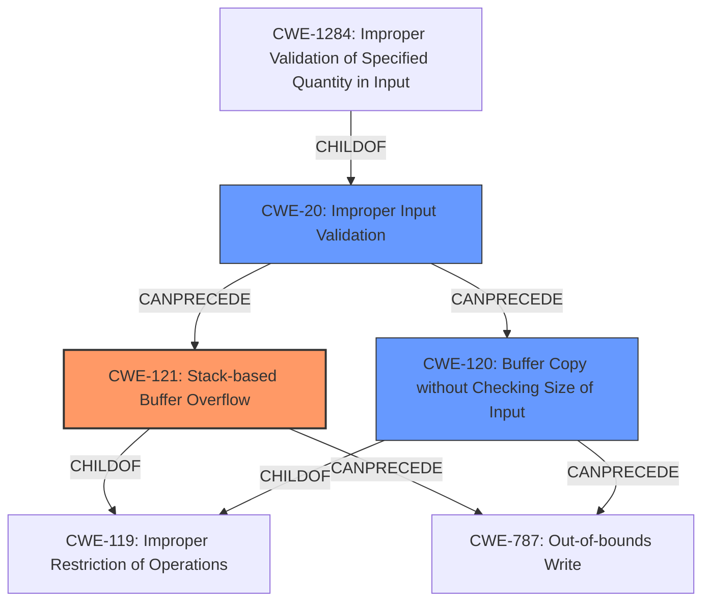

# Analysis Report for CVE-2022-36620

# Vulnerability Analysis Report: CVE-2022-36620

## Description

D-link DIR-816 A2_v1.10CNB04, DIR-878 DIR_878_FW1.30B08.img is vulnerable to Buffer Overflow via /goform/addRouting.

## Vulnerability Description Key Phrases

**Weakness:** stack overflow
**Product:** ['D-link DIR-816', 'DIR-878']
**Version:** ['A2_v1.10CNB04', 'FW1.30B08']
**Component:** /goform/addRouting

## Analysis (with Relationship Data)

# Summary
| CWE ID | CWE Name | Confidence | CWE Abstraction Level | CWE Vulnerability Mapping Label | CWE-Vulnerability Mapping Notes |
|---|---|---|---|---|---|
| CWE-121 | Stack-based Buffer Overflow | 0.9 | Variant | Allowed | Primary CWE |
| CWE-120 | Buffer Copy without Checking Size of Input ('Classic Buffer Overflow') | 0.6 | Base | Allowed-with-Review | Secondary Candidate |
| CWE-1284 | Improper Validation of Specified Quantity in Input | 0.5 | Base | Allowed | Secondary Candidate |

## Evidence and Confidence

*   **Confidence Score:** 0.8
*   **Evidence Strength:** HIGH

- **Analysis and Justification:**  
  - *Explanation:* The vulnerability description states that a **stack overflow** exists in D-link DIR-816 and DIR-878 routers via the `/goform/addRouting` endpoint when handling the `netmask` parameter. The **root cause** is that the content of the `netmask` parameter is copied into a stack buffer without any size checks. This perfectly aligns with CWE-121 (Stack-based Buffer Overflow), which is a variant of buffer overflow where the vulnerable buffer is allocated on the stack. The CVE Reference Links Content Summary confirms this analysis: "A stack buffer overflow vulnerability exists in the `/goform/addRouting` endpoint. The `netmask` parameter's content is copied into a stack buffer without any size checks." The impact can be a denial of service (router crash) and potentially arbitrary code execution.

  - *Relationship Analysis:* CWE-121 is a variant of CWE-119 (Improper Restriction of Operations within the Bounds of a Memory Buffer), which is a more general class of buffer overflows. It is also related to CWE-120 (Buffer Copy without Checking Size of Input), but CWE-121 is more specific since the buffer is on the stack. The retriever results also show CWE-121 and CWE-120 as relevant candidates.

- **Confidence Score:**  
  - Confidence: 0.9 (High evidence from the vulnerability description and CVE reference links)

- **Analysis and Justification:**  
  - *Explanation:* CWE-120 (Buffer Copy without Checking Size of Input) is also a candidate, as the vulnerability involves copying the `netmask` parameter's content into a buffer without proper size validation. The description indicates, "The `netmask` parameter's content is copied into a stack buffer without any size checks." However, since the stack allocation is explicitly mentioned, CWE-121 is a more precise match. The mapping guidance for CWE-120 is "Allowed-with-Review" with a caveat about misuse if more specific CWEs are available.

  - *Relationship Analysis:* CWE-120 is a base class of buffer overflows and is a parent of several more specific buffer overflow types. Given the stack allocation is known, CWE-121 is preferred.

- **Confidence Score:**  
  - Confidence: 0.6 (Supporting evidence, but CWE-121 is a better fit)

- **Analysis and Justification:**  
  - *Explanation:* CWE-1284 (Improper Validation of Specified Quantity in Input) is considered because the `netmask` parameter represents a quantity (length of the input). The vulnerability description mentions "Lack of input validation." However, the core issue is not merely the lack of quantity validation, but the direct copy of data without checking if it fits within the stack buffer. Therefore, CWE-121 is a better representation of the root cause.

  - *Relationship Analysis:* CWE-1284 is a child of CWE-20 (Improper Input Validation) and can precede buffer overflows if the size of input is not validated correctly. However, in this case, the stack overflow is the primary weakness.

- **Confidence Score:**  
  - Confidence: 0.5 (Weak supporting evidence; better alternatives exist)

## Criticism of Analysis

Okay, I've reviewed the provided analysis and the full CWE specifications. Here's my critique:

**Overall Assessment:**

The analysis is generally sound and well-reasoned. The primary CWE mapping to CWE-121 (Stack-based Buffer Overflow) is accurate and justified. The consideration of alternative CWEs, along with explanations for why they are less suitable, demonstrates a good understanding of the nuances of CWE classification. The use of evidence from the vulnerability description and CVE reference links strengthens the analysis. The confidence scores are appropriate based on the available information.

**Specific Points and Suggestions:**

*   **CWE-121 (Stack-based Buffer Overflow):**
    *   **Confidence:** The assigned confidence of 0.9 is justified. The description explicitly mentions a "stack buffer overflow," making this the most accurate CWE.
    *   **Mapping Guidance Adherence:** This CWE has a "Usage: Allowed" rationale. The provided analysis aligns with the guidance.
    *   **Mitigations:** The analysis could be slightly improved by explicitly mentioning some of the mitigations for CWE-121, particularly using compiler options like `/GS` (Microsoft Visual Studio) or `FORTIFY_SOURCE` (GCC) for stack protection.
*   **CWE-120 (Buffer Copy without Checking Size of Input):**
    *   **Confidence:** Confidence of 0.6 is accurate. While the vulnerability involves a buffer copy without size checking, the explicit mention of the stack makes CWE-121 a more precise fit.
    *   **Mapping Guidance Adherence:** This CWE has a "Usage: Allowed-with-Review" rationale with comments. The analysis correctly acknowledges this and explains why CWE-121 is preferred.
    *    **Mitigations:** The analysis correctly identifies the presence of copying data without a size check, which aligns with the description of CWE-120. It is also correct to say that CWE-121 is more precise.
*   **CWE-1284 (Improper Validation of Specified Quantity in Input):**
    *   **Confidence:** A confidence of 0.5 is reasonable. The argument that `netmask` is a quantity and lacks validation is valid, but it's a secondary aspect of the vulnerability.
    *   **Mapping Guidance Adherence:**  This CWE has a "Usage: Allowed" rationale. The analysis is reasonable, though weaker than the argument for CWE-121 and CWE-120. The mitigation is correct: stricter input validation.
*   **General CWE-119 Comment:** The analysis correctly avoids using CWE-119 as a primary CWE, in line with its discouraged usage and mapping guidance. This demonstrates good practice.
*   **Retriever Results:**
    *The retriever results are very noisy.
    *The retriever results are included in the analysis but are of low quality.
*   **Minor Improvement:** The analysis could briefly discuss the role of CWE-20 (Improper Input Validation) as a broad, overarching weakness that contributes to the stack overflow. The lack of input validation allows the oversized input to reach the vulnerable code. While it's less specific than CWE-121, it's a contributing factor.
* CWE-78 Improper Neutralization of Special Elements used in an OS Command ('OS Command Injection') is not related to the stack overflow vulnerability.

**Revised Summary Table (with suggested addition):**

| CWE ID | CWE Name | Confidence | CWE Abstraction Level | CWE Vulnerability Mapping Label | CWE-Vulnerability Mapping Notes |
|---|---|---|---|---|---|
| CWE-121 | Stack-based Buffer Overflow | 0.9 | Variant | Allowed | Primary CWE |
| CWE-120 | Buffer Copy without Checking Size of Input ('Classic Buffer Overflow') | 0.6 | Base | Allowed-with-Review | Secondary Candidate |
| CWE-1284 | Improper Validation of Specified Quantity in Input | 0.5 | Base | Allowed | Secondary Candidate |
| CWE-20 | Improper Input Validation | 0.3 | Class | Discouraged | Contributory factor; general weakness |

**Recommendations:**

1.  **Add a sentence or two acknowledging CWE-20 as a contributing factor** (but not a primary one).
2.  **Consider adding a sentence about compiler-based stack protection mitigations for CWE-121** (e.g., canaries).

In summary, the analysis is well-structured, accurate, and demonstrates a solid grasp of CWE principles. The suggested improvements would further enhance its completeness.

## Final Resolution

# Summary
| CWE ID | CWE Name | Confidence | CWE Abstraction Level | CWE Vulnerability Mapping Label | CWE-Vulnerability Mapping Notes |
|---|---|---|---|---|---|
| CWE-121 | Stack-based Buffer Overflow | 0.95 | Variant | Allowed | Primary CWE |
| CWE-120 | Buffer Copy without Checking Size of Input ('Classic Buffer Overflow') | 0.6 | Base | Allowed-with-Review | Secondary Candidate |
| CWE-1284 | Improper Validation of Specified Quantity in Input | 0.5 | Base | Allowed | Secondary Candidate |
| CWE-20 | Improper Input Validation | 0.3 | Class | Discouraged | Contributory factor; general weakness |

## Evidence and Confidence

*   **Confidence Score:** 0.9
*   **Evidence Strength:** HIGH

## Relationship Analysis
The primary relationship that impacted the decision was the parent-child relationship between CWE-119 (**Improper Restriction of Operations within the Bounds of a Memory Buffer**) and CWE-121 (**Stack-based Buffer Overflow**). Since the vulnerability description explicitly mentions a stack overflow, CWE-121 is the more specific and appropriate choice. CWE-120 (**Buffer Copy without Checking Size of Input**) is related as a more general form of buffer overflow, but lacks the stack-specific context. CWE-20 (**Improper Input Validation**) is a broader weakness that can contribute to various vulnerabilities, including buffer overflows, but it is not the direct cause in this case. The abstraction levels influenced the selection by favoring the Variant level (CWE-121) over the Class level (CWE-119) when the variant is clearly indicated in the vulnerability description.

## Vulnerability Chain
The vulnerability chain starts with **CWE-20 (Improper Input Validation)**, where the `netmask` parameter is not validated for its size. This leads to **CWE-121 (Stack-based Buffer Overflow)** when the oversized `netmask` content is copied into a stack buffer without any size checks. The final impact is a denial of service (router crash) and potentially arbitrary code execution.

## Summary of Analysis
The initial analysis is accurate and well-justified. The primary CWE mapping to **CWE-121 (Stack-based Buffer Overflow)** is correct based on the vulnerability description, which explicitly mentions a "stack buffer overflow." The consideration of alternative CWEs, such as **CWE-120 (Buffer Copy without Checking Size of Input)** and **CWE-1284 (Improper Validation of Specified Quantity in Input)**, demonstrates a good understanding of CWE classification nuances. The inclusion of **CWE-20 (Improper Input Validation)** as a contributory factor, as suggested in the criticism, further enhances the completeness of the analysis.

The graph relationships influenced the final selection by highlighting the parent-child relationship between **CWE-119 (Improper Restriction of Operations within the Bounds of a Memory Buffer)** and **CWE-121 (Stack-based Buffer Overflow)**, which reinforced the choice of the more specific CWE-121.

The selected CWEs are at the optimal level of specificity. **CWE-121 (Stack-based Buffer Overflow)** accurately represents the root cause of the vulnerability, while **CWE-20 (Improper Input Validation)** acknowledges the contributing factor of insufficient input validation.

The vulnerability description states that a "stack buffer overflow vulnerability exists in the `/goform/addRouting` endpoint. The `netmask` parameter's content is copied into a stack buffer without any size checks." This evidence strongly supports the classification of **CWE-121 (Stack-based Buffer Overflow)** as the primary weakness.

*Report generated on 2025-03-18 16:17:30*
