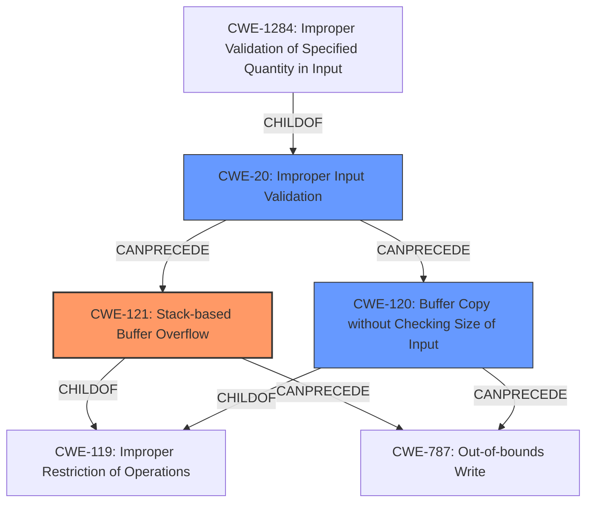

# Final Resolution for CVE-2022-36620

# Summary
| CWE ID | CWE Name | Confidence | CWE Abstraction Level | CWE Vulnerability Mapping Label | CWE-Vulnerability Mapping Notes |
|---|---|---|---|---|---|
| CWE-121 | Stack-based Buffer Overflow | 0.95 | Variant | Allowed | Primary CWE |
| CWE-120 | Buffer Copy without Checking Size of Input ('Classic Buffer Overflow') | 0.6 | Base | Allowed-with-Review | Secondary Candidate |
| CWE-1284 | Improper Validation of Specified Quantity in Input | 0.5 | Base | Allowed | Secondary Candidate |
| CWE-20 | Improper Input Validation | 0.3 | Class | Discouraged | Contributory factor; general weakness |

## Evidence and Confidence

*   **Confidence Score:** 0.9
*   **Evidence Strength:** HIGH

## Relationship Analysis
The primary relationship that impacted the decision was the parent-child relationship between CWE-119 (**Improper Restriction of Operations within the Bounds of a Memory Buffer**) and CWE-121 (**Stack-based Buffer Overflow**). Since the vulnerability description explicitly mentions a stack overflow, CWE-121 is the more specific and appropriate choice. CWE-120 (**Buffer Copy without Checking Size of Input**) is related as a more general form of buffer overflow, but lacks the stack-specific context. CWE-20 (**Improper Input Validation**) is a broader weakness that can contribute to various vulnerabilities, including buffer overflows, but it is not the direct cause in this case. The abstraction levels influenced the selection by favoring the Variant level (CWE-121) over the Class level (CWE-119) when the variant is clearly indicated in the vulnerability description.

## Vulnerability Chain
The vulnerability chain starts with **CWE-20 (Improper Input Validation)**, where the `netmask` parameter is not validated for its size. This leads to **CWE-121 (Stack-based Buffer Overflow)** when the oversized `netmask` content is copied into a stack buffer without any size checks. The final impact is a denial of service (router crash) and potentially arbitrary code execution.

## Summary of Analysis
The initial analysis is accurate and well-justified. The primary CWE mapping to **CWE-121 (Stack-based Buffer Overflow)** is correct based on the vulnerability description, which explicitly mentions a "stack buffer overflow." The consideration of alternative CWEs, such as **CWE-120 (Buffer Copy without Checking Size of Input)** and **CWE-1284 (Improper Validation of Specified Quantity in Input)**, demonstrates a good understanding of CWE classification nuances. The inclusion of **CWE-20 (Improper Input Validation)** as a contributory factor, as suggested in the criticism, further enhances the completeness of the analysis.

The graph relationships influenced the final selection by highlighting the parent-child relationship between **CWE-119 (Improper Restriction of Operations within the Bounds of a Memory Buffer)** and **CWE-121 (Stack-based Buffer Overflow)**, which reinforced the choice of the more specific CWE-121.

The selected CWEs are at the optimal level of specificity. **CWE-121 (Stack-based Buffer Overflow)** accurately represents the root cause of the vulnerability, while **CWE-20 (Improper Input Validation)** acknowledges the contributing factor of insufficient input validation.

The vulnerability description states that a "stack buffer overflow vulnerability exists in the `/goform/addRouting` endpoint. The `netmask` parameter's content is copied into a stack buffer without any size checks." This evidence strongly supports the classification of **CWE-121 (Stack-based Buffer Overflow)** as the primary weakness.