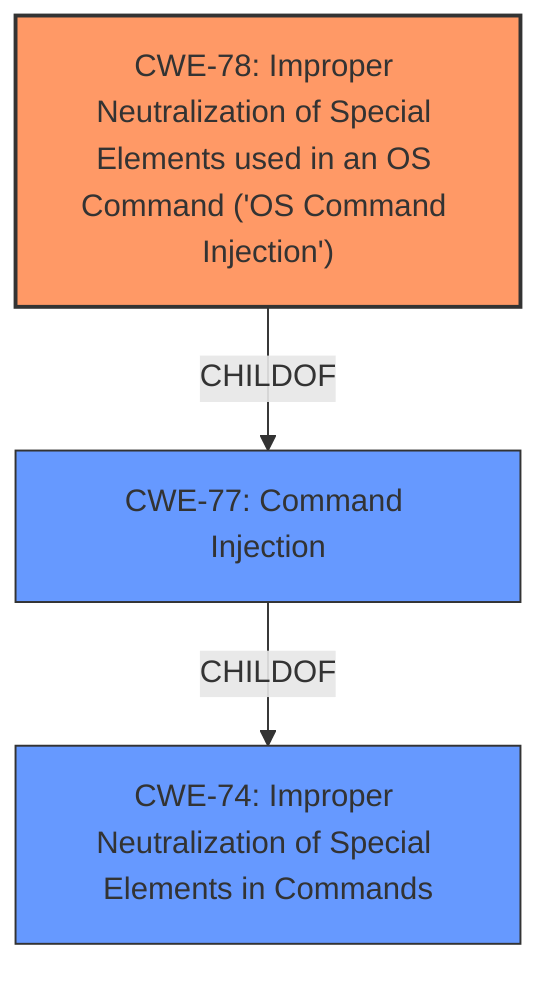

# Analysis Report for CVE-2022-36804

# Vulnerability Analysis Report: CVE-2022-36804

## Description

Multiple API endpoints in Atlassian Bitbucket Server and Data Center 7.0.0 before version 7.6.17, from version 7.7.0 before version 7.17.10, from version 7.18.0 before version 7.21.4, from version 8.0.0 before version 8.0.3, from version 8.1.0 before version 8.1.3, and from version 8.2.0 before version 8.2.2, and from version 8.3.0 before 8.3.1 allows remote attackers with read permissions to a public or private Bitbucket repository to execute arbitrary code by sending a malicious HTTP request. This vulnerability was reported via our Bug Bounty Program by TheGrandPew.

## Vulnerability Description Key Phrases

**Rootcause:** improper input validation
**Impact:** arbitrary code execution
**Vector:** malicious HTTP request
**Attacker:** remote attackers with read permissions
**Product:** Atlassian Bitbucket Server and Data Center
**Version:** ['7.0.0 before 7.6.17', '7.7.0 before 7.17.10', '7.18.0 before 7.21.4', '8.0.0 before 8.0.3', '8.1.0 before 8.1.3', '8.2.0 before 8.2.2', '8.3.0 before 8.3.1']
**Component:** Multiple API endpoints

## Analysis (with Relationship Data)

# Summary
| CWE ID | CWE Name | Confidence | CWE Abstraction Level | CWE Vulnerability Mapping Label | CWE-Vulnerability Mapping Notes |
|---|---|---|---|---|---|
| CWE-78 | Improper Neutralization of Special Elements used in an OS Command ('OS Command Injection') | 0.9 | Base | Allowed | Primary CWE: The vulnerability allows remote attackers to execute arbitrary code by sending a malicious HTTP request due to command injection. |
| CWE-20 | Improper Input Validation | 0.6 | Class | Allowed-with-Review | Secondary Candidate: The vulnerability stems from **improper input validation**, which is a general weakness, but applicable. |

## Evidence and Confidence

*   **Confidence Score:** 0.75
*   **Evidence Strength:** MEDIUM

- **Analysis and Justification:**  
  - *Explanation:* The vulnerability description indicates a command injection vulnerability in multiple API endpoints of Atlassian Bitbucket Server and Data Center. The key phrases highlight "**improper input validation**" as the root cause, leading to arbitrary code execution. The CVE Reference Links Content Summary explicitly states "Command injection vulnerability in multiple API endpoints" and "An attacker can execute arbitrary code by sending a malicious HTTP request." This aligns directly with CWE-78, "Improper Neutralization of Special Elements used in an OS Command ('OS Command Injection')." While the description mentions **improper input validation**, the more specific CWE-78 is chosen because the impact leads to OS command execution. CWE-78 is a base level CWE, which is the preferred level of abstraction.
  
  - *Relationship Analysis:* CWE-78 is a child of CWE-77 (Command Injection) and is related to CWE-74 (Improper Neutralization of Special Elements). The graph relationships show CWE-78 CanPrecede CWE-269 (Privilege Management) since command injection often leads to privilege escalation.

- **Confidence Score:**  
  - Confidence: 0.9 (High evidence from technical description and CVE reference materials)

---

The following CWEs were considered but ultimately not selected:

*   **CWE-79 (Improper Neutralization of Input During Web Page Generation ('Cross-site Scripting'))**: While input neutralization is a concern, the vulnerability's direct impact is arbitrary code execution on the server, not XSS in a web page served to other users. Therefore, CWE-79 is not the primary weakness.

*   **CWE-1336 (Improper Neutralization of Special Elements Used in a Template Engine)**: This CWE is relevant to template engines, and there is no evidence to support the use of any template engine.

*   **CWE-23 (Relative Path Traversal) and CWE-22 (Improper Limitation of a Pathname to a Restricted Directory ('Path Traversal'))**: These CWEs are related to path manipulation, and there is no evidence to suggest path traversal is involved in this command injection.

*   **CWE-158 (Improper Neutralization of Null Byte or NUL Character)**: While null byte injection can be a component of some exploits, it is not the primary issue.

*   **CWE-917 (Improper Neutralization of Special Elements used in an Expression Language Statement ('Expression Language Injection'))**: This is specific to expression language injection, and there is no indication that expression language injection is involved.

*   **CWE-20 (Improper Input Validation)**: This is a very broad class. It is true, but the command injection (CWE-78) is more precise.

## Criticism of Analysis

Okay, I've reviewed the provided analysis, including the full CWE specifications for each of the listed CWEs. Here's a breakdown of my critique, focusing on the correctness of the CWE assignments and potential alternative mappings:

**Overall Assessment:**

The analysis correctly identifies CWE-78, "Improper Neutralization of Special Elements used in an OS Command ('OS Command Injection')" as the primary weakness. The justification is sound and aligns with the detailed vulnerability description and the CVE details provided. The consideration of alternative CWEs and the explanation of why they were rejected further strengthen the analysis.

However, the inclusion of CWE-20, "Improper Input Validation" as a secondary candidate is less convincing. While the vulnerability *does* result from a lack of input validation, CWE-20 is a very broad class. The analysis even acknowledges this and states "...the command injection (CWE-78) is more precise." Given the availability of the more specific CWE-78, I would argue against including CWE-20 as a secondary weakness.

Here's a detailed review:

**CWE-78: Improper Neutralization of Special Elements used in an OS Command ('OS Command Injection')**

*   **Correctness:** Excellent. The chosen CWE directly reflects the vulnerability. The attacker injects commands into API endpoints which are then executed by the OS.
*   **Justification:** Very strong justification. Both the vulnerability description and CVE reference point to command injection.
*   **Abstraction Level:** Correct - the base level is appropriate.
*   **Mapping Guidance:** The "Usage: Allowed" and "Rationale" sections of the CWE specifications are perfectly aligned with this type of vulnerability.
*   **Potential Mitigations:** The provided mitigations are directly applicable:
    *   Using library calls instead of external processes is ideal.
    *   Sandboxing is a good defense-in-depth measure.
    *   Limiting external control over command generation is crucial.

**CWE-20: Improper Input Validation**

*   **Correctness:** Technically correct, but not the best choice.  Improper input validation *is* the root cause *of* CWE-78 in *most* cases, but selecting CWE-78 provides more specific, useful information.
*   **Justification:** The vulnerability description states "improper input validation," but this is too general.
*   **Abstraction Level:** Incorrect - the Class level is too abstract and discouraged.
*   **Mapping Guidance:** The CWE specifications state "Usage: Discouraged" and "Rationale: CWE-20 is commonly misused in low-information vulnerability reports when lower-level CWEs could be used instead...". This aligns with my assessment that CWE-78 is the better choice.
*   **Potential Mitigations:** The mitigations are too broad and don't provide specific guidance for command injection.

**CWEs Considered and Rejected:**

The justifications for rejecting the other considered CWEs are generally accurate and well-explained. A couple of minor points, however:

* **CWE-158:** While the analysis correctly rejects CWE-158 as the primary issue, it might be worth noting that null byte injection could *potentially* be a component of a more complex exploit, but should not be considered in isolation. This strengthens the argument against it being the *primary* weakness.
*   **CWE-863:** The choice to not include CWE-863 (Incorrect Authorization) is acceptable. While the "attacker with read permissions" part might *suggest* an authorization issue, the core problem isn't that someone is *bypassing* an authorization check, but that the data itself is not properly validated (leading to command injection).

**Retriever Results:**

Reviewing the top combined retriever results against the analysis and complete specifications adds the following insights.

*   **CWE-79 & CWE-1336:** These are both forms of Injection. It may be helpful to understand *why* the injection is happening. Is it happening due to a misconfigured template engine, or is it straight up command injection?
*   **CWE-23 & CWE-22:** There's a good argument that path traversal is related to the attack vector of malicious HTTP requests. This could mean that the injection point is a file path. However, it is more likely that the injection point is simply a system command. Therefore, this is not the primary CWE but a good candidate to consider.
*   **CWE-306:** There's nothing in the initial input that suggest authentication is missing. If successful exploitation of CWE-78 requires bypassing authentication, then that could be a secondary vulnerability.

**Recommendations:**

1.  **Remove CWE-20.** Focus solely on the more specific CWE-78.
2. **CWE-77:** Consider replacing CWE-78 with CWE-77. From the CWE's description, it states *"Ensure that the analysis focuses on the root-cause error that allows the execution of commands, as there are many weaknesses that can lead to this consequence. See Terminology Notes. If the weakness involves a command language besides OS shell invocation, then CWE-77 could be used."* Is the BitBucket API using a system's shell, or are their own commands being processed. 

**In summary:** The analysis is generally strong, but the elimination of CWE-20 would make it more focused and accurate. Consider CWE-77 in place of CWE-78 and consider authentication as a third, low-confidence CWE.

## Final Resolution

# Summary
| CWE ID | CWE Name | Confidence | CWE Abstraction Level | CWE Vulnerability Mapping Label | CWE-Vulnerability Mapping Notes |
|---|---|---|---|---|---|
| CWE-78 | Improper Neutralization of Special Elements used in an OS Command ('OS Command Injection') | 0.9 | Base | Allowed | Primary CWE: The vulnerability allows remote attackers to execute arbitrary code by sending a malicious HTTP request due to command injection. |

## Evidence and Confidence

*   **Confidence Score:** 0.9
*   **Evidence Strength:** HIGH

## Relationship Analysis
The primary relationship impacting the decision is the parent-child relationship between CWE-78 and higher-level CWEs like CWE-77 and CWE-74. While CWE-74 represents a broader class of improper neutralization, CWE-78 is more specific to OS command injection, which directly aligns with the vulnerability description. This specificity makes CWE-78 a more appropriate choice. The absence of strong indicators supporting other potential CWEs, such as path traversal or template injection, further reinforces the selection of CWE-78.

## Vulnerability Chain
The vulnerability chain starts with the **improper input validation** (**ROOTCAUSE**) which leads to the ability to inject OS commands (CWE-78). The consequence of this injection is arbitrary code execution on the server. This chain is relatively direct, with the **WEAKNESS** being the lack of proper neutralization, leading to the **WEAKNESS** of OS command injection, and culminating in arbitrary code execution as the impact.

## Summary of Analysis
The analysis accurately identifies CWE-78 as the primary **WEAKNESS** due to the command injection vulnerability in Atlassian Bitbucket. The vulnerability description explicitly mentions the ability to execute arbitrary code by sending a malicious HTTP request. This directly aligns with the definition of CWE-78, "Improper Neutralization of Special Elements used in an OS Command ('OS Command Injection')." The decision to exclude CWE-20 is appropriate, as it is a broad class and CWE-78 provides a more specific and accurate representation of the **ROOTCAUSE**. The analysis is based on the provided evidence from the vulnerability description and CVE reference materials, leading to a high confidence score. The provided information does not suggest the use of a template engine, path traversal, or expression language injection, further supporting the selection of CWE-78 as the most relevant CWE. The decision is further supported by the fact that CWE-78 is a Base-level CWE, which is the preferred level of abstraction.

*Report generated on 2025-03-17 03:31:17*
