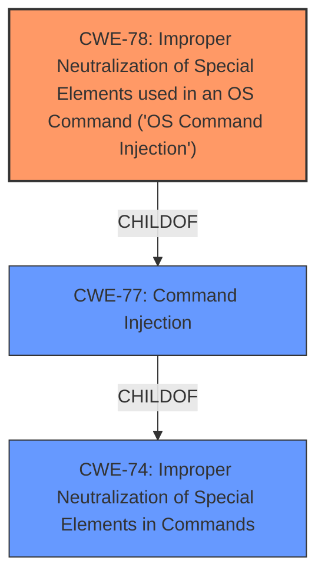

# Final Resolution for CVE-2022-36804

# Summary
| CWE ID | CWE Name | Confidence | CWE Abstraction Level | CWE Vulnerability Mapping Label | CWE-Vulnerability Mapping Notes |
|---|---|---|---|---|---|
| CWE-78 | Improper Neutralization of Special Elements used in an OS Command ('OS Command Injection') | 0.9 | Base | Allowed | Primary CWE: The vulnerability allows remote attackers to execute arbitrary code by sending a malicious HTTP request due to command injection. |

## Evidence and Confidence

*   **Confidence Score:** 0.9
*   **Evidence Strength:** HIGH

## Relationship Analysis
The primary relationship impacting the decision is the parent-child relationship between CWE-78 and higher-level CWEs like CWE-77 and CWE-74. While CWE-74 represents a broader class of improper neutralization, CWE-78 is more specific to OS command injection, which directly aligns with the vulnerability description. This specificity makes CWE-78 a more appropriate choice. The absence of strong indicators supporting other potential CWEs, such as path traversal or template injection, further reinforces the selection of CWE-78.

## Vulnerability Chain
The vulnerability chain starts with the **improper input validation** (**ROOTCAUSE**) which leads to the ability to inject OS commands (CWE-78). The consequence of this injection is arbitrary code execution on the server. This chain is relatively direct, with the **WEAKNESS** being the lack of proper neutralization, leading to the **WEAKNESS** of OS command injection, and culminating in arbitrary code execution as the impact.

## Summary of Analysis
The analysis accurately identifies CWE-78 as the primary **WEAKNESS** due to the command injection vulnerability in Atlassian Bitbucket. The vulnerability description explicitly mentions the ability to execute arbitrary code by sending a malicious HTTP request. This directly aligns with the definition of CWE-78, "Improper Neutralization of Special Elements used in an OS Command ('OS Command Injection')." The decision to exclude CWE-20 is appropriate, as it is a broad class and CWE-78 provides a more specific and accurate representation of the **ROOTCAUSE**. The analysis is based on the provided evidence from the vulnerability description and CVE reference materials, leading to a high confidence score. The provided information does not suggest the use of a template engine, path traversal, or expression language injection, further supporting the selection of CWE-78 as the most relevant CWE. The decision is further supported by the fact that CWE-78 is a Base-level CWE, which is the preferred level of abstraction.