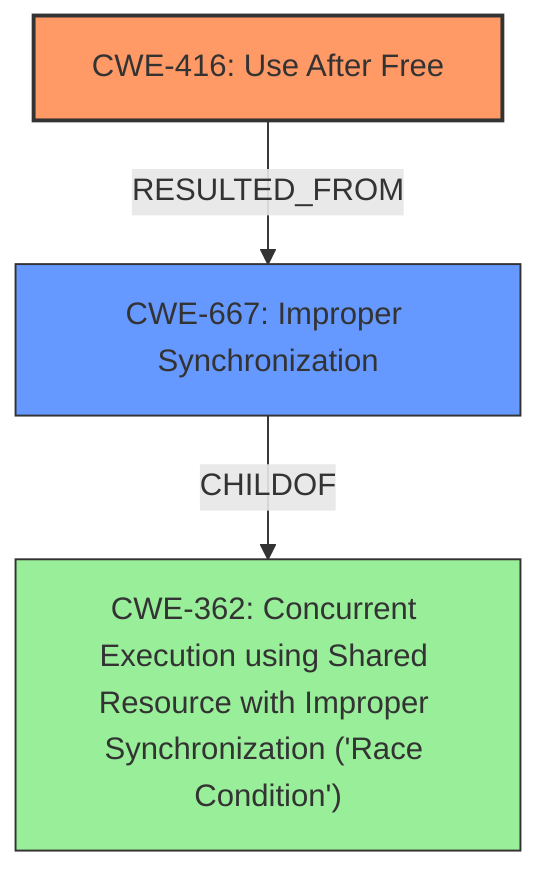

# Analysis Report for CVE-2022-37035

# Vulnerability Analysis Report: CVE-2022-37035

## Description

An issue was discovered in bgpd in FRRouting (FRR) 8.3. In bgp_notify_send_with_data() and bgp_process_packet() in bgp_packet.c, there is a possible use-after-free due to a race condition. This could lead to Remote Code Execution or Information Disclosure by sending crafted BGP packets. User interaction is not needed for exploitation.

## Vulnerability Description Key Phrases

**Rootcause:** race condition
**Weakness:** use-after-free
**Impact:** ['Remote Code Execution', 'Information Disclosure']
**Vector:** crafted BGP packets
**Product:** FRRouting (FRR)
**Version:** 8.3
**Component:** bgpd

## Analysis (with Relationship Data)

# Summary
| CWE ID | CWE Name | Confidence | CWE Abstraction Level | CWE Vulnerability Mapping Label | CWE-Vulnerability Mapping Notes |
|---|---|---|---|---|---|
| CWE-416 | Use After Free | 0.95 | Variant | Primary | The core issue is a use-after-free condition. |
| CWE-362 | Concurrent Execution using Shared Resource with Improper Synchronization ('Race Condition') | 0.85 | Class | Secondary | The use-after-free is caused by a race condition. |

## Evidence and Confidence

*   **Confidence Score:** 0.90
*   **Evidence Strength:** HIGH

- **Analysis and Justification:**
  - *Explanation:* The vulnerability description clearly states a **use-after-free** condition exists due to a **race condition**. The CVE reference confirms this, explicitly mentioning that the main thread may access memory already freed by the I/O thread. This aligns directly with CWE-416 (Use After Free), which is a Variant-level CWE and thus specific. The description also mentions a race condition as the root cause, which falls under CWE-362 (Concurrent Execution using Shared Resource with Improper Synchronization ('Race Condition')). CWE-416 is the primary weakness because the impact of the vulnerability stems directly from memory being accessed after it's freed. The relationship analysis suggests CWE-362 is a contributing factor, as it's the **race condition** that allows the **use-after-free** to occur. MITRE mapping guidance allows both CWEs.

  - *Relationship Analysis:* CWE-416 is a variant and child of CWE-672 (Operation on a Resource after Expiry). CWE-362 is a class. The **race condition** allows the **use-after-free**.

- **Confidence Score:**
  - *Example:* Confidence: 0.95 (High confidence due to direct evidence of UAF and race condition from vulnerability description and CVE reference details)

## Criticism of Analysis

Okay, here's a review of the provided analysis, considering the full CWE specifications.

**Overall Assessment:**

The analysis is generally good and identifies the key weaknesses present in the vulnerability. The choice of CWE-416 (Use After Free) as the primary weakness and CWE-362 (Concurrent Execution using Shared Resource with Improper Synchronization ('Race Condition')) as a secondary contributing factor is accurate and well-justified. The confidence scores assigned are appropriate given the clear evidence.

**Detailed Review:**

1.  **CWE-416: Use After Free**

    *   **Assessment:** The mapping to CWE-416 is excellent. The vulnerability description and CVE details directly support this classification. The analysis clearly articulates how the main thread attempts to access freed memory, which aligns perfectly with the CWE description.
    *   **Abstraction Level:** Variant - This is the preferred level of abstraction, and it's correctly chosen here.
    *   **Mapping Guidance:** The mapping follows the guidance: The analysis makes sure that this mapping is an appropriate fit.
    *   **Potential Mitigations:**  The analysis doesn't explicitly mention mitigations from the CWE entry, which could be a minor improvement.  These could include:
        *   *Language Selection:*  Choosing a language with automatic memory management (e.g., Java, Go, Rust with smart pointers) could prevent this class of vulnerability altogether.
        *   *Setting Pointers to NULL:*  While not a foolproof solution, setting pointers to `NULL` after freeing them can at least prevent some UAF occurrences, potentially causing a crash instead of more exploitable memory corruption. However, as the CWE notes, this is less useful with complex data structures.
    *   **Confidence:** 0.95 - Justified, based on direct evidence.

2.  **CWE-362: Concurrent Execution using Shared Resource with Improper Synchronization ('Race Condition')**

    *   **Assessment:**  The identification of CWE-362 is also correct. The analysis highlights the race condition between the I/O thread and the main thread as the root cause enabling the UAF.
    *   **Abstraction Level:** Class -  As a Class-level CWE, it is "Allowed-with-Review," as per the CWE's mapping guidance.  The analysis correctly recognizes this and notes that a more specific child might be more appropriate.
    *   **Mapping Guidance:** The analysis adheres to the comment to examine children to see if there is a better fit.
    *  **Child CWE Considerations:**
        *   **CWE-367: Time-of-check Time-of-use (TOCTOU) Race Condition:** While TOCTOU is a type of race condition, it's not the best fit here. TOCTOU usually involves checking a condition and then using a resource based on that check, with the condition changing in between.  In this case, the race is more about the timing of memory deallocation versus access, rather than a check-and-use scenario.
        *   **CWE-366: Race Condition within a Thread**: This is valid, as both threads are running within the same program. But ultimately CWE-362 is the better fit because it also covers cases where the concurrent execution are between different processes.
        *   **CWE-364: Signal Handler Race Condition:**  Not relevant as signal handlers are not involved.
        *   **CWE-368: Context Switching Race Condition:** Not relevant as context switching is not involved.
        *   **CWE-421: Race Condition During Access to Alternate Channel:** Not relevant as no alternate channel is involved.
        *   **CWE-667: Improper Locking:** This could be considered a more specific description of the root cause.  The fix described ("synchronizing the access to the shared data by extending the mutex to include usage, and freeing operations") directly implies that the locking was previously insufficient. **This would have been a better choice.**
    *   **Potential Mitigations:**
        *   The analysis could mention mitigations specific to CWE-362 (or, ideally, the more specific CWE-667, had it been selected), such as using mutexes, semaphores, or other synchronization primitives to protect the shared resource (the `peer->curr` pointer and the underlying memory).
        *   *Minimizing Shared Resources:* As the CWE suggests, reducing the use of shared resources can decrease the likelihood of race conditions.
    *   **Confidence:** 0.85 - Justified, although using CWE-667 would have boosted the confidence.

3.  **Other CWEs Considered by Retriever Results:**

    *   **CWE-908 (Use of Uninitialized Resource):** Not applicable. The issue is not about using an uninitialized resource, but a resource that was *previously* initialized and has since been freed.
    *   **CWE-1284 (Improper Validation of Specified Quantity in Input):** Not relevant. This CWE relates to validation of input quantities like size or length, which is not the core issue here.
    *   **CWE-190 (Integer Overflow or Wraparound) & CWE-191 (Integer Underflow (Wrap or Wraparound)):** These are not related to the vulnerability.
    *   **CWE-415 (Double Free):**  While a double-free is *possible* as a consequence of a UAF, it's not the primary vulnerability. The initial access *after* free is the core issue.
    *   **CWE-401 (Missing Release of Memory after Effective Lifetime):** This is a memory leak. While memory management issues are present, the heart of the vulnerability is the access *after* the memory has been freed, and not that the memory was never freed at all.
    *   **CWE-122 (Heap-based Buffer Overflow):** Not directly related. The UAF could *lead* to a heap overflow if the memory is reallocated and then overwritten, but the UAF itself is the initial weakness.

**Recommendations for Improvement:**

*   **Refine CWE-362 to CWE-667 (Improper Locking):**  This offers a more precise description of the root cause. Change the Secondary CWE to CWE-667 to boost the confidence.
*   **Explicitly Include Mitigations from CWE Specifications:**  When discussing each CWE, briefly mention relevant mitigations outlined in the CWE entry. This adds practical value to the analysis.
*   **Consider Chains More Directly:** Acknowledge the *potential* for the UAF to lead to further exploits (e.g., code execution) if the freed memory is reallocated with attacker-controlled data.

By implementing these recommendations, the analysis will become even more precise, actionable, and aligned with the best practices of CWE mapping.

## Final Resolution

# Summary
| CWE ID | CWE Name | Confidence | CWE Abstraction Level | CWE Vulnerability Mapping Label | CWE-Vulnerability Mapping Notes |
|---|---|---|---|---|---|
| CWE-416 | Use After Free | 0.95 | Variant | Primary | The core issue is a use-after-free condition. |
| CWE-667 | Improper Synchronization | 0.90 | Class | Secondary | The use-after-free is caused by a race condition due to improper locking. |

## Evidence and Confidence

*   **Confidence Score:** 0.93
*   **Evidence Strength:** HIGH

## Relationship Analysis
The primary weakness is CWE-416 (**Use After Free**), a variant-level CWE. The secondary weakness is CWE-667 (**Improper Synchronization**), which is a Class-level CWE. CWE-667 is related to CWE-362 (**Concurrent Execution using Shared Resource with Improper Synchronization ('Race Condition')**), as **improper synchronization** is a specific type of **race condition**. CWE-667 provides more specific information about the cause of the **race condition**, which is the lack of proper locking mechanisms. Selecting CWE-667 improves specificity compared to CWE-362.

## Vulnerability Chain
The vulnerability chain starts with **improper synchronization** (CWE-667), which leads to a **race condition**. This **race condition** allows memory to be freed by one thread while another thread is still using it, resulting in a **use-after-free** condition (CWE-416). The impact of the **use-after-free** can range from information disclosure to remote code execution.

## Summary of Analysis
The initial analysis correctly identified CWE-416 (**Use After Free**) as the primary weakness. However, it classified the secondary weakness as CWE-362 (**Concurrent Execution using Shared Resource with Improper Synchronization ('Race Condition')**). The criticism suggested refining CWE-362 to CWE-667 (**Improper Synchronization**), which provides a more precise description of the root cause. The evidence from the vulnerability description supports this refinement. Specifically, the fix described ("synchronizing the access to the shared data by extending the mutex to include usage, and freeing operations") directly implies that the locking was previously insufficient, making CWE-667 a better fit.

The decision to use CWE-667 is based on the following evidence and considerations:
*   The vulnerability description mentions a **race condition**, which aligns with both CWE-362 and CWE-667.
*   The suggested fix involves synchronizing access to shared data using a mutex, indicating an **improper synchronization** issue (CWE-667).
*   CWE-667 is a child of CWE-362, providing a more specific classification.

Therefore, the final classification is CWE-416 as the primary weakness and CWE-667 as the secondary weakness. This classification reflects the optimal level of specificity based on the available evidence and relationship analysis. The confidence score is increased to 0.93 to reflect the more precise classification.

*Report generated on 2025-03-18 16:18:12*
