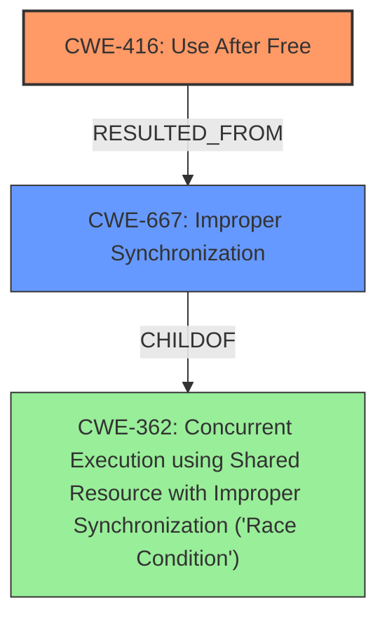

# Final Resolution for CVE-2022-37035

# Summary
| CWE ID | CWE Name | Confidence | CWE Abstraction Level | CWE Vulnerability Mapping Label | CWE-Vulnerability Mapping Notes |
|---|---|---|---|---|---|
| CWE-416 | Use After Free | 0.95 | Variant | Primary | The core issue is a use-after-free condition. |
| CWE-667 | Improper Synchronization | 0.90 | Class | Secondary | The use-after-free is caused by a race condition due to improper locking. |

## Evidence and Confidence

*   **Confidence Score:** 0.93
*   **Evidence Strength:** HIGH

## Relationship Analysis
The primary weakness is CWE-416 (**Use After Free**), a variant-level CWE. The secondary weakness is CWE-667 (**Improper Synchronization**), which is a Class-level CWE. CWE-667 is related to CWE-362 (**Concurrent Execution using Shared Resource with Improper Synchronization ('Race Condition')**), as **improper synchronization** is a specific type of **race condition**. CWE-667 provides more specific information about the cause of the **race condition**, which is the lack of proper locking mechanisms. Selecting CWE-667 improves specificity compared to CWE-362.

## Vulnerability Chain
The vulnerability chain starts with **improper synchronization** (CWE-667), which leads to a **race condition**. This **race condition** allows memory to be freed by one thread while another thread is still using it, resulting in a **use-after-free** condition (CWE-416). The impact of the **use-after-free** can range from information disclosure to remote code execution.

## Summary of Analysis
The initial analysis correctly identified CWE-416 (**Use After Free**) as the primary weakness. However, it classified the secondary weakness as CWE-362 (**Concurrent Execution using Shared Resource with Improper Synchronization ('Race Condition')**). The criticism suggested refining CWE-362 to CWE-667 (**Improper Synchronization**), which provides a more precise description of the root cause. The evidence from the vulnerability description supports this refinement. Specifically, the fix described ("synchronizing the access to the shared data by extending the mutex to include usage, and freeing operations") directly implies that the locking was previously insufficient, making CWE-667 a better fit.

The decision to use CWE-667 is based on the following evidence and considerations:
*   The vulnerability description mentions a **race condition**, which aligns with both CWE-362 and CWE-667.
*   The suggested fix involves synchronizing access to shared data using a mutex, indicating an **improper synchronization** issue (CWE-667).
*   CWE-667 is a child of CWE-362, providing a more specific classification.

Therefore, the final classification is CWE-416 as the primary weakness and CWE-667 as the secondary weakness. This classification reflects the optimal level of specificity based on the available evidence and relationship analysis. The confidence score is increased to 0.93 to reflect the more precise classification.