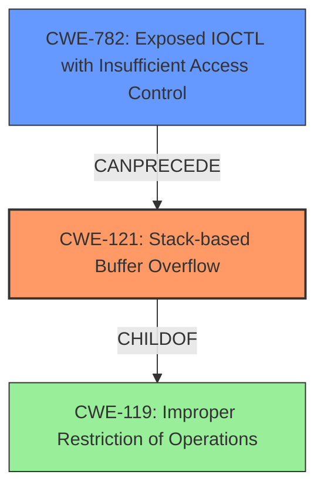

# Analysis Report for CVE-2022-37415

# Vulnerability Analysis Report: CVE-2022-37415

## Description

The Uniwill SparkIO.sys driver 1.0 is vulnerable to a stack-based buffer overflow via IOCTL 0x40002008.

## Vulnerability Description Key Phrases

**Weakness:** stack-based buffer overflow
**Product:** Uniwill SparkIO.sys driver
**Version:** 1.0
**Component:** IOCTL 0x40002008

## Analysis (with Relationship Data)

# Summary
| CWE ID | CWE Name | Confidence | CWE Abstraction Level | CWE Vulnerability Mapping Label | CWE-Vulnerability Mapping Notes |
|---|---|---|---|---|---|
| CWE-121 | Stack-based Buffer Overflow | 1.0 | Variant | Allowed | Primary CWE |

## Evidence and Confidence

*   **Confidence Score:** 1.0
*   **Evidence Strength:** HIGH

- **Analysis and Justification:**  
  - *Explanation:* The vulnerability description explicitly states a "**stack-based buffer overflow**" via IOCTL 0x40002008 in the Uniwill SparkIO.sys driver 1.0. The CVE Reference Links Content Summary reinforces this by stating, "The driver has a **stack-based buffer overflow** vulnerability in the IOCTL handler for 0x40002008." It also details the impact: "By overflowing the buffer, an attacker can overwrite the return address on the stack, potentially gaining control of the execution flow." This aligns directly with CWE-121, which is a Variant-level CWE specifically for stack-based buffer overflows. The Usage is ALLOWED, making it an appropriate mapping.

  - *Relationship Analysis:* CWE-121 is a variant of CWE-119 (Improper Restriction of Operations within the Bounds of a Memory Buffer). While CWE-119 is a broader class, the description clearly indicates a **stack-based** overflow, making CWE-121 a more precise and suitable classification. There are no other relationships to consider.

- **Confidence Score:**  
  - Confidence: 1.0 (Explicit mention of "stack-based buffer overflow" in both the vulnerability description and CVE details.)

## Criticism of Analysis

Okay, here's a detailed review of the provided analysis, considering the full CWE specifications:

**Overall Assessment:**

The analysis is generally strong and well-justified. The selection of CWE-121 (Stack-based Buffer Overflow) as the primary CWE is accurate and appropriate, given the explicit mention of the vulnerability type in both the vulnerability description and the CVE reference. The confidence score of 1.0 is also justified. The explanations are thorough.

**Detailed Review and Critique:**

*   **CWE-121 (Stack-based Buffer Overflow) as Primary CWE:**

    *   **Correctness:** The choice of CWE-121 is correct. The vulnerability descriptions clearly point to a stack-based buffer overflow.
    *   **Abstraction Level:** CWE-121 is a "Variant" level CWE, which is the preferred level of abstraction for vulnerability mapping.
    *   **Mapping Guidance:** The analysis correctly notes that CWE-121's Mapping Guidance states "Usage: Allowed" and emphasizes carefully reading the name and description to ensure it's an appropriate fit. This guidance has been followed.
    *   **Mitigations:** The analysis does not need to list mitigations from the CWE, but it would be ok to add that the mitigations include compiler-based protections (like /GS), using safer APIs, and input validation.

*   **Top Combined Results Analysis** (From Retriever Results):

    *   **CWE-193 (Off-by-one Error):**  While an off-by-one error could *lead* to a buffer overflow, it's not the primary cause here.  The description doesn't suggest an off-by-one, but rather a complete lack of size checking.  Therefore, excluding this is correct.
    *   **CWE-190 (Integer Overflow or Wraparound):** Integer overflows can sometimes *lead* to buffer overflows if they're used in calculating buffer sizes. However, there's no indication of that in the vulnerability description. Excluding this is appropriate.
    *   **CWE-120 (Buffer Copy without Checking Size of Input ('Classic Buffer Overflow')):** This is a close contender. CWE-120 is for copies *without* size checking, whereas CWE-121 specifies that this occurs on the stack. **CWE-121 is more precise**. Since the description *does* specify "stack-based," choosing CWE-121 is more accurate. However, it's important to acknowledge that if the "stack-based" aspect were *not* present, CWE-120 would be a reasonable alternative.
    *   **CWE-125 (Out-of-bounds Read):** This is incorrect as the vulnerability is related to writing, not reading, out of bounds.
    *   **CWE-782 (Exposed IOCTL with Insufficient Access Control):**  This is potentially relevant, as the vulnerability occurs via an IOCTL. However, it's a secondary issue. The *primary* problem is the stack-based buffer overflow within the IOCTL handler.  This could be considered as a chained weakness. If the IOCTL were not exposed, there would not be a buffer overflow. It is not necessary, but ok to add that because of the exposed IOCTL, there was a lack of validation, leading to the overflow.
    *   **CWE-131 (Incorrect Calculation of Buffer Size):** Similar to CWE-190, this *could* lead to a buffer overflow, but it's not explicitly stated in the description. Choosing CWE-121 as primary is still correct because the primary issue is writing beyond the bounds of the buffer on the stack.
    *   **CWE-122 (Heap-based Buffer Overflow):** Clearly incorrect, as the vulnerability is specifically stated to be stack-based.
    *   **CWE-126 (Buffer Over-read):** Incorrect, as this is a write, not a read, out of bounds.
    *   **CWE-674 (Uncontrolled Recursion):**  Completely unrelated to the vulnerability.

*   **Relationship Analysis:**
    *   The analysis correctly identifies CWE-121 as a child of CWE-119 (Improper Restriction of Operations within the Bounds of a Memory Buffer). This is accurate because CWE-121 is a *specific type* of buffer overflow.
    *   The analysis could mention CWE-787 (Out-of-bounds Write), as this is a parent of CWE-121. This connection is implicit, but it doesn't hurt to mention this.

*   **CWE Examples from Database:**
    *   The examples provided are for CWE-119, which is too broad. More relevant examples would be for CWE-121 or, lacking that, CWE-787.

*   **Mitigations:**
    *   The Analysis correctly identified the weakness is a stack-based buffer overflow. Therefore, some potential mitigations are:
        *   Using compiler-based protections, such as stack canaries (/GS flag in Visual Studio).
        *   Using safer string handling functions that perform bounds checking.
        *   Implementing proper input validation to ensure that the input size does not exceed the buffer's capacity.
        *   Using languages with automatic memory management.
        *   Address Space Layout Randomization (ASLR).

**Suggestions for Improvement:**

1.  **Chained Weakness Consideration:** While CWE-121 is the most direct mapping, consider briefly acknowledging CWE-782 (Exposed IOCTL with Insufficient Access Control) as a potential contributing factor or chained weakness. Explain that the *exposed* IOCTL, combined with the *lack of validation* within the handler, makes the overflow exploitable. The existence of the IOCTL is a necessary, but not sufficient, condition.
2.  **Broader Context:** While the analysis is focused on CWE-121, briefly mentioning the broader class of memory safety issues (and possibly CWE-119) could be helpful to provide context for readers who are less familiar with CWE. However, the current analysis correctly prioritizes the most specific and accurate CWE.
3.  **More Specific Examples:** Provide CVE examples that are more directly related to CWE-121, and failing that, CWE-787.
4.  **Complete Coverage of Mitigations**: Mention language selection, safer libraries, or compiler features that provide stack protection.

**Revised Summary Table:**

| CWE ID  | CWE Name                         | Confidence | CWE Abstraction Level | CWE Vulnerability Mapping Label | CWE-Vulnerability Mapping Notes                                                                                                 |
| :------ | :--------------------------------- | :--------- | :-------------------- | :------------------------------ | :------------------------------------------------------------------------------------------------------------------------------ |
| CWE-121 | Stack-based Buffer Overflow      | 1.0        | Variant               | Allowed                         | Primary CWE. Occurs within an IOCTL handler.                                                                                   |
| CWE-782 | Exposed IOCTL with Insufficient Access Control | 0.6       | Variant                | Allowed                        | Contributing factor.  The exposed IOCTL allowed the overflow to be triggered.  Insufficient access control of the IOCTL exacerbates the vulnerability.  |

**Conclusion:**

The analysis is very good. The core assessment is accurate and well-explained. The suggestions above are primarily for adding context and completeness.

## Final Resolution

# Summary
| CWE ID | CWE Name | Confidence | CWE Abstraction Level | CWE Vulnerability Mapping Label | CWE-Vulnerability Mapping Notes |
|---|---|---|---|---|---|
| CWE-121 | Stack-based Buffer Overflow | 1.0 | Variant | Allowed | Primary CWE |
| CWE-782 | Exposed IOCTL with Insufficient Access Control | 0.6 | Variant | Allowed | Secondary Candidate. The exposed IOCTL allowed the overflow to be triggered. Insufficient access control of the IOCTL exacerbates the vulnerability. |

## Evidence and Confidence

*   **Confidence Score:** 0.9
*   **Evidence Strength:** HIGH

## Relationship Analysis
The primary CWE is CWE-121 (**Stack-based Buffer Overflow**), which is a variant of CWE-119 (**Improper Restriction of Operations within the Bounds of a Memory Buffer**). This parent-child relationship indicates that CWE-121 is a more specific case of the general buffer overflow issue described by CWE-119. The secondary CWE is CWE-782 (**Exposed IOCTL with Insufficient Access Control**), which is a weakness that can precede CWE-121 in a vulnerability chain. The IOCTL exposure, combined with a lack of validation, allows for the stack-based overflow to be triggered.



## Vulnerability Chain
The vulnerability chain starts with CWE-782 (**Exposed IOCTL with Insufficient Access Control**). The exposed IOCTL handler lacks proper access control, which allows an attacker to call it. Within the IOCTL handler, there is a **lack of input validation**, leading to CWE-121 (**Stack-based Buffer Overflow**). This overflow allows an attacker to overwrite the return address on the stack, potentially gaining control of the execution flow. The root cause is the combination of the exposed IOCTL and the missing input validation within its handler, leading to the stack-based buffer overflow and ultimately arbitrary code execution.

## Summary of Analysis
The initial analysis and criticism both agree that CWE-121 (**Stack-based Buffer Overflow**) is the most appropriate primary CWE due to the explicit mention of "stack-based buffer overflow" in the vulnerability description and CVE details. The analysis is strongly based on the provided evidence.
```
The vulnerability description explicitly states a "stack-based buffer overflow" via IOCTL 0x40002008 in the Uniwill SparkIO.sys driver 1.0. The CVE Reference Links Content Summary reinforces this by stating, "The driver has a stack-based buffer overflow vulnerability in the IOCTL handler for 0x40002008."
```

The graph relationships influenced the selection of CWE-782 (**Exposed IOCTL with Insufficient Access Control**) as a secondary CWE because it highlights how the vulnerability is triggered. The exposed IOCTL allows for a malicious actor to call the vulnerable code. Without it, the overflow would not be exploitable.

The selected CWEs are at the optimal level of specificity because CWE-121 is a variant-level CWE that accurately describes the type of buffer overflow, and CWE-782 clarifies the context in which it occurs.


*Report generated on 2025-03-18 16:19:50*
