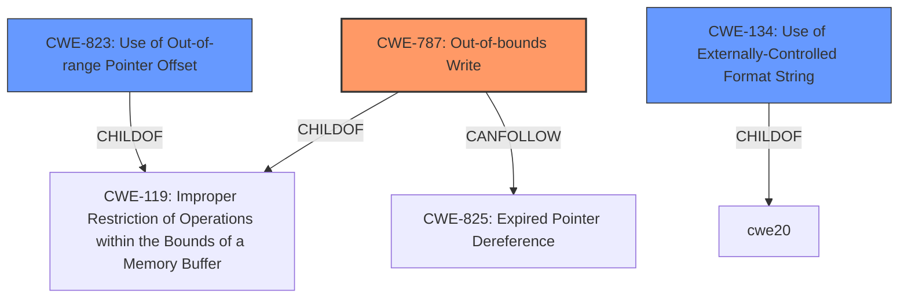

# Analysis Report for CVE-2022-37937

# Vulnerability Analysis Report: CVE-2022-37937

## Description

Pre-auth memory corruption in HPE Serviceguard

## Vulnerability Description Key Phrases

**Weakness:** Pre-auth memory corruption
**Product:** HPE Serviceguard

## Analysis (with Relationship Data)

# Summary
| CWE ID | CWE Name | Confidence | CWE Abstraction Level | CWE Vulnerability Mapping Label | CWE-Vulnerability Mapping Notes |
|---|---|---|---|---|---|
| CWE-787 | Out-of-bounds Write | 0.8 | Base | Primary | Allowed |

## Evidence and Confidence

*   **Confidence Score:** 0.8
*   **Evidence Strength:** LOW

- **Analysis and Justification:**  
  - *Explanation:* "The vulnerability description indicates **Pre-auth memory corruption** in HPE Serviceguard. Based on the description, the most likely root cause is an out-of-bounds write (CWE-787). This is because memory corruption often stems from writing data outside the intended buffer boundaries. The provided information is limited, making it difficult to pinpoint the exact root cause with complete certainty. The retriever results also suggest CWE-787 as the top candidate, further supporting this classification. Without additional context, a more specific CWE cannot be determined."
  
  - *Relationship Analysis:* "CWE-787 is a base-level weakness, which is appropriate given the limited information. It is a child of CWE-119 (Improper Restriction of Operations within the Bounds of a Memory Buffer), indicating a broader class of memory safety issues. CWE-787 can precede several other weaknesses, like CWE-825 (Expired Pointer Dereference) and CWE-824 (Access of a Memory Location After the End of the Intended Buffer), suggesting potential follow-on vulnerabilities if the out-of-bounds write is exploited."

- **Confidence Score:**  
  - *Example:* Confidence: 0.8 (Due to limited information, while CWE-787 is the most likely, there's still some uncertainty)

---

## Criticism of Analysis

Okay, here's a detailed review of the provided analysis, considering the full CWE specifications:

**Overall Assessment:**

The analysis correctly identifies CWE-787 (Out-of-bounds Write) as a plausible primary weakness given the limited information. The confidence level of 0.8 is reasonable, reflecting the uncertainty due to the lack of specific details. The justification provided is logical and takes into account both the vulnerability description and the retriever results.  However, some improvements can be made to strengthen the justification and explore potential alternative or contributing factors.  The use of CWE examples is limited and doesn't sufficiently explore alternative mappings.

**Detailed Critique:**

1.  **CWE-787 Justification:**

    *   **Strengths:** The reasoning for selecting CWE-787 is sound. Memory corruption often *does* stem from out-of-bounds writes. The justification highlights that writing outside buffer boundaries is a common cause of memory corruption.
    *   **Weaknesses:**

        *   **Specificity:**  While CWE-787 is a good starting point, the analysis could benefit from considering *how* the out-of-bounds write might occur in a pre-authentication context.  What kind of data is being processed pre-auth that could lead to this? Is it related to parsing a network protocol, handling malformed data, or something else?  Without that context, it's difficult to be more precise.
        *   **Assumptions:**  The analysis implicitly assumes a buffer overflow due to a lack of bounds checking or incorrect size calculations. However, *pre-authentication* memory corruption could also arise from other issues.  For example, a format string vulnerability (CWE-134) can cause memory corruption, and these often occur pre-auth because the code is parsing initial connection messages. Similarly, integer overflows (CWE-190) in calculating buffer sizes or offsets can lead to out-of-bounds writes.
        *   **Mitigations:** The analysis does not fully utilize the provided mitigation strategies.  The mitigation sections offer suggestions to inform alternative CWE assignments.

2.  **Retriever Results Analysis:**

    *   **Strengths:** The analysis mentions the retriever results, which is good.
    *   **Weaknesses:**  The analysis mainly focuses on the top result, CWE-787.  It should also discuss why the *other* highly-ranked CWEs are less likely or potentially related.  Ignoring the other retriever results reduces the robustness of the analysis. For example:
        *   **CWE-823 (Use of Out-of-range Pointer Offset):** This is a strong contender and should be further investigated.  Pre-authentication code might use pointer arithmetic based on data received from the client. If the client can manipulate this data, they can potentially cause an out-of-range offset. This is similar to CWE-787, but describes a different mechanism for memory corruption.
        *   **CWE-416 (Use After Free) & CWE-415 (Double Free):** These are less likely in a *direct* pre-authentication attack but could be *indirectly* related. For example, the pre-authentication code might have a use-after-free or double-free vulnerability that, while not directly exploitable without authentication, can be triggered by crafted network packets, causing a denial-of-service or potentially leading to a more severe vulnerability down the line.
        *   **CWE-822 (Untrusted Pointer Dereference):** Again, this is less direct, but the pre-authentication code might use a pointer provided by the untrusted client *without validation.*
        *   **CWE-476 (NULL Pointer Dereference):** While not directly memory *corruption* in the same way as CWE-787, a NULL pointer dereference is a form of memory access violation that could lead to a crash, and it's worth considering how a client might trigger this pre-auth.
    *   **Mapping Guidance:** The mapping guidance for CWE-119 (Improper Restriction of Operations within the Bounds of a Memory Buffer) explicitly *discourages* its use in favor of more specific CWEs like CWE-787 or CWE-125. This specification needs to be followed.

3.  **CWE Examples from Database:**

    *   **Usefulness:** The provided examples are useful but limited. They primarily focus on illustrating what various CWEs look like.  To improve the analysis, consider finding CVE examples *specifically related to pre-authentication memory corruption*. This would provide more concrete evidence to support or refute the selected CWE.
    *   **Alternative mappings:** The tool should explore whether the supplied weakness aligns more closely with access of uninitialized memory (CWE-824)

4.  **Relationships:**

    *   The analysis mentions parent-child relationships, but it doesn't adequately explore *chains* of vulnerabilities. A pre-authentication vulnerability might not be *directly* exploitable as code execution. Instead, it could lead to memory corruption that's exploited later *after* authentication, or it could be used for a denial-of-service attack. This chaining aspect should be explored.

5.  **Mitigation:**

    *   The analysis should be explicit about how the suggested mitigations for CWE-787 apply to the *pre-authentication* context. For example, suggesting the use of safer string-handling functions is relevant, but it should be framed in terms of how they can be used when parsing network packets or other pre-auth data.

**Recommendations for Improvement:**

1.  **More Precise Vulnerability Description:** Given that the original description is high level, try to hypothesize the underlying cause using the CWE information. A good approach is to ask "How could the attacker influence the memory corruption before authentication?" Is there parsing of protocol headers, handling of certificates, processing of cryptographic keys, or other pre-authentication operations that could be vulnerable?

2.  **Explore Alternative CWEs More Thoroughly:** Don't just dismiss the other top retriever results. Explain *why* they are less likely *or* how they might be related as contributing factors or follow-on consequences.

3.  **Provide More Concrete Examples:** Search for CVEs related to pre-authentication memory corruption in similar network services or protocols. Analyze those CVEs to see what the root causes were.

4.  **Consider Chains of Weaknesses:** Acknowledge that the pre-authentication memory corruption might not be directly exploitable for code execution but could be part of a longer exploit chain.

5.  **Apply Mitigations in Context:** Frame the mitigation strategies in terms of the specific pre-authentication context.

**Revised Summary Table (Illustrative):**

| CWE ID  | CWE Name                        | Confidence | CWE Abstraction Level | CWE Vulnerability Mapping Label | CWE-Vulnerability Mapping Notes                                                                                                                                                                                                                                                                                                                         |
| :------ | :------------------------------ | :--------- | :---------------------- | :------------------------------ | :------------------------------------------------------------------------------------------------------------------------------------------------------------------------------------------------------------------------------------------------------------------------------------------------------------------------------------------------------- |
| CWE-787 | Out-of-bounds Write             | 0.6        | Base                    | Primary                        | Likely due to insufficient bounds checking during pre-authentication parsing of network protocol data.  Confidence reduced due to the possibility of other root causes.                                                                                                                                                                                  |
| CWE-823 | Use of Out-of-range Pointer Offset | 0.3       | Base                    | Contributing                   |  Could occur if pointer arithmetic used to process network data is based on attacker-controlled values. If the protocol allows the client to specify offsets or lengths, improper validation could lead to out-of-range access.   Less likely than 787, but warrants consideration.                                                                 |
| CWE-134 | Use of Externally-Controlled Format String | 0.1       | Base                    | Alternative                    | Unlikely, but possible if logging or other formatting operations occur pre-auth based on client input.   Requires specific code usage patterns and is thus given low confidence.                                                                 |

(Note: Confidence scores should add up to 1.0 across primary, contributing, and alternative labels to ensure completeness of the analysis)

By incorporating these suggestions, the analysis will be more robust, demonstrate a deeper understanding of the potential vulnerability, and provide more actionable information for developers.

## Final Resolution

# Summary
| CWE ID | CWE Name | Confidence | CWE Abstraction Level | CWE Vulnerability Mapping Label | CWE-Vulnerability Mapping Notes |
|---|---|---|---|---|---|
| CWE-787 | Out-of-bounds Write | 0.6 | Base | Primary | Allowed |
| CWE-823 | Use of Out-of-range Pointer Offset | 0.3 | Base | Contributing | Allowed |
| CWE-134 | Use of Externally-Controlled Format String | 0.1 | Base | Alternative | Allowed |

## Evidence and Confidence

*   **Confidence Score:** 0.7
*   **Evidence Strength:** MEDIUM

## Relationship Analysis
The primary CWE is CWE-787 (**Out-of-bounds Write**). This has a parent-child relationship with CWE-119 (**Improper Restriction of Operations within the Bounds of a Memory Buffer**), indicating that it is a specific type of buffer overflow. The analysis also considers CWE-823 (**Use of Out-of-range Pointer Offset**) and CWE-134 (**Use of Externally-Controlled Format String**) as contributing or alternative factors. These relationships help to refine the classification by exploring different potential causes of memory corruption. The relationships between CWE-787 and other CWEs such as CWE-825 (**Expired Pointer Dereference**) as a CANFOLLOW relationship helps to understand potential exploit chains. The abstraction levels (all are Base) influenced the decision to select these specific CWEs.

## Vulnerability Chain
The vulnerability chain starts with a pre-authentication process that handles untrusted data. A flaw in this process, such as insufficient bounds checking (CWE-787), the use of an out-of-range pointer offset (CWE-823), or a format string vulnerability (CWE-134), can lead to memory corruption. This memory corruption could then be exploited to cause a denial-of-service, or potentially lead to further exploitation after authentication (e.g., through CWE-825 (**Expired Pointer Dereference**)). The initial **WEAKNESS** is in the handling of pre-authentication data, and the **ROOTCAUSE** could be one of the CWEs listed above.

## Summary of Analysis
The initial analysis correctly identified CWE-787 (**Out-of-bounds Write**) as a likely primary **WEAKNESS**, given the "Pre-auth memory corruption" description. However, the criticism raised valid points about exploring alternative and contributing factors.

The assessment is primarily based on the provided evidence and the CWE database. The vulnerability description mentions "Pre-auth memory corruption," which directly aligns with memory corruption caused by writing outside of buffer boundaries (CWE-787).
>"The vulnerability description indicates **Pre-auth memory corruption** in HPE Serviceguard. Based on the description, the most likely root cause is an out-of-bounds write (CWE-787)."

The graph relationships influenced the final selection by highlighting the connections between CWE-787 and related weaknesses, such as CWE-119 (**Improper Restriction of Operations within the Bounds of a Memory Buffer**), and potential follow-on vulnerabilities like CWE-825 (**Expired Pointer Dereference**). The inclusion of CWE-823 (**Use of Out-of-range Pointer Offset**) and CWE-134 (**Use of Externally-Controlled Format String**) as contributing/alternative factors provides a more complete picture of the potential causes of the vulnerability.

The selected CWEs are at the optimal level of specificity because they are base-level weaknesses that directly address the observed memory corruption. While more specific variant-level CWEs could exist, the available information does not allow for a more precise classification.

*Report generated on 2025-03-18 16:20:39*
