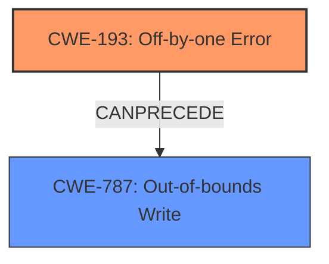

# Final Resolution for CVE-2022-3821

# Summary
| CWE ID | CWE Name | Confidence | CWE Abstraction Level | CWE Vulnerability Mapping Label | CWE-Vulnerability Mapping Notes |
|---|---|---|---|---|---|
| CWE-193 | Off-by-one Error | 0.95 | Base | Allowed | Primary CWE |
| CWE-787 | Out-of-bounds Write | 0.85 | Base | Allowed | Secondary Candidate |

## Evidence and Confidence

*   **Confidence Score:** 0.9
*   **Evidence Strength:** HIGH

## Relationship Analysis
The primary relationship is that **CWE-193** (Off-by-one Error) can precede **CWE-787** (Out-of-bounds Write). **CWE-193** causes an incorrect calculation, leading to the out-of-bounds write. **CWE-125** (Out-of-bounds Read) was considered but ultimately not included due to lack of clear evidence that it would occur during the vulnerability. The base level of **CWE-193** and **CWE-787** provides the right level of specificity.

## Vulnerability Chain
The vulnerability chain starts with an **off-by-one error** (**CWE-193**) in the `format_timespan()` function, specifically related to the calculation of the buffer size. This leads to a **buffer overflow** (**CWE-787**) when writing to the buffer. The resulting impact is a Denial of Service.

## Summary of Analysis
The initial analysis correctly identified **CWE-193 (Off-by-one Error)** as the primary cause of the vulnerability, which is further supported by the CVE Reference Links Content Summary describing the incorrect buffer size calculation. The criticism highlighted the need to explicitly state what is being counted incorrectly, which is the available buffer size. I have updated the analysis to reflect this.

**CWE-787 (Out-of-bounds Write)** is included as a secondary candidate because the **off-by-one error** directly leads to writing beyond the intended buffer boundary. I have clarified this relationship in the analysis.

**CWE-125 (Out-of-bounds Read)** was removed because the vulnerability description and supporting documentation do not provide sufficient evidence to support its inclusion.

The selection of **CWE-193** and **CWE-787** is at the optimal level of specificity because they accurately represent the root cause and the direct consequence of the vulnerability. The mapping guidance for both CWEs is "Allowed," and the rationales are valid.

The confidence score remains at 0.9 due to the clear evidence from the vulnerability description and patch details.